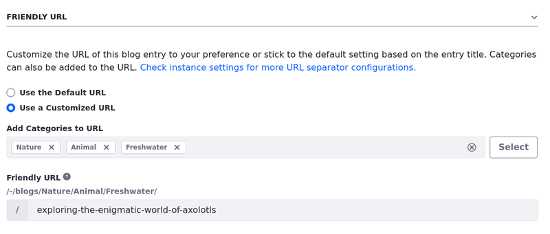
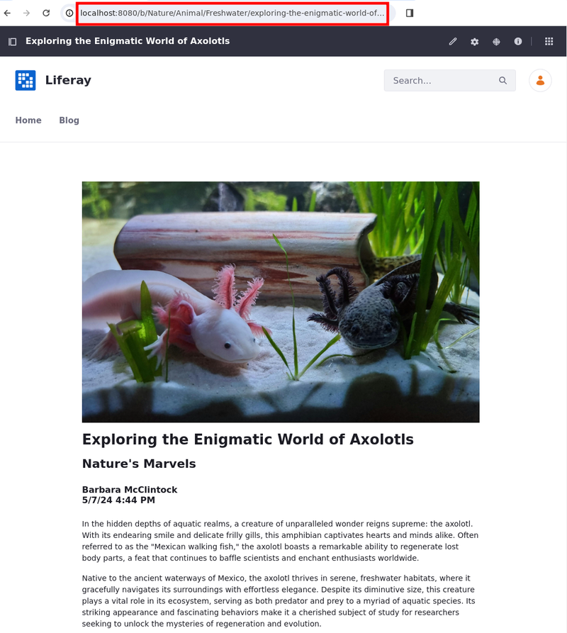

# Adding Blog Entries

Blog entries are scoped to sites. By default, only authenticated users have the ability to create blog entries. See the [Blogs Permissions Reference](./blog-permissions-reference.md) for more information.

You can [create a blog entry](#creating-an-entry) and [display it on a page](./displaying-blogs.md).

```{tip}
Using a Blogs [widget](../../site-building/creating-pages/using-widget-pages/adding-widgets-to-a-page.md) is one of the easiest ways to display your blog entries on a page.
```

## Creating an Entry

1. Open the *Site Menu* (  ) and go to *Content & Data* &rarr; *Blogs*.

1. Under the Entries tab, click *Add* (  ) to add a new blog entry.

   

1. Drag and drop or select a file to upload as an optional cover image for the entry. By default, this cover image is published as part of the blog entry's abstract.

1. Enter a title for the blog entry.

1. Enter an optional subtitle for the entry.

1. Enter the entry's content in the *Content* field. To learn more about the different text editing features, see [Blog Entry Editor Reference](./blog-entry-editor-reference.md).

### Categorizing Blog Entries

<!-- ```{note} Available in Liferay DXP 7.3+. This section must be updated to reflect the new by-default categories and vocabularies in 7.3``` -->

You can help users find content on your site by categorizing blog entries.

Use categories (public and internal), tags, or relate the entry to an asset to categorize your blog entry. See [Defining Categories and Vocabularies for Content](../tags-and-categories/defining-categories-and-vocabularies-for-content.md) to learn more about categories and vocabulary and [Tagging Content and Mananing Tags](../tags-and-categories/tagging-content-and-managing-tags.md) to learn more about using tags.

To categorize your entry using categories and tags,

1. Expand the Categorization section.

1. Click *Select* to choose an existing category or tag.

   Alternately, you can create a new tag by entering the tag name in the Tags field and pressing Return.

To relate an asset to the entry,

1. Expand the Related Assets section and click *Select* to select an asset and link it to the entry.

### Configuring How the Entry is Displayed

To configure the blog entry and how it is displayed, expand the *Configuration* and the *Display Page* sections and adjust the following settings,

| Configuration            | Description |
| :----------------------- | :------------------------------------------------------------------------------------------------------------------------- |
| URL                      | Configure the entry's URL: *Automatic* sets the URL based on the entry's title. *Custom* prompts for a custom Friendly URL |
| Abstract                 | Specify the entry's abstract. By default, the Blogs application uses the first 400 words. *Custom Abstract* prompts for a manual description. |
| Small Image              | Add a small image to be shown as the entry's thumbnail. |
| Display Date             | Configure the display date to be used for the entry. |
| Send Email Entry Updated | Send comments about the entry update. |
| Allow Pingbacks          | When you include a link to another website's content in your post, and if that website supports pingbacks, it receives a notification or "ping" from your site. Pingbacks use XML-RPC requests to the URL you linked. |
| Display Page Template    | Select the default [display page template](../../site-building/displaying-content/using-display-page-templates.md), a specific one, or no display page template to display your blog entry. |



### Publishing the Blog Entry

After you finish editing, categorizing, and configuring your blog entry, click *Publish* to publish it.

Fellow site members can add comments, rate the entry, or share it on other social media sites.



## Related Topics

[Managing Blog Entries](./managing-blog-entries.md)

[Configuring the Blogs App](./configuring-the-blogs-app.md)

[Displaying Blogs](./displaying-blogs.md)
