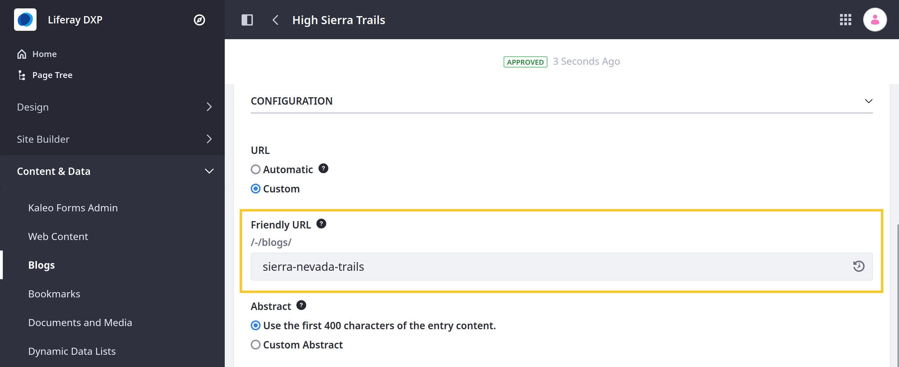
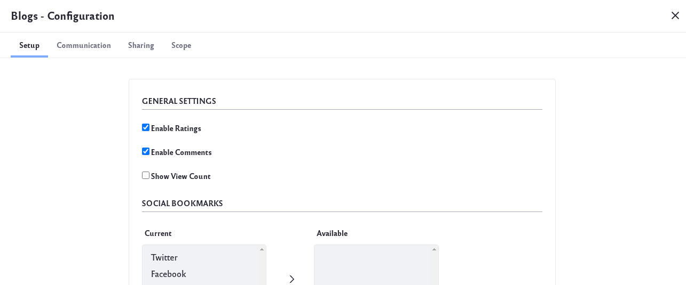
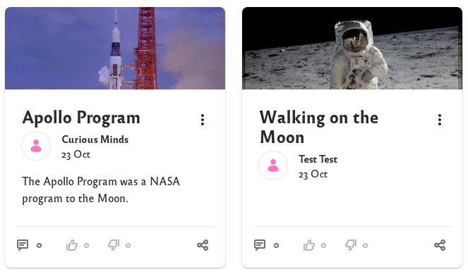

---
taxonomy-category-names:
- Content Management System
- Blogs
- Display Page Templates
- Widgets
- Liferay Self-Hosted
- Liferay PaaS
- Liferay SaaS
uuid: 7f36774b-50b3-439e-8651-f43fe33d6113
---
# Displaying Blogs

Liferay provides two ways display blog entries: [display page templates](#using-display-page-templates) and the [Blogs widget](#using-the-blogs-widget).

## Using Display Page Templates

You can use [display page templates](../../site-building/displaying-content/using-display-page-templates.md) to create reusable, dynamic displays for blog entries. Once set up, users can access each blog entry at a dedicated URL composed of the display page's URL and the entry's friendly URL (i.e., `display-page-url/blog-friendly-url`). See [Publishing Content with Display Pages](../../site-building/displaying-content/using-display-page-templates/publishing-content-with-display-pages.md) for instructions on how to set up display page templates for blog entries.

!!! tip
    In content pages, you can use collection to link to groups of blog entry display pages. See [About Collections and Collection Pages](../../site-building/displaying-content/collections-and-collection-pages/about-collections-and-collection-pages.md) for more information.

<!-- It would be a good idea do include use cases here to exemplify what was said -->

### Managing the Friendly URL History

{bdg-secondary}`Liferay 7.4+`

Each blog entry has a friendly URL that is set automatically or manually during entry creation. If you change the friendly URL after creation, Liferay stores the previous value in the entry's friendly URL history. As long as the old URL remains in the history, Liferay redirects users to the latest version of the blog entry and you cannot use it for other blog entries in the same site. To reuse an old value for a new entry, first remove it from the entry's friendly URL history.

To manage an entry's friendly URL history, 

1. Open the *Site Menu* (  ), expand *Content & Data*, and go to *Blogs*.

1. Click the *Actions* button (  ) for the desired entry and select *Edit*.

1. Expand the Configuration section and click the *History* button (  ) in the Friendly URL field.

   

1. Click the *Restore* button (  ) to replace the current friendly URL with the selected URL.

1. Click the *Forget URL* button (  ) to remove the selected URL from the entry's history. Once removed, you can no longer use the URL to access the blog entry.

   

Changes to the friendly URL history are automatically saved.

## Using the Blogs Widget

Adding the Blogs widget to a page exposes the blog interface to site members. Similarly, adding the widget to a user's personal site (Profile) creates a blog just for that user. The widget works the same way in both cases.

To add a Blogs widget to a page,

1. [Create a new page](../../site-building/creating-pages/adding-pages/adding-a-page-to-a-site.md) or [start editing a content page](../../site-building/creating-pages/using-content-pages/adding-elements-to-content-pages.md).

1. Click *Add* (  ) to open the Fragments and Widgets panel.

1. Under the Collaboration category in the Widgets tab, drag the *Blogs* widget to a place on the page.

Once you've added a Blogs widget to a page, there are several display options for configuring the listing to look the way you want.

To configure the widget, click *Options* () &rarr; *Configuration*.

### Setup Tab

**Enable Ratings:** Enable the [ratings system](../../collaboration-and-social/social-tools/user-guide/using-the-ratings-system.md) for blog entries.

**Enable Comments:** Enable comments on blog entries.

**Show View Count:** Enable showing the number of views for each entry.

**Social Bookmarks:** Enable sharing blog entries on the social media platforms you add to the *Current* column. To move social networking sites between the *Current* and *Available* columns, select the sites and use the arrows between those columns. Similarly, use the up/down arrows beneath the Current column to reorder the sites as they appear on each blog entry.

**Display Style:** Define how social bookmarks appear. *Inline* is the default and displays the social bookmark icons in a row. *Menu* hides them inside a share menu.

**Maximum Items to Display:** The total number of blog entries to display on the initial page. You can select up to 60 to display at once.

**Display Template:** Choose the display layout for blogs:

* **Abstract:** Displays an abstract of each blog entry.

* **Full Content:** Displays the full content of each blog entry.

* **Title:** Displays only the title of each blog entry.

* **Basic:** A stripped-down version of the Abstract, with less text and no cover image.

* **Card:** Displays each blog entry in a card-like rectangle that shows the cover image, title, author, post date, and a few lines of text.

To select a different application display template (ADT) or create your own, click *Manage Templates*.

**Enable Report Inappropriate Content:** Enable flagging content as inappropriate, which sends an email to administrators.

**Enable Ratings for Comments:** Enable the [ratings system](../../collaboration-and-social/social-tools/user-guide/using-the-ratings-system.md) for blog entry comments.

**Show Related Assets:** Enable showing related content from other widgets.

### Communication, Sharing, and Scope Tabs

**Communication:** Lists public render parameters the widget publishes to other widgets on the page. Other widgets can read and take actions on these. For each shared parameter, you can specify whether to allow communication using the parameter and select which incoming parameter can populate it.

**Sharing:** Embed the widget instance as a widget on any website, Facebook, Netvibes, or as an OpenSocial gadget.

**Scope:** Specify the blog instance the widget displays: the current Site's blog (default), the global blog, or the page's blog.

## Related Topics

[Adding Blog Entries](./adding-blog-entries.md)

[Using Display Page Templates](../../site-building/displaying-content/using-display-page-templates.md)
