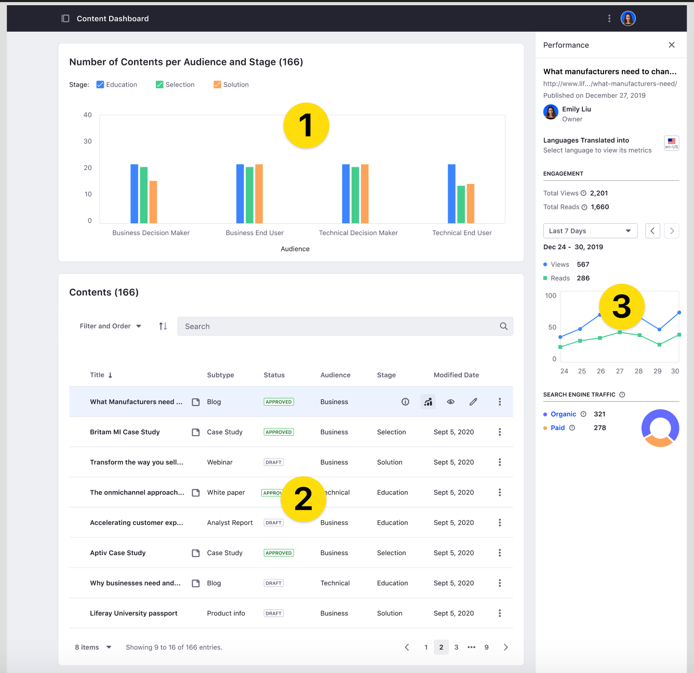

---
toc:
  - ./content-dashboard/content-dashboard-interface.md
  - ./content-dashboard/exporting-the-assets-list-to-a-spreadsheet.md
taxonomy-category-names:
- Content Management System
- Content Dashboard
- Liferay Self-Hosted
- Liferay PaaS
- Liferay SaaS
uuid: 3973639d-af75-493d-9fbd-2b9ff4cd2854
---

# Content Dashboard

{bdg-secondary}`Available 7.3+`

!!! note
    This feature works only with [Elasticsearch](../using-search/installing-and-upgrading-a-search-engine/solr/solr-limitations.md).

The *Content Dashboard* is a global application for managing your content. From the Content Dashboard page, content authors and marketers can access and audit all content generated across sites and asset libraries.

!!! note
    For analyzing performance metrics of your content, use the [Content Performance tool](./page-performance-and-accessibility/about-the-content-performance-tool.md).

Using the Content Dashboard, content authors and marketers can analyze their content in different ways:

- Find and filter content across sites and asset libraries using built-in or custom filters.
- Analyze existing content by audience or phase in a customer journey.
- Audit content areas with enough content or content gaps to improve your content strategy.
- [Export and download asset lists](./content-dashboard/exporting-the-assets-list-to-a-spreadsheet.md) for further analysis.

The Content Dashboard shows information based on the [categories](./tags-and-categories/organizing-content-with-categories-and-tags.md) you assign to content assets. Liferay provides the *Audience* and *Stage* global vocabularies to work along with the Content Dashboard. See [Defining Categories and Vocabularies for Content](./tags-and-categories/defining-categories-and-vocabularies-for-content.md) to learn more about categorizing content.

(1) The Content Audit tool provides metrics based on defined vocabularies and categories. Users can filter and combine global vocabularies to analyze data across different criteria.

(2) See a list of content across all sites and asset libraries. Sort and filter information using built-in or custom [filters](./content-dashboard/content-dashboard-interface.md#filter-options-reference).

!!! tip
    The Content Audit Tool chart changes dynamically based on the filters that you set.

(3) The Content Info sidebar shows different metadata for each asset, while the Content Performane tool gathers statisstics for your content, like the number of views or the traffic acquisition channels.

To learn more about the Content Dashboard interface and how to customize the information for your needs, see the [Content Dashboard Interface](./content-dashboard/content-dashboard-interface.md) topic.
