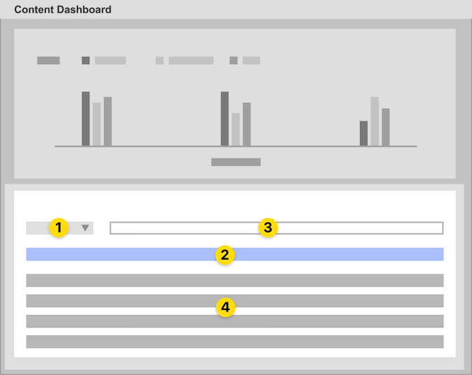
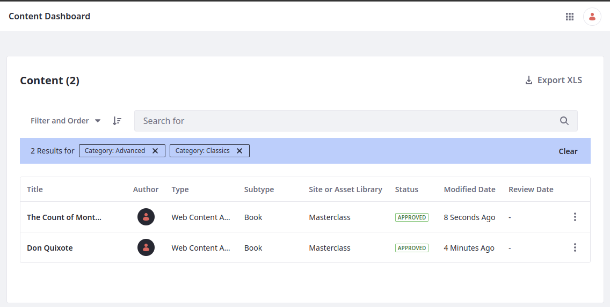

# Content Dashboard Interface

{bdg-secondary}`Available 7.3+`

The Content Dashboard user interface has three main sections:

* [Content Audit Tool](#content-audit-tool) (1)
* [Contents List](#contents-list) (2)
* [Content Info Sidebar](#content-info-sidebar) (3)


To access the dashboard, open the *Global Menu* (  ), go to the *Applications* tab, and click *Content Dashboard*. Here you can view the [content audit tool](#content-audit-tool) (1) at the top of the page and the [contents list](#contents-list) (2) at the bottom. From the contents list, you can access the [content info sidebar](#content-info-sidebar) (3) by hovering over a content item and clicking the *Info* button (  ). Alternatively, you can click the content item's *Actions* button (  ) and select *Info*.

```{note}
If the instance is connected to Analytics Cloud, you can also select *View Metrics* to open the Content Performance side panel. See [About the Content Performance Tool](../page-performance-and-accessibility/about-the-content-performance-tool.md) for more information.
```

## Content Audit Tool

The content audit tool displays assets from the [contents list](#contents-list) section in a chart. This chart represents the total number of assets for the selected [vocabularies and categories](#customizing-vocabularies-and-categories-for-the-content-audit-tool) and can include items from all sites and asset libraries. However, the chart only displays data the current user can access. You can also restrict chart results using [contents list filters](#filtering-and-sorting-content-in-the-contents-list).


```{tip}
If the chart does not display the expected information, [verify your categories](../tags-and-categories/defining-categories-and-vocabularies-for-content.md) for the selected vocabularies and ensure that [your content is categorized](../tags-and-categories/organizing-content-with-categories-and-tags.md).
```

The content audit tool includes these UI elements:

* The chart legend (1)

* X-axis categories for the first vocabulary (2)

* Y-axis categories for the second vocabulary (3)

* The bar chart (4)


### Customizing Vocabularies and Categories for the Content Audit Tool

By default, the bar chart shows the total number of assets for each category in the selected vocabularies. To change these vocabularies,

1. Click the *Configure* button (  ) in the content audit area.

1. Use the *left* and *right* arrow buttons to select which vocabularies to display in the chart.

   You can only use one or two vocabularies at a time. Also, you can only combine vocabularies from the same site. However, you can use global vocabularies with vocabularies from any site.

1. Click the *up* and *down* arrow buttons to order the vocabularies.

   The chart uses the top vocabulary for the x-axis and the bottom vocabulary for the y-axis.

   

1. Click *Save*.

```{tip}
Click the *Flip Axes* button (  ) to quickly switch the x- and y-axes.
```

## Contents List

By default, the contents list displays all content you can access across your sites and asset libraries. From here, you can sort and filter this content using built-in or custom filters. The content audit tool chart changes dynamically based on the filters that you set.

The contents list includes these UI elements:

* Filter and Sort selector (1)

* Filter editor (2)

* Search field (3)

* List of contents (4)



In the list of contents, you can find the following columns:

| Column                | Description                                                                                                                             |
|:----------------------|:----------------------------------------------------------------------------------------------------------------------------------------|
| Title                 | Displays the content's title.                                                                                                           |
| Author                | Identifies the content's author.                                                                                                        |
| Type                  | Indicates the content type: web content article, document {bdg-secondary}`7.4+`, or blogs entry {bdg-secondary}`7.4 U23+/GA23+`         |
| Subtype               | Indicates the sub content [subtype](../tags-and-categories/defining-categories-and-vocabularies-for-content.md#creating-subcategories). |
| Site or Asset Library | Indicates the location of the content item in the Liferay instance.                                                                     |
| Status                | Displays the workflow statuses for each content item.                                                                                   |
| Vocabulary (x-axis)   | Lists the categories applied to the content item from the content audit tool's [x-axis vocabulary](#content-audit-tool).                |
| Vocabulary (y-axis)   | Lists the categories applied to the content item from the content audit tool's [y-axis vocabulary](#content-audit-tool).                |
| Modified Date         | Displays when the content item was last modified.                                                                                       |

The content list uses the *Page* icon (  ) to identify assets that have a [display page template](../../site-building/displaying-content/using-display-page-templates.md).

You can hover over content in the list to access these actions:

* *View* (  ): View the content's display page.

* *Edit* (  ): Open the content in edit mode.

* *Info* (  ): Open the [content info](#content-info-sidebar) sidebar.

* *View Metrics* (  ): Open the [content performance panel](../page-performance-and-accessibility/about-the-content-performance-tool.md).

    

### Filtering and Sorting Content in the Contents List

To filter content, you can click the *Filter and Order* drop-down menu and select a [pre-defined filter](#filter-options-reference). Here you can also sort content by title or modified date.

Additionally, you can use the search bar to filter content by keyword, or click a bar in the [content audit](#content-audit-tool) chart to filter content by the selected category.



See [Understanding Contents List Filters](#understanding-contents-list-filters) for more information on how combining filters works.

```{note}
When you close the dashboard page, the default filter and sorting option are reset.
```

### Filter Options Reference

{bdg-secondary}`For 7.4+`

From the *Filter and Order* drop-down menu, you can choose these options:

| Filter                | Description                                                                                                                                                                                                                  |
|:----------------------|:-----------------------------------------------------------------------------------------------------------------------------------------------------------------------------------------------------------------------------|
| Categories            | Filters using one or more [categories](../tags-and-categories/organizing-content-with-categories-and-tags.md) from your vocabularies.                                                                                        |
| Site or Asset Library | Filters by site or asset library.                                                                                                                                                                                            |
| Type                  | Filters by content type and subtype, including out-of-the-box and custom subtypes.                                                                                                                                           |
| Extension             | Filters by file extension:</br><ul><li>`audio`</li><li>`code`</li><li>`compressed`</li><li>`image`</li><li>`presentation`</li><li>`spreadsheet`</li><li>`text`</li><li>`vectorial`</li><li>`video`</li><li>`other`</li></ul> |
| Tags                  | Filters by content [tags](../tags-and-categories/tagging-content-and-managing-tags.md).                                                                                                                                      |
| Filter by Author      | Filters by content author.                                                                                                                                                                                                   |
| Filter by Status      | Filters by the content's [workflow status](../../process-automation/workflow/introduction-to-workflow.md).                                                                                                                   |


### Understanding Contents List Filters

* When you use the categories or tags filters with more than one criteria, the results correspond to content that meets all the criteria (see example A.)

* When you choose multiple options for the same filter criteria, the contents list shows assets matching at least one option (see example B.)

* The criteria from different filters is combined using the `and` operator (see example C.)

| Example | Filter By           | Filter Example                                   | Contents List Results                                                       |
| :------ | :------------------ | :----------------------------------------------- | :-------------------------------------------------------------------------- |
| A       | Categories          | Categories: *Entrepreneur* and *Family*          | Only assets that belong to both the *Entrepreneur* `and` Family Categories. |
| B       | Authors             | Authors: *Peter* and *Linda*                     | Assets authored by *Peter* `or` *Linda* `or` both.                          |
| C       | Categories, Authors | Category is *Entrepreneur* and Author is *Linda* | Only assets under the *Entrepreneur* Category `and` authored by Linda.      |

## Content Info Sidebar

The info sidebar provides access to actions and metadata for your selected asset. To open the sidebar, click the *Actions* button (  ) for the desired asset and select *Info*. Alternatively, you can hover over the asset and click the *Info* button (  ).


This table lists available metadata and actions for different asset types.

| Asset Type                                          | Metadata/Action                                                                                                                                                                                                                                                                                                                                                                                                                                 |
|:----------------------------------------------------|:------------------------------------------------------------------------------------------------------------------------------------------------------------------------------------------------------------------------------------------------------------------------------------------------------------------------------------------------------------------------------------------------------------------------------------------------|
| Web Content                                         | <ul><li>Title</li><li>Type {bdg-secondary}`7.4 U44+/GA44+`</li><li>Subtype </li><li>Version</li><li>Status</li><li>Author</li><li>Preview Image {bdg-secondary}`7.4 U42+/GA42+`</li><li>Languages Translated Into</li><li>Display Date</li><li>Creation Date</li><li>Modified Date</li><li>ID</li><li>Subscribe {bdg-secondary}`7.4 U42+/GA42+`</li></ul>                                                                                       |
| Documents and Media {bdg-secondary}`7.4 U23+/GA23+` | <ul><li>Title</li><li>URL</li><li>WebDAV URL {bdg-secondary}`7.4 U42+/GA42+`</li><li>Filename</li><li>Type {bdg-secondary}`7.4 U44+/GA44+`</li><li>Subtype</li><li>MIME Type {bdg-secondary}`7.4 U44+/GA44+`</li><li>Version</li><li>Status</li><li>Author</li><li>Preview Image</li><li>Download</li><li>Share {bdg-secondary}`7.4 U42+/GA42+`</li><li>Extension</li><li>Size</li><li>Creation Date</li><li>Modified Date</li><li>ID</li></ul> |
| Blog Entries                                               | <ul><li>Title</li><li>Type</li><li>Version</li><li>Status</li><li>Author</li><li>Preview Image {bdg-secondary}`7.4 U42+/GA42+`</li><li>Share {bdg-secondary}`7.4 U42+/GA42+`</li><li>Display Date</li><li>Creation Date</li><li>Modified Date</li><li>ID</li></ul>                                                                                                                                                                                                                        |


## Additional Information

* [About the Content Dashboard](./about-the-content-dashboard.md)
* [About the Content Performance Tool](../page-performance-and-accessibility/about-the-content-performance-tool.md)
* [Defining Categories and Vocabularies for Content](../tags-and-categories/defining-categories-and-vocabularies-for-content.md)
