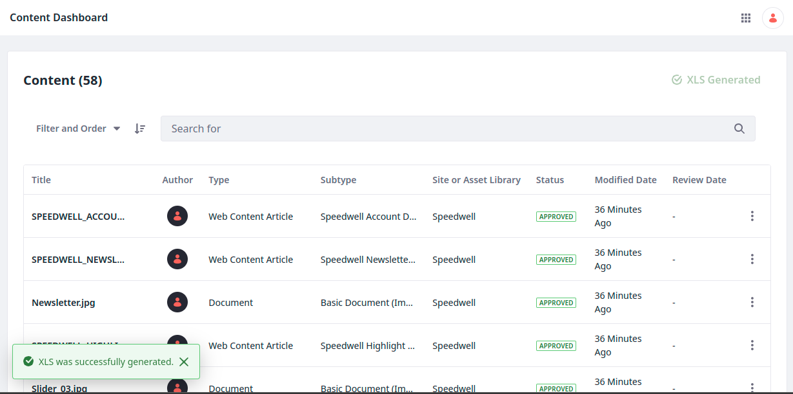

---
taxonomy-category-names:
- Content Management System
- Content Dashboard
- Liferay Self-Hosted
- Liferay PaaS
- Liferay SaaS
uuid: 1553a9b8-a964-40db-abd2-ee882863bfd9
---
# Exporting Assets List To a Spreadsheet

The Content Dashboard can export a spreadsheet (`.xls` file) of content related metadata for further analysis.

To export the asset list to a spreadsheet follow these steps:

1. Open the *Global Menu* () and navigate to *Applications* &rarr; *Content Dashboard*.

1. Click on *Export XLS* to download the asset list.


While generating the file, *Export XLS* is replaced with a status and a cancel button for the export process. If you click *Cancel Export*, the export process stops and shows a message: *XLS generation was canceled*.

When the export process is complete, the status shows the message: *XLS Generated*.



```{note}
Navigating away from the page while the `.xls` file is being generated stops the export process. The system prompts the user before leaving the page.


```

## XLS File Content

All metadata is exported from contents and documents, so the `.xls` file contains the following columns:

* Title
* Author
* Type
* Subtype
* Site or Asset Library
* Status
* Categories
* Tags
* Modified Date
* Review Date
* Description
* Extension
* File Name
* Size
* Display Date
* Creation Date
* Languages Translated Into

```{note}
The available metadata present in the `.xls` file affects content types. For example, an image will not display anything for *Languages Translated Into*, as an image cannot be translated.
```
