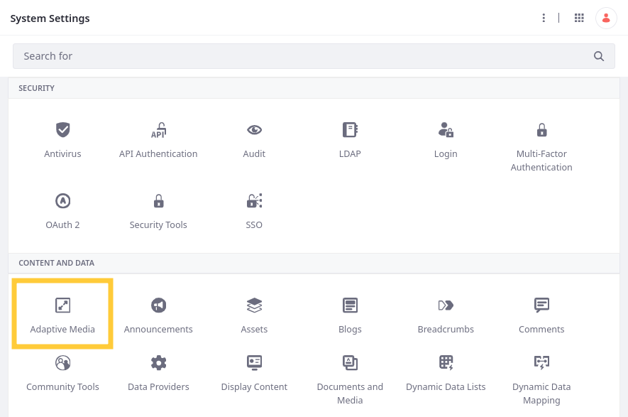
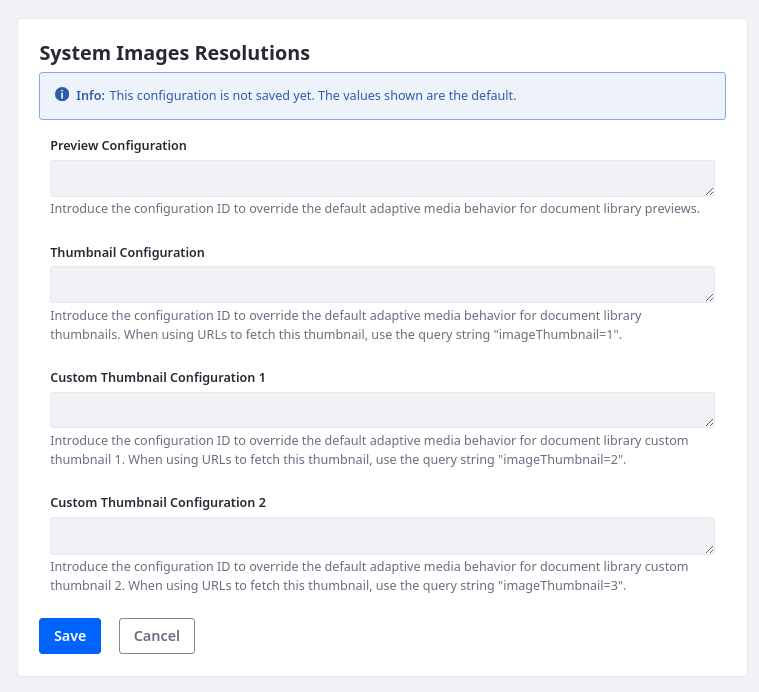
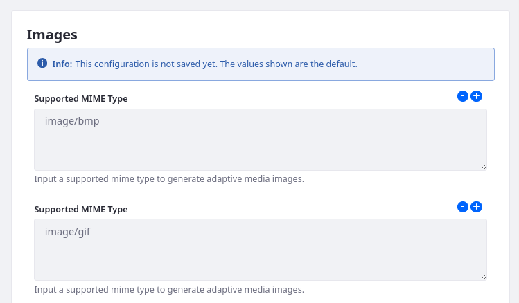
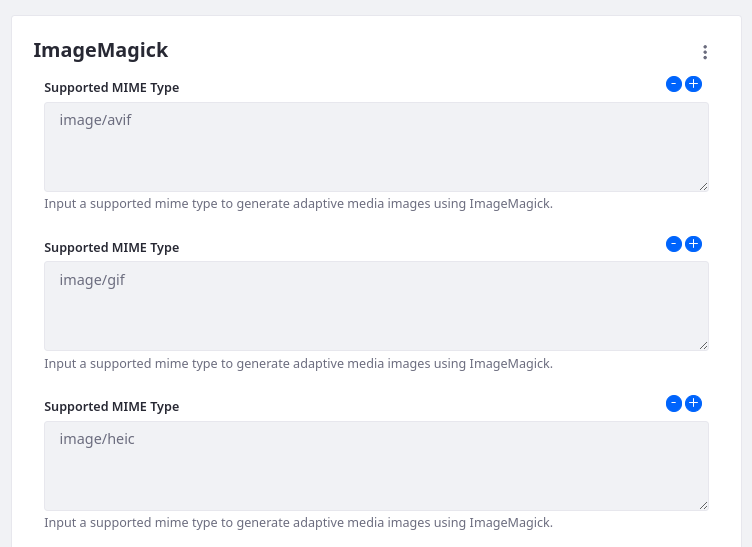
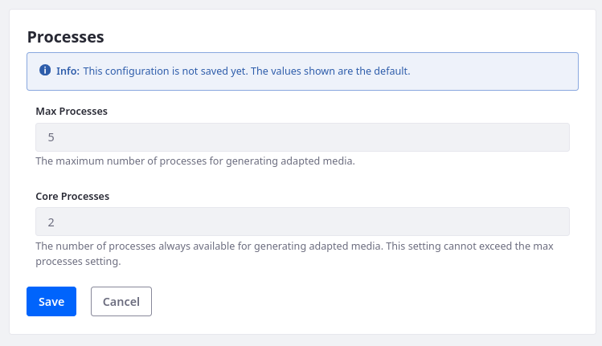

# Adaptive Media Configuration Reference

{bdg-secondary}`Liferay 7.3 U28+/GA28+ and 7.4 U78+/GA78+`

With Adaptive Media, you can configure supported media types, determine the resolutions used for previews and thumbnails in the document library, and more. To access these settings,

1. Open the *Global Menu* (  ), go to the *Control Panel* tab, and click *System Settings*.

1. Click *Adaptive Media* under Content and Data.

    

Configuration options appear in four tabs:

* System Images Resolutions: Configure resolutions used for document library thumbnails and previews.
* Images: Configure which media types are supported by Adaptive Media.
* ImageMagick: Configure which media types are generated using ImageMagick.
* Processes: Configure asynchronous processing.

## Systems Images Resolutions

Here you can override Adaptive Media's default behavior for document library previews and thumbnails. By default, Adaptive Media chooses the best image resolution for previews and thumbnails based on the closest dimensions to user's screen type and resolution. But you can enter resolution IDs to override this process (e.g., `Preview-1000x0`).



| Field                            | Description                                                                                                    |
|:---------------------------------|:---------------------------------------------------------------------------------------------------------------|
| Preview Configuration            | Enter a resolution ID to override the default adaptive media behavior for document library previews.           |
| Thumbnail Configuration          | Enter a resolution ID to override the default adaptive media behavior for document library thumbnails.         |
| Custom Thumbnail Configuration 1 | Enter a resolution ID to override the default adaptive media behavior for document library custom thumbnail 1. |
| Custom Thumbnail Configuration 2 | Enter a resolution ID to override the default adaptive media behavior for document library custom thumbnail 2. |

## Images

Here you can determine the media types processed by Adaptive Media and enable or disable [Gifsicle](https://www.lcdf.org/gifsicle/).



| Field               | Description                                                                                                                                                                                                                                                                                  |
|:--------------------|:---------------------------------------------------------------------------------------------------------------------------------------------------------------------------------------------------------------------------------------------------------------------------------------------|
| Supported MIME Type | Determine the media types processed by Adaptive Media. If an image is uploaded and its media type is not listed, Adaptive Media ignores the image. By default, this list includes `bmp`, `gif`, `jpeg`, `pjpeg`, `png`, `svg+xml`, `x-citrix-jpeg`, `x-citrix-png`, `x-ms-bmp`, and `x-png`. |


| Field    | Description                                                                                                                                                            |
|:---------|:-----------------------------------------------------------------------------------------------------------------------------------------------------------------------|
| Gifsicle | You can enable Gifsicle to adapt gif files. See [Enabling Optimization of Animated GIFs](../../devops/enabling-optimization-of-animated-gifs.md) for more information. |

## ImageMagick

Here you can determine which media types are processed using [ImageMagick](http://www.imagemagick.org). To use ImageMagick, you must first install it on your Liferay server. See [Enabling ImageMagick and Ghostscript](../../../../system-administration/using-the-server-administration-panel/configuring-external-services.md#enabling-imagemagick-and-ghostscript) for more information.



| Field               | Description                                                                                                                                                                                                                                                                                                           |
|:--------------------|:----------------------------------------------------------------------------------------------------------------------------------------------------------------------------------------------------------------------------------------------------------------------------------------------------------------------|
| Supported MIME Type | Determine the media types processed by ImageMagick in Adaptive Media. If an image is uploaded and its media type isn't in this list, Adaptive Media does not use ImageMagick for generating its preview. By default, this list contains  `avif`, `gif`, `heic`, `tiff`, and `webp`, but you can add other media types. See [ImageMagick documentation](https://imagemagick.org/script/formats.php) for a list of supported media types. |

## Processes

Here you can configure Adaptive Media's asynchronous processing. Modify these values to improve performance.



| Field          | Description                                                                                                                                                    |
|:---------------|:---------------------------------------------------------------------------------------------------------------------------------------------------------------|
| Max Processes  | Set the maximum number of processes for generating adapted media. The default value is `5`.                                                                    |
| Core Processes | Set the number of processes always available for generating adapted media. The default value is `2`. This value cannot exceed the maximum number of processes. |

```{warning}
Larger values for Max Processes and Core Processes can consume large amounts of memory and result in out of memory errors. Out of memory errors can also occur if source images are large. You should run performance tests to optimize these settings for the amount of memory available on your system.
```

## Related Topics

* [Adding Image Resolutions](./adding-image-resolutions.md)
* [Managing Image Resolutions](./managing-image-resolutions.md)
