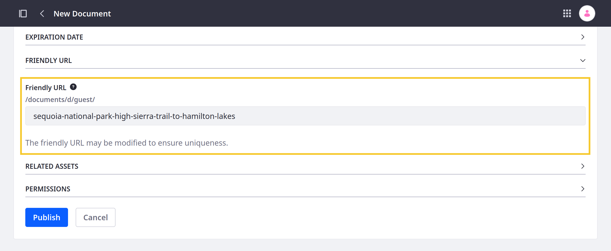
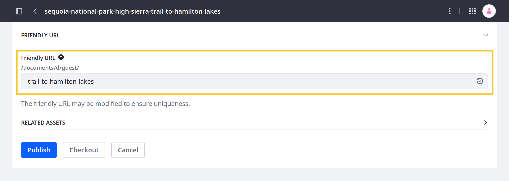
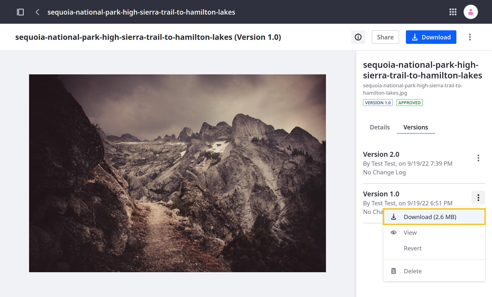

# Configuring Document URLs

{bdg-secondary}`Available Liferay 7.4 U27+/GA27+`

When a file is uploaded, Liferay automatically generates a friendly URL for accessing it. This URL uses the following structure: `server-address/documents/d/sites-friendly-url/file-friendly-URL`. Unless specified during upload, Liferay uses the file's name for the friendly URL, but you can manually change this value at any time. Once set, you can access the latest version of the file at its friendly URL.

```{note}
For 7.4 U26/GA26 and earlier versions, Liferay generates file URLs using the following structure: `server-address/documents/site-id/folder-id/file-name/UUID`. If you're updating to U27+/GA27+, existing files continue to use their old URLs based on this pattern. However, whenever one of these files is first updated by a user, Liferay converts its URL to use the new structure. Until updated, you can continue to access your files using their old URLs. 
```

## Setting Friendly URLs for Documents

You can manually configure a file's friendly URL during [file upload](./uploading-files.md) or whenever editing the file.

```{note}
When uploading multiple files, each file's friendly URL is automatically generated using its name. 
```

Follow these steps to set a file's friendly URL:

1. Open the *Site Menu* (  ), expand *Content & Data*, and go to *Documents and Media*.

1. Begin uploading or editing the desired file.

1. Edit the *Friendly URL* field.

   Each URL value must be unique per site. If a value is already in use, Liferay automatically resolves the conflict by adding a numeric value to the end of the URL (e.g., `my-file`, `my-file-1`, `my-file-2`).

   

1. Click *Publish*.

Once saved, you can access the file at the designated URL (e.g., `http://server-address/documents/d/site-friendly-url/file-friendly-URL`).

## Friendly URL History

When you change a file's friendly URL, Liferay automatically retains a history of the previous URLs. You can continue to use these saved URLs to access the latest version of the file. If desired, you can remove old friendly URL entries.

```{note}
While saved in the friendly URL history, old file URLs cannot be used for other files in the same site. To reuse the URL for another file, you must first remove it from the file's friendly URL history.
```

Follow these steps to view and manage retained URLs for a file:

1. Open the *Site Menu* (  ), expand *Content & Data*, and go to *Documents and Media*.

1. Click the *Actions* button (  ) for the desired file and select *Edit*.

1. Click the *History* button (  ) in the Friendly URL field.

   

1. Click the *Restore* button (  ) to replace the current friendly URL with the selected URL.

1. Click the *Forget URL* button (  ) to remove the selected URL from the file's history. Once removed, you can no longer use the URL to access the file.

   

Changes to the friendly URL history are automatically saved.

```{note}
Beginning with Liferay 7.4 U34/GA34, the display page template framework takes into account each file's friendly URL history. This means users can continue to access a file's display page using old friendly URLs, provided those URLs remain in the file's friendly URL history. All URLs in the file's friendly URL history are automatically redirected to the file's current URL.

When the file is on the same site as its display page template, the file's friendly URL is appended to the display page URL (i.e., `display-page-url/file-friendly-url`). However, if the file is in a different site or asset library from the template, the URL pattern also includes the friendly URL of the file's site or asset library (i.e., `display-page-url/site-friendly-url/document-friendly-url`). This is to avoid duplicate URLs.
```

## Document Version URLs

All file friendly URLs lead to latest version of the file. If you want to access the URL for previous file versions, navigate to the file's version history and copy the *download* URL for the desired version.



## Additional Information

* [Documents and Media Overview](../documents-and-media-overview.md)
* [Uploading Files](./uploading-files.md)
* [Configuring Your Site's Friendly URL](../../../site-building/site-settings/managing-site-urls/configuring-your-sites-friendly-url.md)
* [Configuring Your Page's Friendly URL](../creating-pages/page-settings/configuring-your-pages-friendly-url.md)
