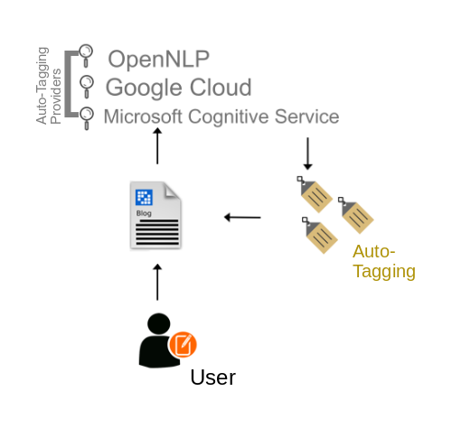

---
toc:
  - ./auto-tagging/configuring-asset-auto-tagging.md
  - ./auto-tagging/auto-tagging-assets.md
  - ./auto-tagging/auto-tagging-images.md
taxonomy-category-names:
- Content Management System
- Categories and Tags
- Liferay Self-Hosted
- Liferay PaaS
- Liferay SaaS
uuid: a9274b09-7106-430d-927f-26472612acd4
---

# Auto-Tagging

Auto-tagging is the process of assigning descriptive tags or labels to digital content automatically without manual intervention. When having multiple content, auto-tagging organizes and groups this content by determining related tags, which is assigned according to attributes, context, or metadata.

A user wants to create a blog. It's content will be extensive and there are many different topics that can be grouped and organized. Instead of tagging them manually, you may use the Auto-Tagging providers to spare your time.

Liferay offers the option for automatic tagging assets and images within your work processes, allowing the user to configure it at three levels: *Global*, *Virtual Instance* and *Site*:

**Global (System Settings)**: Enable or disable auto-tagging for the Liferay server. For auto-tagging to function on any level, it must be enabled globally. At the global level, you can also set a default configuration for all virtual instances. This is not available in Liferay Cloud SaaS. 

**Virtual Instance (Instance Settings)**: Override auto-tagging configurations set at the global level. This setting determines the default configuration for all instance sites.

**Site**: Override auto-tagging configurations set at the global and instance levels.

Liferay offers three main providers (*OpenNLP, Google Cloud* and *Microsoft Cognitive Service*) to support the user when working with images, text-based documents, text-based web content, and blog entries. Once enabled, they examine the content begin created and generate the relevant tags.

The following articles instructs how to configure and utilize correctly the providers:

:::{grid-item-card} Configuring Asset Auto-Tagging
:link: ./auto-tagging/configuring-asset-auto-tagging.md
:::
:::{grid-item-card} Auto-Tagging Assets
:link: ./auto-tagging/auto-tagging-assets.md
:::
:::{grid-item-card} Auto-Tagging Images
:link: ./auto-tagging/auto-tagging-images.md
:::
