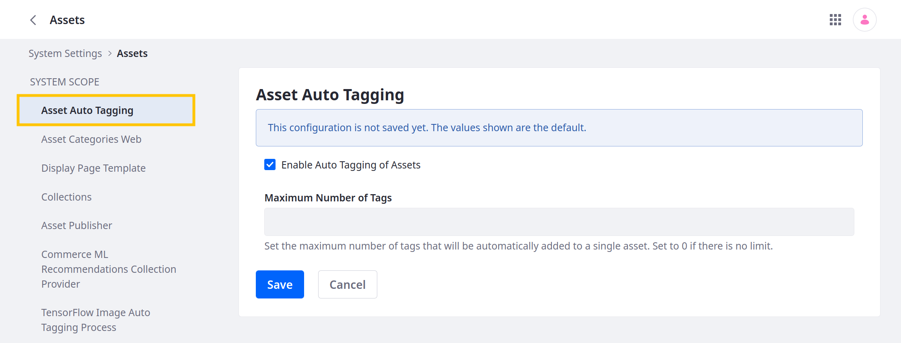

---
taxonomy-category-names:
- Content Management System
- Categories and Tags
- Liferay Self-Hosted
- Liferay PaaS
- Liferay SaaS
uuid: 48c633fe-df2d-4f68-a630-cc85c8d1e33a
---

# Configuring Asset Auto-Tagging

[Tagging assets](../tagging-content-and-managing-tags.md) is a great way to organize content. Typically, the content creator manually applies tags during creation, but you can configure Liferay to tag content automatically. For example, you can scan an image on upload and apply tags that describe the image's content.

By default, asset auto-tagging is only triggered when content is created. Beginning with Liferay 7.4 U36/GA36, you can configure virtual instances to allow auto-tag assets on updates as well. See [Virtual Instance Scope Configuration](#virtual-instance-scope-configuration) for more information.

## Global Scope Configuration

1. Open the *Global Menu* (), click the *Control Panel* tab, and go to *System Settings*.

1. In the Content and Data section, click *Assets*.

1. Under System Scope, click *Asset Auto-Tagging*.

   

1. Check the box to enable or disable Asset Auto-Tagging globally.

1. Set the *Maximum Number of Tags* that can be added automatically to an asset. Setting the value to `0` means there is no limit.

1. Click *Save* when finished.

To set the default auto-tagging configuration for all instances, select *Asset Auto-Tagging* under Virtual Instance Scope. The available settings are the same as those in the System Scope.

## Virtual Instance Scope Configuration

When enabled globally, auto-tagging is also enabled by default for each Virtual Instance. You can, however, disable or configure it for each instance.

Follow these steps to configure auto-tagging at the Virtual Instance scope:

1. Open the *Global Menu* (), click the *Control Panel* tab, and go to *Instance Settings*.

1. In the Content and Data section, click *Assets*.

1. Under Virtual Instance Scope, click *Asset Auto-Tagging*.

   

1. Check/Uncheck *Enable Asset Auto-Tagging*.

1. Check/Uncheck *Update Auto-Tags*. If unchecked, auto-tagging is only triggered during asset creation and upload. If checked, auto-tagging is triggered when assets are edited.

1. Set the *Maximum Number of Tags* that can be added automatically to an asset. Setting the value to `0` means there is no limit.

1. Click *Save* when finished.

Once saved, this determines the default configuration for the current virtual instance. If you've enabled the *Update Auto-Tags* feature, editing supported assets triggers auto-tagging. If desired, you can disable this behavior for existing content items.

## Site Scope Configuration

1. Open the *Site Menu* (), expand *Configuration*, and go to *Site Settings*.

1. For 7.4+, go to *Assets* under Content and Data and click the *Asset Auto-Tagging* tab.

   

   For earlier versions, go to the *General* tab and expand the *Asset Auto-Tagging* section.

1. Use the toggle to enable or disable auto-tagging for the site.

1. Click *Save*.

## Related Topics

- [Tagging Content and Managing Tags](../tagging-content-and-managing-tags.md)
- [Auto-tagging Images](./auto-tagging-images.md)
- [Site Settings UI Reference](../../../site-building/site-settings/site-settings-ui-reference.md)
