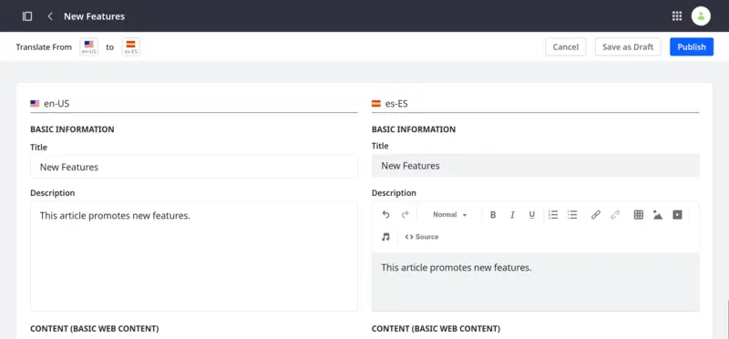
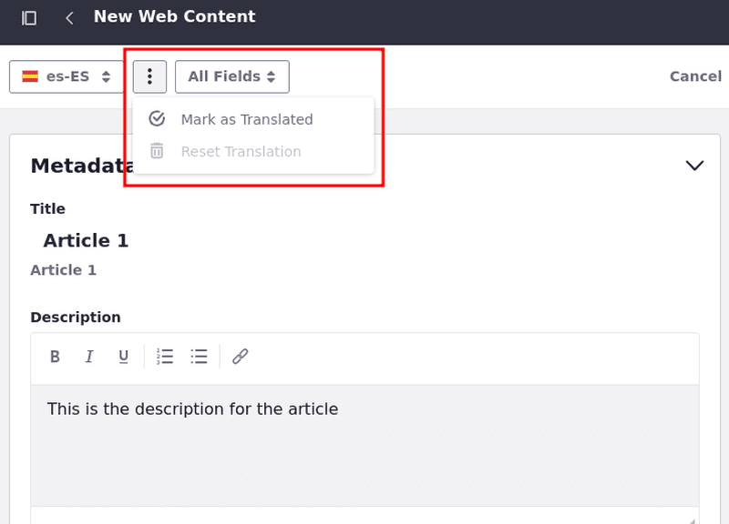
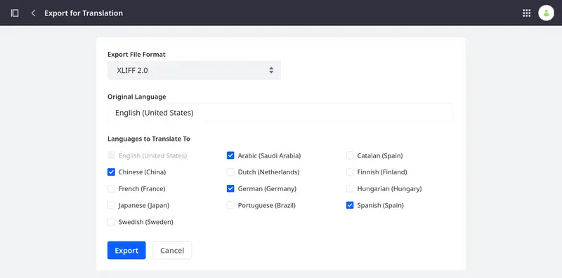

# Translating Web Content

{bdg-secondary}`Available Liferay DXP/Portal 7.3+`

Liferay provides integrated tools for translating Web Content articles, so you can create engaging, localized content for your global users. With these tools, you can manually translate Web Content or import translations as XLIFF files.

If desired, you can [enable a custom workflow](./enabling-workflows-for-translations.md) to direct the review and publishing process for translations.

```{note}
The languages available for translation are determined by your instance's localization settings. See [Initial Instance Localization](../../installation-and-upgrades/setting-up-liferay/initial-instance-localization.md) and [Virtual Instance Localization](../../system-administration/configuring-liferay/virtual-instances/localization.md) for more information.
```

## Manually Translating Content

```{note}
To manually translate Web Content, users must have either *View* and *Update* permissions for the asset or Translation permissions for one or more languages. See [Managing Permissions for Translation](./managing-translation-permissions.md) for more information.
```

Follow these steps to manually translate Web Content:

1. Open the *Site Menu* (), expand *Content & Data*, and go to *Web Content*.

1. Click the *Actions* button (  ) for the content you want to translate and select *Translate*.

   This redirects you to the translation interface, where you can view the content's original text alongside your translation.

   The left column displays the language you're translating from, and the right column provides editable fields you can use for your translation.

   

1. Select the *language* you want to translate.

   ```{important}
   Users with content Update permissions can translate the original text into any language.

   Users with translate permissions can only translate the origin text into languages for which they have permission.
   ```

   

1. Enter your translation for available fields.

1. Click *Publish* to create a new version of the web content or initiate a workflow, if it's enabled.

   Alternatively, click *Save as Draft* to save and publish your translation at a later time.

## Exporting and Importing Translations

```{note}
To manually translate Content Page experiences, users must have either *View* and *Update* permissions for Content Pages or Translation permissions for one or more languages. See [Managing Translation Permissions](./managing-translation-permissions.md) for more information.
```

With Liferay, you can export Web Content for translation as `.xliff` or `.xlf` files. You can send these files to translators and then import the translations together as a `.zip` file or individually as `.xliff` or `.xlf` files.

```{important}
Liferay supports both XLIFF 1.2 and 2.0 files. However, it may not support all features and capabilities those formats provide.
```

### Exporting Content for Translation

Follow theses steps:

1. Open the *Site Menu* (), expand *Content & Data*, and go to *Web Content*.

1. Click the *Actions* button (  ) for the content you want to translate and select *Export for Translation*. This opens a modal window for configuring your export.

   

   Alternatively, you can select multiple articles and click the *Export for Translation* button.

   

1. Select an export format: *XLIFF 1.2* or *XLIFF 2.0*.

1. Select the Web Content's original language.

1. Select the languages you want to translate to.

   

1. Click *Export*.

Liferay generates a ZIP archive that contains an XLIFF file for each selected language. You can then use these files with compatible translation software.

### Importing Content Translations

Follow theses steps:

1. Open the *Site Menu* (), expand *Content & Data*, and go to *Web Content*.

1. Click the *Actions* button (  ) for the translated Web Content and select *Import Translation*.

   

   Alternatively, you can import translations for multiple articles at once by clicking the *Actions* button () in the Application Bar and selecting *Import Translations*.

   

1. Select the `.xliff`, `.xlf`, and `.zip` files you want to import.

   

   ```{important}
   While Liferay supports importing XLIFF files created using the [Export for Translation](#exporting-content-for-translation) action, it cannot guarantee the successful import of files generated by other means.
   ```

1. Click *Publish*.

   If successful, Liferay displays a success message with the imported files. The Web Content is updated with all changes included in the translation files. If workflow is enabled, this change must be approved as with other content updates.

   

   However, if errors occur during import, Liferay notifies you of the failing files and provides a downloadable CSV error report.

   

## Translating Web Content Using Third Party Services

If you've enabled Liferay's integration with [Google Cloud Translation](https://cloud.google.com/translate/docs/setup), [Amazon Translate](https://docs.aws.amazon.com/translate/latest/dg/what-is.html), or [Microsoft Translator](https://docs.microsoft.com/en-us/azure/cognitive-services/translator/), you can use them to automatically translate Web Content. See [Using Third Parties for Translation](./using-third-parties-for-translation.md) for more information.

## Additional Information

* [Translating Content Pages](./translating-content-pages.md)
* [Using Third Parties for Translation](./using-third-parties-for-translation.md)
* [Enabling Workflows for Translations](./enabling-workflows-for-translations.md)
