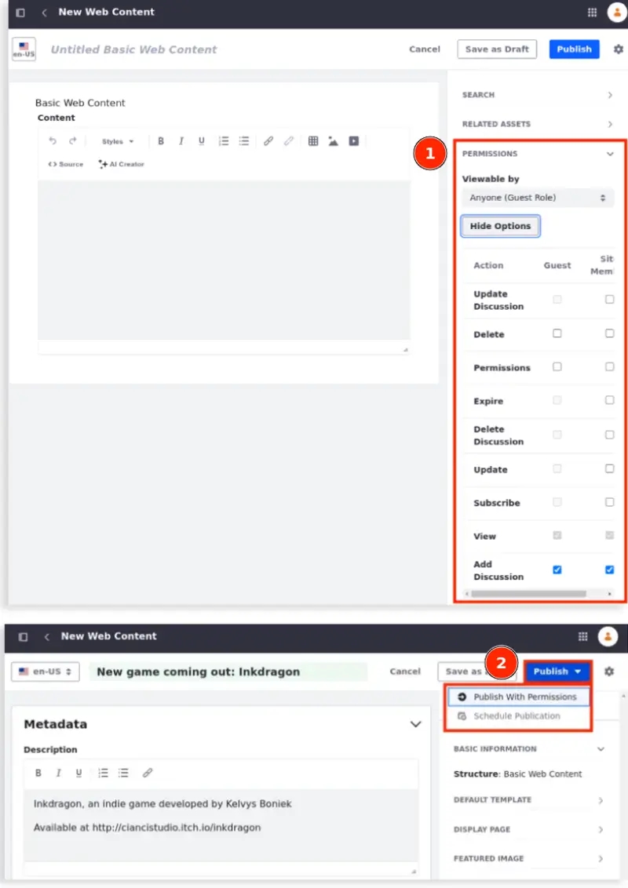

---
taxonomy-category-names:
- Content Management System
- Web Content and Structures
- Liferay Self-Hosted
- Liferay PaaS
- Liferay SaaS
uuid: a7ff0bd6-553d-42f4-ad4b-ee23268f6f90
---

# Assigning Permissions to Web Content Articles

With Liferay's permissions framework, you can control which users can create, view, and manage web content articles. You can set permissions for individual articles or {bdg-secondary}`Liferay DXP 2024.Q2+/Portal 7.4 GA120+` multiple articles at once. See [Understanding Roles and Permissions](../../../users-and-permissions/roles-and-permissions/understanding-roles-and-permissions.md) for more information.

1. Follow the steps to [create a web content article](./adding-a-basic-web-content-article.md).

1. The Permissions section appears at the bottom-right of the Properties tab (1). Click *More Options* to set permissions for Guests and Site Members. You can also set your article's [visibility](./adding-a-basic-web-content-article.md#setting-the-web-content-articles-visibility-and-permissions) by choosing a *Viewable by* option.

   {bdg-secondary}`Liferay DXP 2024.Q2+/Portal 7.4 GA120+` Alternatively, you can set permissions before publishing web content using the *Publish With Permissions* option (2). See [Publish With Permissions and Schedule Publications](./adding-a-basic-web-content-article.md#publish-with-permissions-and-schedule-publications) to learn more.

   

1. Select the permissions you need for your roles. See [Web Content Articles Permissions Reference](#web-content-articles-permissions-reference) to learn more about each permission.

1. Proceed with the publication process.

To assign permissions to web content articles after publication,

1. Open the *Site Menu* () and navigate to *Content & Data* &rarr; *Web Content*.

1. Select the *Web Content* tab to set permissions for web content articles.

1. For the web content articles where you want to assign permissions, click *Actions* () and select *Permissions* (1).

   {bdg-secondary}`Liferay DXP 2024.Q2+/Portal 7.4 GA120+` You can also select the checkbox next to the web content article(s) (see [permissions in bulk](#setting-web-content-articles-permissions-in-bulk)) and click *Permissions* at the top options bar (2).

   

1. Select the permissions you need for your roles. See [Web Content Articles Permissions Reference](#web-content-articles-permissions-reference) to learn more about each permission.

1. Click *Save*.

## Setting Web Content Articles Permissions in Bulk

{bdg-secondary}`Liferay DXP 2024.Q2+/Portal 7.4 GA120+`

1. Open the *Site Menu* () and navigate to *Content & Data* &rarr; *Web Content*.

1. Select the checkbox next to the web content articles you want to configure.

   !!! note
       You can only assign permissions in bulk to web content articles. Folder permissions must be set individually.

1. Click *Permissions* at the top options bar.

1. Update the permissions for each role. See [Web Content Articles Permissions Reference](#web-content-articles-permissions-reference) to learn more about each permission.

   There are four available icons when setting permissions in bulk.

   (1) () indicates that the permission is **set in some** of the selected web content articles, but not all of them.

   !!! tip
       Uncheck the permission to disable it on all selected web content articles. To enable the permission on all selected web content articles, uncheck and check it.

   (2) () indicates that the permission is **not set to any** of the selected web content articles.

   (3) () indicates that you **can't set** the permission for that role.

   (4) () indicates that the permission is **set in all** of the selected web content articles.

   <!-- These icons are included in another PR (LRDOCS-12620). I checked the path and I'm pretty sure they'll load once they are up. Eric -->

   

1. Click *Save* to apply the changes.

## Web Content Articles Permissions Reference

Here's a list of permissions associated with web content articles. To learn more about DXP roles and permissions in general, see [Roles and Permissions](../../../users-and-permissions/roles-and-permissions.md).

| Permission        | Description                                                                                   |
|:------------------|:----------------------------------------------------------------------------------------------|
| Update Discussion | Edit another user's comment on the web content article.                                       |
| Delete            | Move the web content article to the [Recycle Bin](../../recycle-bin/recycle-bin-overview.md). |
| Permissions       | View and modify the web content article's permissions.                                        |
| Expire            | Set an article's expiration date.                                                             |
| Delete Discussion | Delete an article's comments.                                                                 |
| Update            | Edit and modify the web content article.                                                      |
| Subscribe         | Receive notifications for new and modified web content articles.                              |
| View              | View the web content article.                                                                 |
| Add Discussion    | Comment on the web content article.                                                           |

All permissions and users displayed when modifying your permissions appear on the left. {bdg-secondary}`Liferay DXP 2024.Q2+/Portal 7.4 GA120+` On the right is a simplified view showing the most common roles displayed when creating an article.

## Related Topics

- [Assigning Permissions to Web Content Structures and Templates](../web-content-structures/assigning-permissions-to-structures-and-templates.md)
- [Web Content Articles](../web-content-articles.md)
