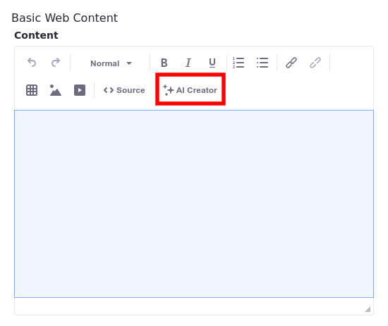

# Generating Content Using AI Creator

You can integrate OpenAI's ChatGPT engine with the [Web Content](adding-a-basic-web-content-article.md) app through the powerful AI Creator tool. With an OpenAI API key configured for your instance or site, you can use the AI Creator feature directly in your Web Content editor and generate content with a few clicks.

## Enabling AI Creator

```important
ChatGPT Integration for Web Content is currently behind a release feature flag. Read [Feature Flags](../../../system-administration/configuring-liferay/feature-flags.md) for more information.
```

You must add an API key to authenticate your access to ChatGPT:

1. Open the *Global Menu*(  ) and navigate to the *Control Panel* tab &rarr; *Instance Settings* (under Configuration).

1. Click *AI Creator* under *Content and Data*.

1. Paste your OpenAI API key into the *API Key* field.

1. Click *Save*.

```note
You can enable or disable the AI Creator button by toggling the Enable OpenAI to Create Content checkbox. If you choose to disable the feature, the button does not appear in the Web Content editor.
```

## Using AI Creator

After [enabling the feature flag and configuring the API Key](#enabling-ai-creator), you can use AI Creator in your web content editor:

1. Open the *Global Menu*(  ) and select your site on the right.
   
1. Open the *Product Menu* (  ) and select the *Web Content* app under Content & Data.
  
1. Click *Add* (  ) to create a Basic Web Content article.
  
1. Click *AI Creator*.

    

1. In the AI Creator modal window, fill in these three fields:

    * **Description**: The desired content (e.g. "A blog post about the sleeping habits of cats").
    * **Tone**: The tone for your text. There are five options available: Neutral, Casual, Friendly, Formal, and Academic.
    * **Word Count**: An approximate word count for your text.

1. Click *Create*.

1. (Optional) If you don't like the AI-generated content, you can click *Try Again* to regenerate the content.

    

1. Click *Add* to insert the content into your web content article.

You can now publish your automatically generated web content article.
