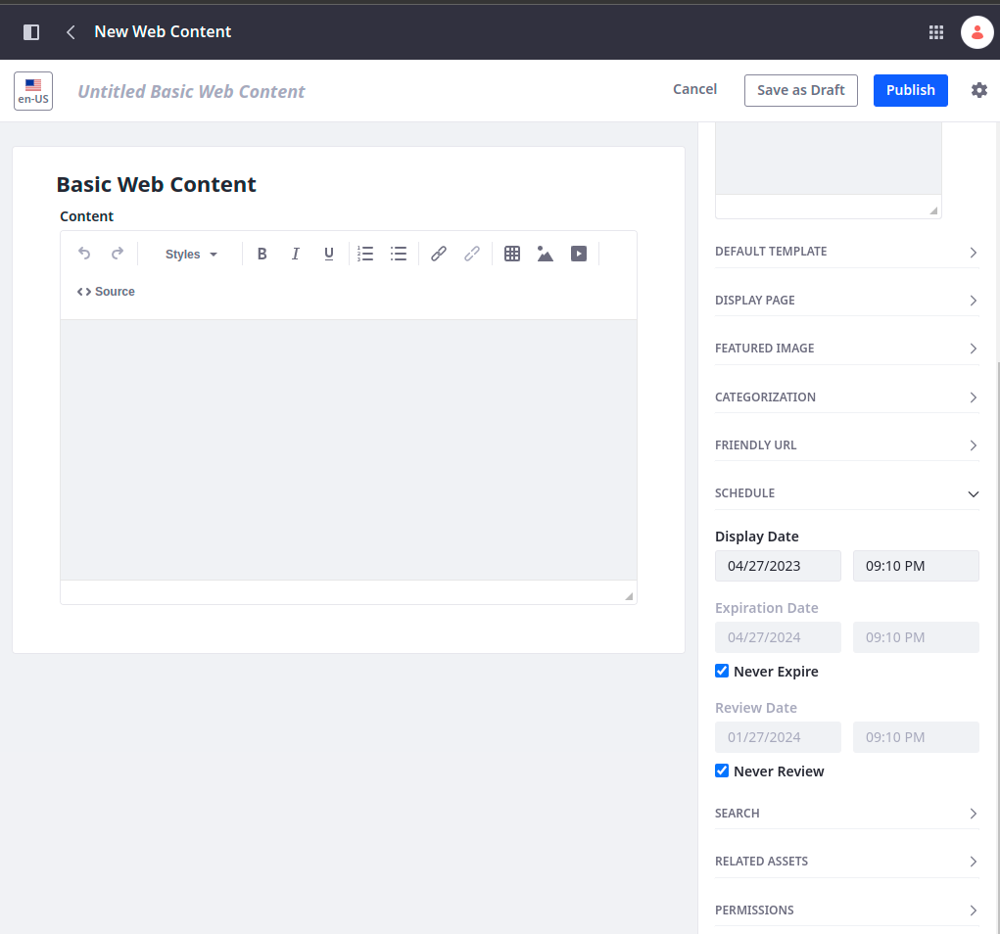
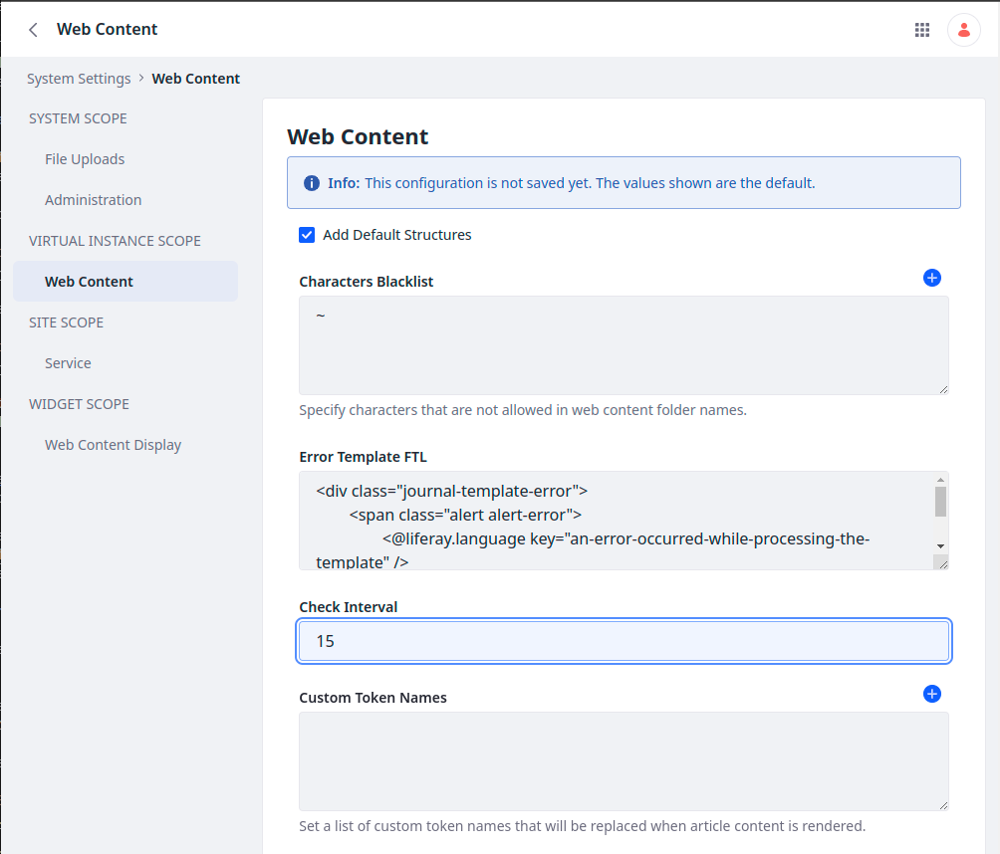

# Using Expiration and Review Dates in Web Content

> Available: Liferay DXP/Portal 7.4+

The Web Content application can set expiration and review dates for web content articles, making it easier to manage time-sensitive content. When enabled, the application checks for any articles that have reached their expiration or review date at configurable intervals, based on the Web Content system setting.

If an article has reached its expiration or review date, a [notification email](#configuring-notification-emails) is automatically sent to file owners, reviewers, and any users subscribed to the folder containing the article.

Additionally, when an article expires, it is deactivated and cannot be used or edited. To reactivate the article, you must change its expiration date, or disable article expiration. While expired, the article cannot be accessed.

By contrast, when an article requires review, it remains available for use. Reaching the article's review date only triggers user notifications and does not affect the article's availability.

## Enabling Expiration and Review Dates

By default, web content articles are set to never expire or require review. However, you can enable and set expiration and review dates when creating or editing articles.

When creating or editing a single article, these settings appear as follows.

When editing multiple articles, expiration is done through the taskbar or action menu.

To activate expiration or review, uncheck the *Never Expire* or *Never Review* checkbox. The default review and expiration dates are set to one year from the time of activation. You can also set a different date and time.

Liferay's system only checks for articles that have reached their expiration or review date according to the set [check interval](#configuring-the-check-interval).

When an expiration or review date has been reached, relevant users are [notified](#configuring-notification-emails). If the article is expired, it is no longer available for use on the platform.

## Configuring the Check Interval

The Web Content application is configured by default to check article expiration and review dates every 15 minutes. But, you can customize this interval through the Control Panel.

1. Open the *Global Menu* (), click on the *Control Panel* tab, and go to *System Settings* &rarr; *Web Content* &rarr; *Web Content*.

1. Use the *Check Interval* field to determine the number of minutes between article checks.

   

1. Click on *Save* when finished.

Once saved, the system will check for articles that have reached their expiration or review date according to the set interval.

## Configuring Notification Emails

When an article expires or requires review, a notification email is sent to the article's owners, reviewers, or any users subscribed to the folder containing the article. The Web Content application provides a default notification message, but you can customize the message.

1. Navigate to the *Web Content* application in a Site or Asset Library.

1. Click on the Actions button () in the Application Bar, and select *Configuration*.

1. In the modal window, click on the *Web Content Review Email* or *Web Content Expired Email* tabs.

   

1. Draft the desired notification message.

1. Click on *Save* when finished.

## Additional Information

* [Adding a Basic Web Content Article](./adding-a-basic-web-content-article.md)
* [Filtering and Sorting Web Content Articles](./filtering-and-sorting-web-content-articles.md)
