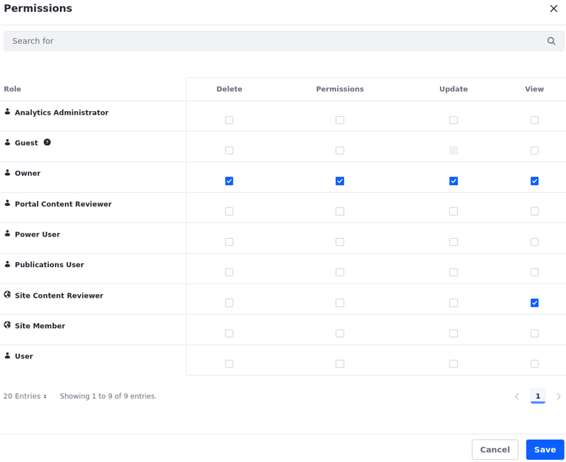

---
taxonomy-category-names:
- Content Management System
- Web Content and Structures
- Liferay Self-Hosted
- Liferay PaaS
- Liferay SaaS
uuid: 54b92a15-9854-49d9-bef3-ff6e74f53c9b
---
# Assigning Permissions to Web Content Structures and Templates

Web content structures and templates provide direct access to Liferay's API. To avoid unauthorized or unintended access to Liferay DXP functionality, you should configure permissions for web content structures and templates.

As a best practice, define two different roles with access to web content structures and templates:

1. **Content Developer:** Users with this role have permission to create and edit web content structures or templates.

1. **Content Creator:** Users with this role have permission to view web content structures or templates, so they can use them to create content.

For information about how to create roles, see [Creating and Managing Roles](../../../users-and-permissions/roles-and-permissions/creating-and-managing-roles.md).

Consider the information below when you assign permissions to web content structures or templates:

* Determine if your roles must have global permissions for all web content structures or templates across the Liferay DXP instance, or only for specific sites.
* The View permission only allows users to view web content structures or templates.
* The majority of users should not be able to edit web content structures or templates.

## Security Considerations for Web Content Templates

Web content templates use the FreeMarker Template Language (FTL) by default. Users with permission to create or edit templates using FreeMarker may execute arbitrary code on your DXP instance and access sensitive information, including information about other users.

```{important}
Grant permission to create or edit web content templates in FreeMarker to trusted users only.
```

You can disable template creation completely. Once disabled, users can no longer access creation options for web content templates. This action does not affect existing templates.

1. Open the *Control Panel* tab in the Global Menu.

1. Go to *Configuration* &rarr; *System Settings* &rarr; *Content and Data* &rarr; *Dynamic Data Mapping*.

1. Click *Dynamic Data Mapping Web*.

1. Uncheck *Enable Template Creation*.

1. Click *Save* or *Update*.

## Assigning Permissions

1. Open the *Site Menu* (  ) and navigate to *Content & Data* &rarr; *Web Content*.

1. Select the *Structures* tab to set permissions for structures, or the *Templates* tab to set permissions for templates.

1. For the web content template where you want to assign permissions, click *Actions* (  ) and select *Permissions*.

1. Select the permissions you need for your roles.

1. Click *Save*.



See [Defining Role Permissions](../../../users-and-permissions/roles-and-permissions/defining-role-permissions.md) for more information on configuring permissions.

## Related Topics

* [Creating Structures](./creating-structures.md)
* [Configuring Structure Fields](./configuring-structure-fields.md)
* [Managing Structures](./managing-structures.md)
