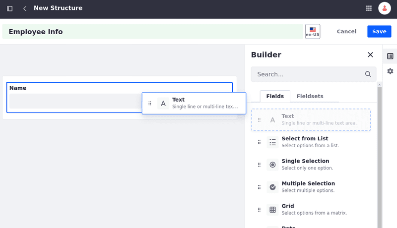
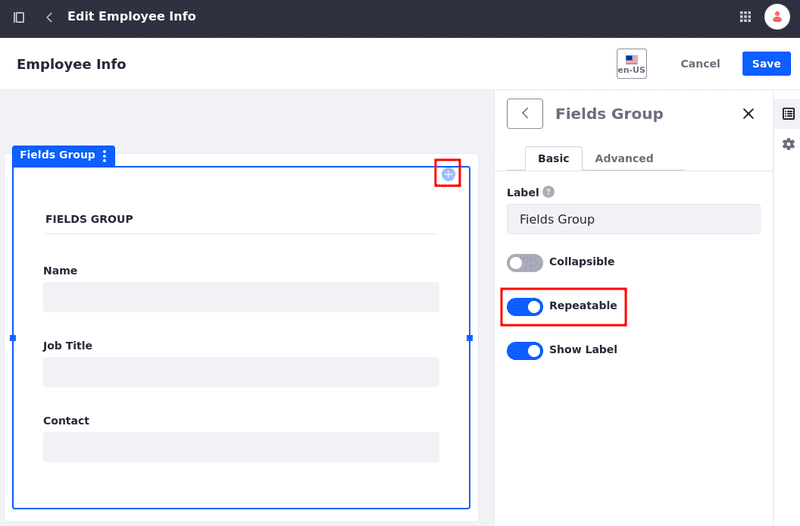
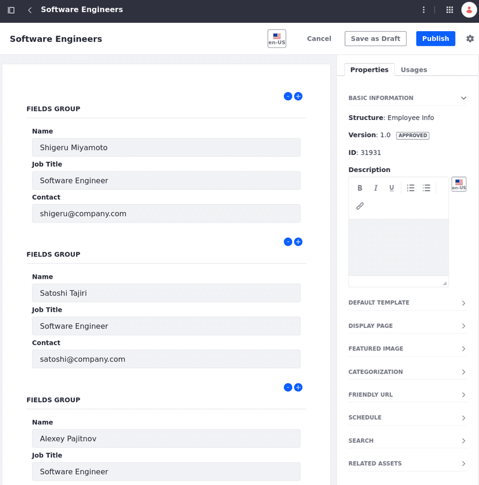
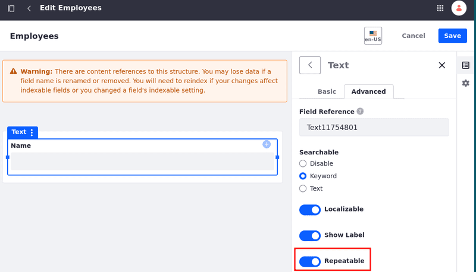
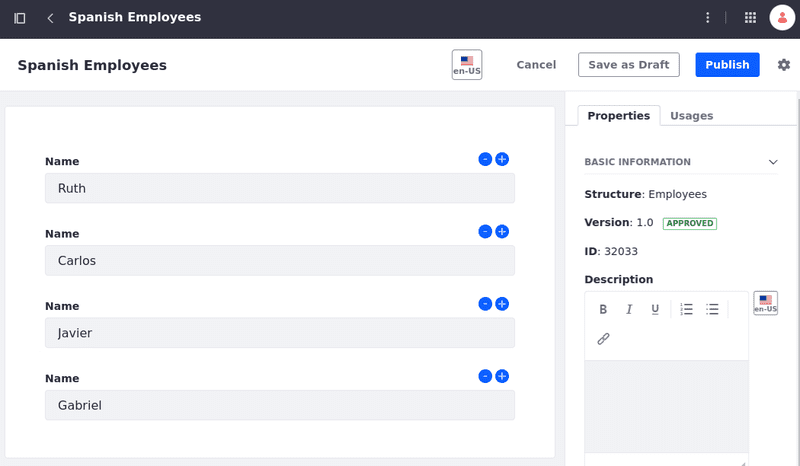
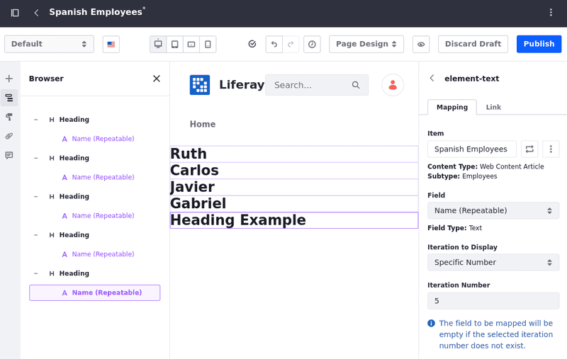

---
taxonomy-category-names:
- Content Management System
- Web Content and Structures
- Fragments
- Liferay Self-Hosted
- Liferay PaaS
- Liferay SaaS
uuid: 5bd46464-470f-4431-af10-3ff5cbbe4206
---

# Mapping Repeatable Fields to Fragments

!!! important
    Currently, this feature is behind a release feature flag (LPD-11377). Read [Release Feature Flags](../../../system-administration/configuring-liferay/feature-flags.md#release-feature-flags) for more information.

{bdg-secondary}`Liferay DXP 2024.Q3+/Portal 7.4 GA132+`

Create dynamic and flexible content displays by integrating repeatable fields within web content structures and articles into elements added to pages. This process involves designing web content structures with repeatable fields, creating articles based on those structures, mapping those fields to fragments, and displaying the content on pages.

Start by [creating a web content structure with repeatable fields](#creating-a-web-content-structure-with-repeatable-fields).

## Creating a Web Content Structure With Repeatable Fields

In this example, create a structure with a repeatable fields group to store basic information about employees in a fictional software company.

1. Open the *Site Menu* (), expand *Content & Data*, and go to *Web Content*.

1. Select the *Structures* tab and click *New*. Name the structure `Employee Info`.

1. Drag and drop a *Text* field to the structure. Change its label to `Name`.

1. Add a second *Text* field on top of the Name field to create a fields group. Label it `Job Title`.

   

1. Add a third *Text* field into the Fields Group to place it at the end of the group. Label it `Contact`.

   

1. Select the Fields Group and, on the right side, toggle the *Repeatable* option on.

   The () icon appears at the top right corner, confirming the fields group is repeatable.

   

1. Click *Save*.

## Creating a Web Content Article

Create a web content article based on the `Employee Info` web content structure and add information about the software engineers in the fictional company.

1. Open the *Site Menu* (), expand *Content & Data*, and go to *Web Content*.

1. Select the *Web Content* tab and click *New*. Choose *Employee Info* structure. Name the article `Software Engineers`.

1. Add a name, a job title, and contact for an employee.

1. Click () and fill in the information for a few more fields groups.

   

1. Click *Publish*.

## Mapping Repeatable Fields in Display Page Templates

Create a display page template and map the repeatable fields of the `Software Engineers` article to fragments within a Collection Display fragment to display the list of software engineers in the company.

1. Open the *Site Menu* (), expand *Design*, and go to *Page Templates*.

1. Select the *Display Page Templates* tab and click *New*. Select a Master Page.

1. Name it `Software Engineers List`, select *Web Content Article* as the Content Type, and *Employee Info* as the Subtype. Click *Save*.

1. In the Fragments and Widgets sidebar, look for the *Collection Display* fragment and drag and drop it into the page.

1. Select the *Collection Display* fragment and, on the right, click *Select Collection*.

   

1. In the modal window that opens, select the *Repeatable Fields Collection Provider* tab and choose the collection you want to display. In this example, it's `Fields Group`.

   

1. Add a *Heading* fragment into the Fields Group collection item.

   

   !!! note
       If the collection display contains more than one item, you can drag the fragment or widget to any of them. The rest of the items in your collection use the same layout settings automatically.

1. Double-click the *Heading* fragment. On the right, under the Mapping tab, select *Name* as the field.

   

1. Repeat the same process to add two more Heading fragments to the first Collection Item and select *Job Title* and *Contact* as their fields.

1. To help visualize the collection items, select the last *Heading* mapped to the Contact field. On the right, select the *Styles* tab. Under Spacing, add a *Spacer 4* as the Margin Bottom.

   

1. Preview the display page template by clicking *None* at the top right corner &rarr; *Select Other Item* &rarr; `Software Engineers`.

   

In the end, you should see the information added to the repeatable fields groups in the `Software Engineers` article.

## Mapping Repeatable Fields to Other Fragments in Content Pages

You can also map repeatable fields to other fragments in content pages and select which iteration to display. In this example, create a simpler web content structure and article with the names of employees in a certain department. Then, map the information to fragments added to a content page.

Start by creating another web content structure and article:

1. Create a simple web content structure named `Employees` with one repeatable *Text* field labeled `Name`.

   

1. Create a web content article based on the Employees structure. Name it however you want and add some names to it. In this example, it's called `Spanish Employees` and it's a list of Spanish employees.

   

Create a content page, add some Heading fragments to it, and map the article's fields to the fragments:

1. Open the *Site Menu* (), expand *Site Builder*, and go to *Pages*.

1. Click *New* &rarr; *Page*. Select the *Blank* template and name it.

1. In the Fragments and Widgets sidebar, look for the *Heading* fragment and drag and drop it into the page.

1. Double-click the *Heading* fragment. On the right, select the `Spanish Employees` article as the Item and *Name (Repeatable)* as the Field.

   The repeatable fields are marked as `(Repeatable)`.

   

1. Choose which *Iteration to Display*: First, Last, or select a Specific Number.

   The iteration numbers start at one. If the specific number doesn't exist, the field appears as empty.

   

This way, you can select and display specific fields from the list of repeatable fields.

## Related Topics

- [Mapping and Linking Fragment Elements](../../../site-building/creating-pages/page-fragments-and-widgets/using-fragments/mapping-and-linking-fragment-elements.md)
- [Mapping Web Content Templates to Fragments](../web-content-templates/mapping-web-content-templates-to-fragments.md)
- [Mapping Calendar Event Fields to Display Page Templates](../../../collaboration-and-social/calendar/mapping-calendar-event-fields-to-display-page-templates.md)
