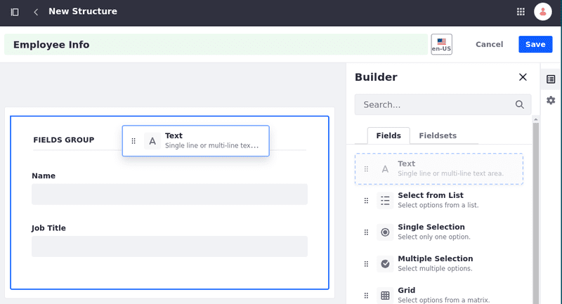
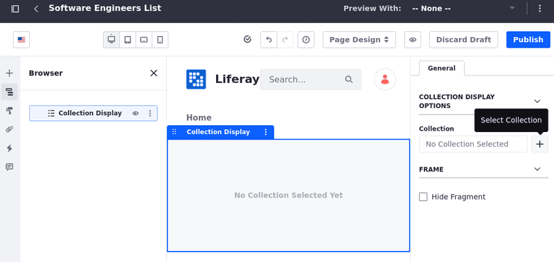
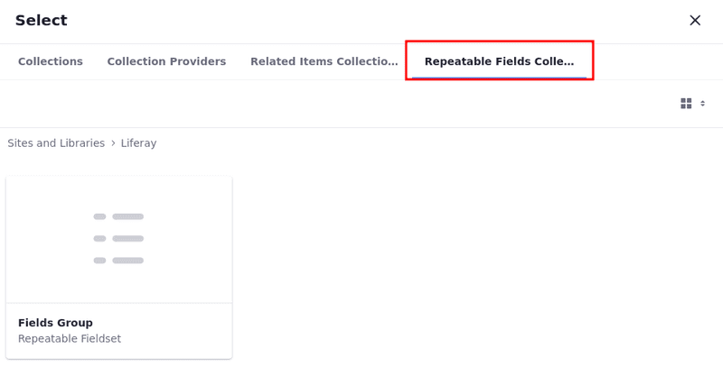
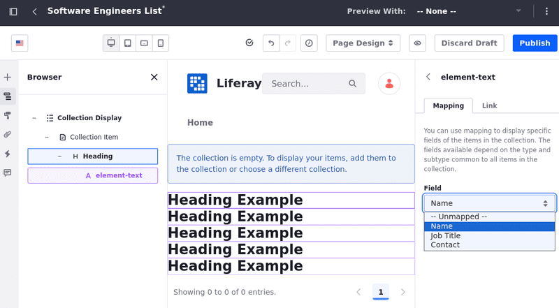
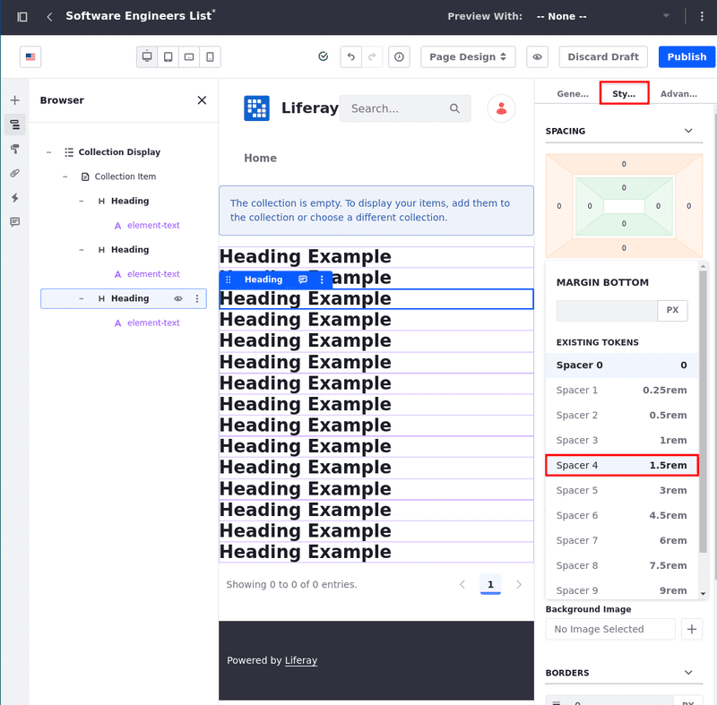
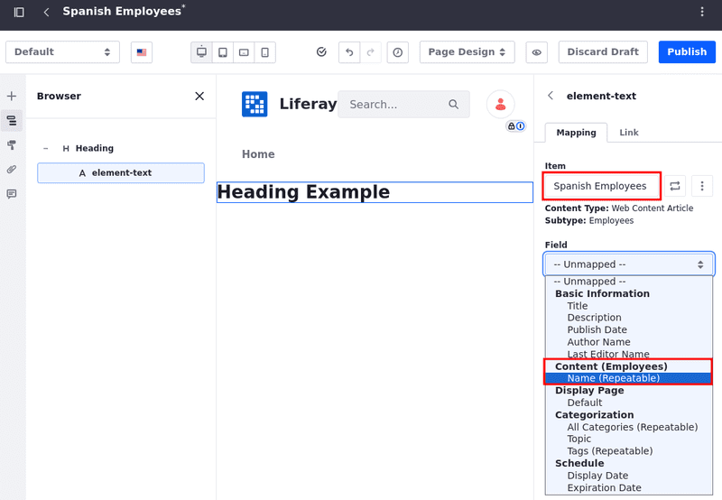
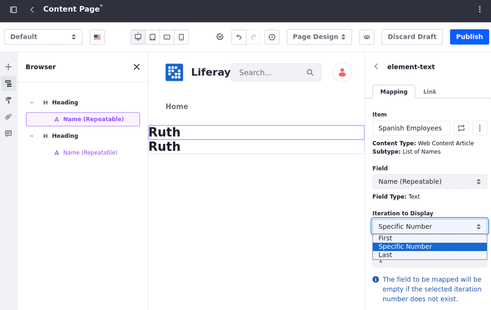

---
taxonomy-category-names:
- Content Management System
- Web Content and Structures
- Fragments
- Liferay Self-Hosted
- Liferay PaaS
- Liferay SaaS
uuid: 5bd46464-470f-4431-af10-3ff5cbbe4206
---

# Mapping Repeatable Fields to Fragments

!!! important
    Currently, this feature is behind a release feature flag (LPD-11377). Read [Release Feature Flags](../../../system-administration/configuring-liferay/feature-flags.md#release-feature-flags) for more information.

{bdg-secondary}`Liferay DXP 2024.Q3+/Portal 7.4 GA132+`

Create dynamic and flexible content displays by integrating repeatable fields within web content structures. This process involves creating web content structures with repeatable fields, mapping those fields to various fragments, and displaying the content on display page templates or content pages.

Start by [creating a web content structure with repeatable fields](#creating-a-web-content-structure-with-repeatable-fields).

## Creating a Web Content Structure With Repeatable Fields

In this example, create a structure with a repeatable fields group to store basic information about employees.

1. Open the *Site Menu* (), expand *Content & Data*, and go to *Web Content*.

1. Select the *Structures* tab and click *New*.

1. Name the structure `Employee Info` and drag and drop a *Text* field to the structure. Change its label to `Name`.

1. Add a second *Text* field on top of the Name field to create a fields group. Label it `Job Title`.

   

1. Add a third *Text* field into the Fields Group to place it at the end of the group. Label it `Contact`.

   

1. Select the Fields Group and, on the right side, toggle the *Repeatable* option on.

   The () icon appears at the top right corner, confirming the fields group is repeatable.

   

1. Click *Save*.

## Creating a Web Content Article Based on the Structure

Create a simple web content article based on the `Employee Info` web content structure.

1. Open the *Site Menu* (), expand *Content & Data*, and go to *Web Content*.

1. Select the *Web Content* tab and click *New*. Choose *Employee Info*.

1. Name the article `Software Engineers` and add a name, a job title, and contact for an employee.

1. Click () and fill in the information for a few more groups.

   

1. Click *Publish*.

## Mapping Repeatable Fields to Collection Display Fragments

Create a display page template and map a Collection Display fragment to the web content article's fields to display the list of software engineers in your company.

1. Open the *Site Menu* (), expand *Design*, and go to *Page Templates*.

1. Select the *Display Page Templates* tab and click *New*. Select a Master Page.

1. Name it `Software Engineers List`, select *Web Content Article* as the Content Type, and *Employee Info* as the Subtype. Click *Save*.

1. In the Fragments and Widgets sidebar, look for the *Collection Display* fragment and drag and drop it into the page.

1. Select the *Collection Display* fragment and, on the right, click *Select Collection*.

   

1. In the modal window that opens, select the *Repeatable Fields Collection Provider* tab and choose the Repeatable Fieldset you want to display. In this example, it's `Fields Group`.

   

1. Add a *Heading* fragment in the Fields Group collection item.

   

   !!! tip
       If the fragments aren't placed correctly inside the fields group, use the *Browser* on the left to reorganize them.

1. Double-click the *Heading* fragment. On the right, under the Mapping tab, select *Name* as the field.

   !!! note
       A fragment is added to each collection item. It looks like multiple fragments are added, but there is only one Heading fragment in the Collection Item. You can confirm that checking the Browser tab on the left.

   

1. Repeat the same process to add two more Heading fragments to the first Collection Item and select *Job Title* and *Contact* as their fields.

1. Select the *last Heading* mapped to the Contact field. On the right, select the *Styles* tab. Under Spacing, add a *Spacer 4* as the Margin Bottom. This helps visualizing the collection items.

   

One last step that helps visualizing the modifications. Click *None* at the top right corner &rarr; *Select Other Item* to preview the display page template using an existing web content article.

Then, select the `Software Engineers` web content article. All the information added to the article appears in the Collection Display fragment.

## Mapping Repeatable Fields to Other Fragments

You can also map repeatable fields to other fragments and select which iteration to display. In this example, start by creating another web content structure and article:

1. Create a simple web content structure named `Employees` with one repeatable *Text* field labeled `Name`.

   

1. Create a web content article based on the Employees structure. Name it however you want and add some names to it. In this example, it's called `Spanish Employees` and it's a list of employees from Spain.

   

Create a content page and map the article's fields to fragments:

1. Open the *Site Menu* (), expand *Site Builder*, and go to *Pages*.

1. Click *New* &rarr; *Page*. Select the *Blank* template and name it.

1. In the Fragments and Widgets sidebar, look for the *Heading* fragment and drag and drop it into the page.

1. Double-click the *Heading* fragment. On the right, select the recently created web content article as the Item and *Name (Repeatable)* as the Field.

   !!! note
       The repeatable fields are marked as `(Repeatable)`. Once you map two repeatable fields, the Iteration to Display option appears.

   

1. Choose which *Iteration to Display*: First, Last, or select a Specific Number.

   If the specific number doesn't exist, the field appears as empty.

   

This way, you can display specific fields from the list of repeatable fields.

## Related Topics

- [Mapping and Linking Fragment Elements](../../../site-building/creating-pages/page-fragments-and-widgets/using-fragments/mapping-and-linking-fragment-elements.md)
- [Mapping Web Content Templates to Fragments](../web-content-templates/mapping-web-content-templates-to-fragments.md)
- [Mapping Calendar Event Fields to Display Page Templates](../../../collaboration-and-social/calendar/mapping-calendar-event-fields-to-display-page-templates.md)
