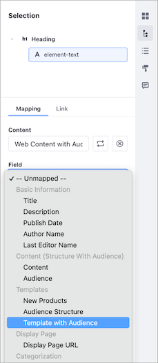

# Mapping Web Content Templates to Fragments
<!--TASK: Relocate to section on Web Content Templates, since this is done on the Web Content side. -->
By default, you can map [web content structure](../../../content-authoring-and-management/web-content/web-content-structures/understanding-web-content-structures.md) fields holding a single value (such as date, numeric, image, number, or text) to fragments. For multi-value fields (such as select from list, radio button, or HTML) you must first render the field using a [web content template](../../../content-authoring-and-management/web-content/web-content-templates/creating-web-content-templates.md); then you can map the template to a fragment.

For example, the *Web Content with Audience* structure on this image contains a Content field of *Text* type and an audience field of *Select from List* type:


You can map the single-value content field directly to a fragment, but you need a web content template to map the multi-value audience field. The [web content template](../../../content-authoring-and-management/web-content/web-content-templates/creating-web-content-templates.md) should use the same structure as the web content article containing the field you want to map. The following image shows this relationship:


```{note}
If you want to map several structure field values to individual fragments, you must create a separate web content template that renders just one field for each field that uses that structure. If you render all your fields in one template, all their values map to the fragment when you select the template.
```

## Mapping a Web Content Template to a Fragment

1. [Create a web content structure](../../../content-authoring-and-management/web-content/web-content-structures/creating-structures.md) that contains the multi-value field you want to map.

1. [Create a web content template](../../../content-authoring-and-management/web-content/web-content-templates/creating-web-content-templates.md) that uses the same structure with the multi-value field (A).

1. In the web content template, under fields (B), select the *variable* (C) with the multi-value field in the structure.

    

1. [Create the web content](../../../content-authoring-and-management/web-content/web-content-articles/adding-a-basic-web-content-article.md) based on the previous web content template.

    

1. On the fragment-supported page (content page, display page template, etc.) [add the fragment](../../../site-building/creating-pages/using-content-pages/adding-elements-to-content-pages.md).

1. On the sidebar panel, click the *Selection* () button and choose the element in the fragment you want to map.

1. Under the Mapping section, [*select and map*](../../../site-building/creating-pages/page-fragments-and-widgets/using-fragments/configuring-fragments/fragment-sub-elements-reference.md#mapping-settings) the web content article that contains the value you want to map.

1. Click the *Field* drop-down menu and select the web content template you created before.

   

1. Click *Publish* to save the changes.

```{warning}
A web content article is reindexed when it is edited and saved, but content pages are reindexed only when published (to conserve resources). Therefore, when a web content article mapped to a cached fragment is updated, the update doesn't appear on the content page until you publish the page again or [unmark the fragment as cacheable](../../creating-pages/page-fragments-and-widgets/using-fragments/managing-fragments.md#managing-individual-page-fragments).
```

## Related Topics

[Using Fragments](../../../site-building/creating-pages/page-fragments-and-widgets/using-fragments.md)

[Understanding Web Content Structures](../../../content-authoring-and-management/web-content/web-content-structures/understanding-web-content-structures.md)

[Creating Web Content Templates](../../../content-authoring-and-management/web-content/web-content-templates/creating-web-content-templates.md)
