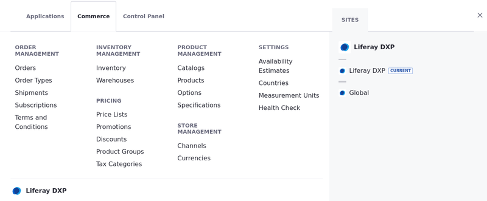

---
taxonomy-category-names:
- Platform
- Site Navigation
- Liferay Self-Hosted
- Liferay PaaS
- Liferay SaaS
uuid: 5e95a054-5432-4645-aafe-b57d6d9c0220
---

# Navigating DXP

Liferay DXP's out-of-the-box navigation is organized into three major areas: [_Site Menu_](#site-menu), [_Personal Menu_](#personal-menu), and [_Global Menu_](#global-menu).

## Site Menu

The DXP _Site Menu_ on the left side of the screen contains actions, content, and configurations that are scoped to the specific site currently being viewed. You can click on the _Site Menu_ () in the application bar to expand or hide it.

The site menu indicates the selected site. In the above example, the site is `Liferay DXP`. You can change what site you are working with by clicking the _Compass_ () in the site menu.

These are some common site building and management activities that can be done in the site menu:

- [Adding pages](../site-building/creating-pages/adding-pages/adding-a-page-to-a-site.md)
- [Creating content](../content-authoring-and-management.md)
- [Managing site memberships](../site-building/sites/site-membership/adding-members-to-sites.md)
- [Configuring and optimizing site behavior and functionality](../site-building.html)

## Applications Bar

The _Application Bar_ appears at the top of each page and [Site Menu](#site-menu) application. The application bar shows an Actions menu () with different options depending on the application that is currently open.

When you open a page in view mode, the available tools in the application bar change depending on the page type.

For [content pages](../site-building/creating-pages/using-content-pages.md) (A), the available tools are

| Tools                                                              | Description                                                                                                                                                                                                        |
| :----------------------------------------------------------------- | :----------------------------------------------------------------------------------------------------------------------------------------------------------------------------------------------------------------- |
| Edit ()                            | Access the page's editor.                                                                                                                                                                                          |
| Configure Page ()    | Access the page's configuration.                                                                                                                                                                                   |
| Simulation ()          | Access preview for different screen sizes and content that users can have on a page.                                                                                                                               |
| Content Performance () | Opens the [Content Performance tool](./../content-authoring-and-management/page-performance-and-accessibility/about-the-content-performance-tool.md), which helps analyze your content performance quantitatively. |
| A/B Test ()              | Opens the [A/B Testing tool](./../site-building/optimizing-sites/ab-testing/ab-testing.md), which evaluates the effectiveness of content pages by testing a variant design against the current design.             |
| Page Audit ()         | Opens the [Page Audit tool](./../content-authoring-and-management/page-performance-and-accessibility/about-the-page-audit-tool.md), which helps users identify performance-related issues.                         |

For [widget pages](../site-building/creating-pages/using-widget-pages/adding-widgets-to-a-page.md) (B), the available options are

| Tools                                                              | Description                                                                                                                                                                                                        |
| :----------------------------------------------------------------- | :----------------------------------------------------------------------------------------------------------------------------------------------------------------------------------------------------------------- |
| Configure Page ()    | Access the page's configuration.                                                                                                                                                                                   |
| Toggle Controls ()   | Enable/Disable a widget's controls that pop up when you hover your cursor over them.                                                                                                                               |
| Add ()                              | Access the page's editor.                                                                                                                                                                                          |
| Simulation ()          | Access preview for different screen sizes and content that users can have on a page.                                                                                                                               |
| Content Performance () | Opens the [Content Performance tool](./../content-authoring-and-management/page-performance-and-accessibility/about-the-content-performance-tool.md), which helps analyze your content performance quantitatively. |
| Page Audit ()         | Opens the [Page Audit tool](./../content-authoring-and-management/page-performance-and-accessibility/about-the-page-audit-tool.md), which helps users identify performance-related issues.                         |

!!! note
The application bar options for content and widget pages depend on your Liferay DXP version. [Content Performance](../content-authoring-and-management/page-performance-and-accessibility/about-the-content-performance-tool.md) is available for content pages starting with Liferay DXP 7.3 and for widget pages starting with Liferay DXP 7.4. Page Audit is available starting with Liferay DXP 7.4, and the Toggle Controls option is available starting with Liferay DXP 7.3.

## Personal Menu

The _Personal Menu_ is the hub for information and activities for a user that is logged in.

These are several common actions that users can perform from the personal menu:

- [Change account information](./introduction-to-the-admin-account.md#changing-account-information)
- [See what sites they are members of](../site-building/sites/site-membership/adding-members-to-sites.md)
- [Review site notifications](../collaboration-and-social/notifications-and-requests/user-guide/managing-notifications-and-requests.md)
- [Sign out](./introduction-to-the-admin-account.md#signing-out)

## Global Menu

The DXP _Global Menu_ contains the [Applications](#applications-menu), [Commerce](#commerce-menu), and [Control Panel](#control-panel) menus. Click the _Global Menu_ () at the top right corner of the screen to access it.

!!! note
By default, users with the _Guest_ or _User_ roles are not able to access the global menu.

You can also navigate to other sites available to you from either the Applications, Commerce, or Control Panel tabs in the global menu, on the right side of the interface.

### Applications Menu

The _Applications Menu_ contains a variety of links to manage many different applications within your Liferay DXP server.

Here are some of the applications that can be managed from the applications menu:

- [Content Dashboard](../content-authoring-and-management/content-dashboard.md)
- [Workflow](../process-automation/workflow/introduction-to-workflow.md)
- [Remote Apps](../liferay-development/customizing-liferays-look-and-feel.md#custom-element-client-extensions)

### Commerce Menu

Beginning in Liferay 7.3 CE GA6 and Liferay DXP 7.3 GA1, Liferay Commerce 3.0 is now bundled with Liferay Portal 7.3 CE GA6 and Liferay DXP 7.3 GA1.

Here are some functions that can be managed from Liferay Commerce:

- [Creating a New Catalog](https://learn.liferay.com/commerce/latest/en/product-management/catalogs/creating-a-new-catalog.html)
- [Creating a New Channel](https://learn.liferay.com/commerce/latest/en/starting-a-store/channels/managing-channels.html)
- [Manage Inventory](https://learn.liferay.com/commerce/latest/en/inventory-management.html)
- [Process Orders](https://learn.liferay.com/commerce/latest/en/order-management/orders/processing-an-order.html)

To learn more about Liferay Commerce, see [Introduction to Liferay Commerce](https://learn.liferay.com/commerce/latest/en/starting-a-store/introduction-to-liferay-commerce.html).

### Control Panel

The _Control Panel_ contains general administrative actions and configurations that can be scoped globally to the Liferay DXP installation or to a particular instance.

Here are some common administrative activities that can be done in the control panel:

- [Manage users, permissions, and roles](../users-and-permissions/users/adding-and-managing-users.md)
- [Change how users login](../installation-and-upgrades/securing-liferay/authentication-basics.md)
- [Create new sites](../site-building/sites/adding-a-site.md)
- [Add new custom fields to applications on the site](./../system-administration/configuring-liferay/adding-custom-fields.md)

## DXP 7.1 and 7.2

In Liferay DXP versions prior to 7.3, the contents of the global menu are found within the control panel, which is located above the site menu on the left side of the screen.

## What's Next

Continue our Getting Started walkthrough and learn about [Creating Your First Site](./creating-your-first-site.md).

## Related Topics

- [Creating Your First Site](./creating-your-first-site.md)
- [Changing Your Site's Appearance](./changing-your-sites-appearance.md)
