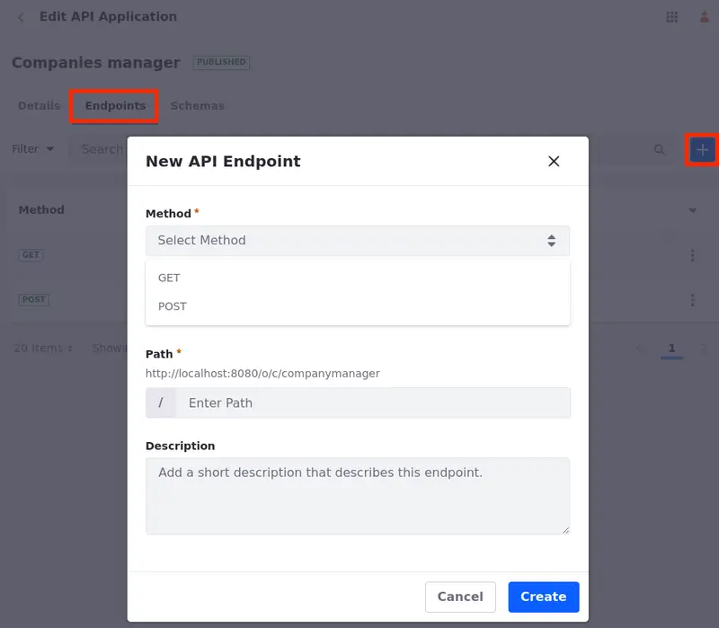
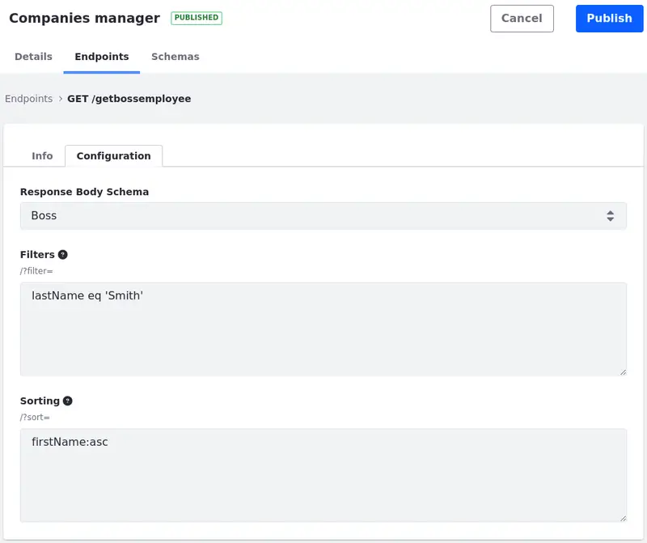

# API Builder
{bdg-secondary}`Liferay DXP 2023.Q4+/Portal 7.4 GA96+`
{bdg-link-primary}`[Beta Feature](../system-administration/configuring-liferay/feature-flags.md#beta-feature-flags)`

!!! important
   This feature is currently behind a [beta feature flag](../../system-administration/configuring-liferay/feature-flags.md#beta-feature-flags). API endpoints currently support retrieving and creating collections of entities.

The API builder makes it easy for you to create custom API applications in Liferay. Create API schemas and endpoints that meet your exact needs.

## Using the API Builder

Each custom API application can house multiple endpoints and schemas. This is similar to Liferay's out-of-the-box API applications. For example, the `headless-admin-user` API application houses endpoints for `accounts`, `organizations`, `roles`, `user-accounts`, etc.

!!! note
    The API Builder is configured at an instance-level scope. Create different API applications that are unique to each virtual instance. To re-create an API application in another instance, use the [data migration center](./consuming-apis/data-migration-center.md).

To use the API Builder application,

1. Open the *Global Menu* (), select the *Control Panel* tab, and click *API Builder* under Object.

1. See a list of your custom API applications.

   The title, URL, description, last update, and status appear for each API application.

   

From the API Builder, you can also [create](#creating-custom-api-applications) and [manage](#managing-custom-api-applications) custom API applications.

### Creating Custom API Applications

1. While in the [API Builder](#using-the-api-builder), click *Add* () and fill in the requested information.

1. Add the Title, the URL, and (optionally) a description for your API.

   !!! note
       The URL has a limit of 255 characters., and it must contain only numbers, letters, or dashes.

1. Click *Create*.

### Managing Custom API Applications

Use the Actions menu () next to the API application to manage it. Choose one of the available options:

- **Edit**: edit your API application.

   You can also click on the name of the API application to edit it.

- **Delete**: delete your API application.

- **Change Publication Status**: change your publication status from published to unpublished or vice versa.

   An API application that has an unpublished status can be used only after it is published. Once published, the generated APIs have the same set of features as Liferay's out-of-the-box APIs (i.e. pagination, filtering, sorting, etc.)

### Editing Custom API Applications

Once the [API application is created](#creating-custom-api-applications), edit it to create new [endpoints](#creating-and-managing-endpoints) and [schemas](#creating-and-managing-schemas) that work similarly to Liferay's out-of-the-box API applications.

To edit an API application, find the API application you want to edit and click on its name. You can also edit the API application through the Actions menu () next to the application and selecting *Edit*.

## Creating and Managing Endpoints
{bdg-secondary}`Liferay DXP 2024.Q1+ U112`
{bdg-link-primary}`[Beta Feature](../system-administration/configuring-liferay/feature-flags.md#beta-feature-flags)`

!!! important
   This feature is currently behind a [beta feature flag](../../system-administration/configuring-liferay/feature-flags.md#beta-feature-flags) (LPS-178642). API endpoints currently support retrieving and creating collections of entities.

API endpoints are the specific URL locations that accept requests.

To see, manage, and create endpoints,

1. Start [editing your API application](#editing-custom-api-applications) and select the *Endpoints* tab to see a list of your custom endpoints.

   The method, URL path, description, and last update are shown for each endpoint.

To create a new endpoint,

1. Click *Add* () and enter your details.

1. Select one of two methods, [GET](#creating-an-endpoint-using-the-get-method) or [POST](#creating-an-endpoint-using-the-post-method).

   The GET method requests and retrieves data from a specified source while the POST method is used to submit data to be processed to a specified source.

Here are the differences when creating an endpoint using a GET or a POST method:

| Detail | GET | POST |
| :--- | :---: | :---: |
| Retrieve Type | Collection or Single Element | &#10006; |
| Scope | Company or Site | Company or Site |
| Path | Path + Parameter | Path |
| Description | &#10004; | &#10004; |

### Creating an Endpoint Using the GET Method

Endpoints can be scoped for instance or site. Select the scope based on your object's scope. Click the *Configuration* tab to configure the endpoint. Select a schema to use with the endpoint.

JSON filtering can be incorporated into the endpoint. For example, `filter=lastName eq 'Smith'` could be used to filter the endpoint for entries that contain a last name Smith. 

JSON sorting can also be incorporated. For example `sort=firstName:asc` could be used to sort the entries alphabetically by first name.

See [API query parameters](./consuming-apis/api-query-parameters.md) to learn more about filtering and sorting.

To manage endpoints,

1. To edit or delete an endpoint, click *Options* () and click *Edit* or *Delete*.

### Creating an Endpoint Using the POST Method

## Creating and Managing Schemas

API schemas specify what entities are returned (or received) by your API. To manage schemas, click into one of your custom API applications and click the *Schemas* tab. See a list of your custom schemas. The name, description, and last update are shown for each schema.

To create a new schema, click *Add* () and enter your details. Then click the new schema's *Properties* tab and select the entities you want included. Select from the various entities that are available from your [Liferay object](../building-applications/objects/creating-and-managing-objects.md). If the object has [object relationships](../building-applications/objects/creating-and-managing-objects/relationships.md), the entities from those objects can be selected also. 

Note, an object's property names can be renamed to suit your needs. For example, for the `student` object in the screenshot, change `First Name` to `Given Name`.

To edit or delete a schema, click *Options* () and click *Edit* or *Delete*.

## Next Steps

* [Building a Sample API Application](./api-builder/building-a-sample-api-application.md)
