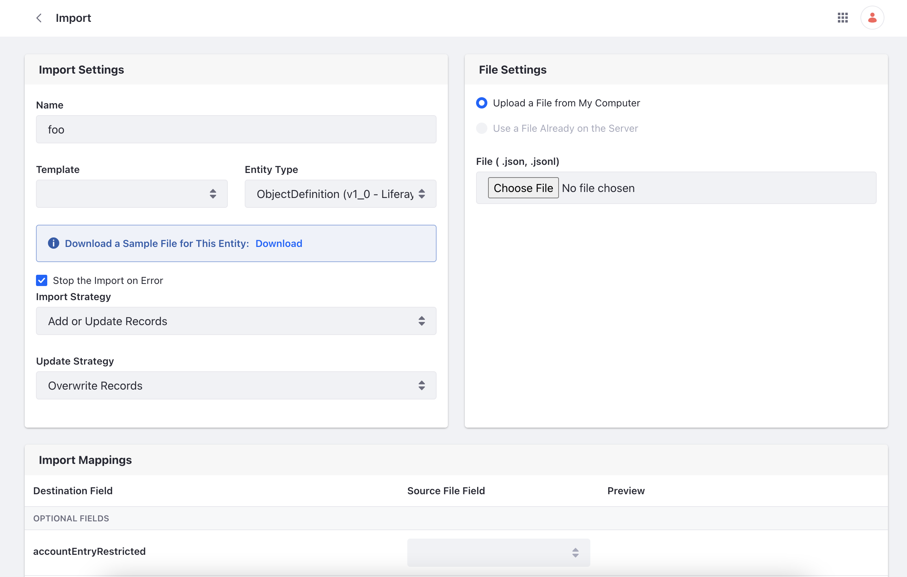
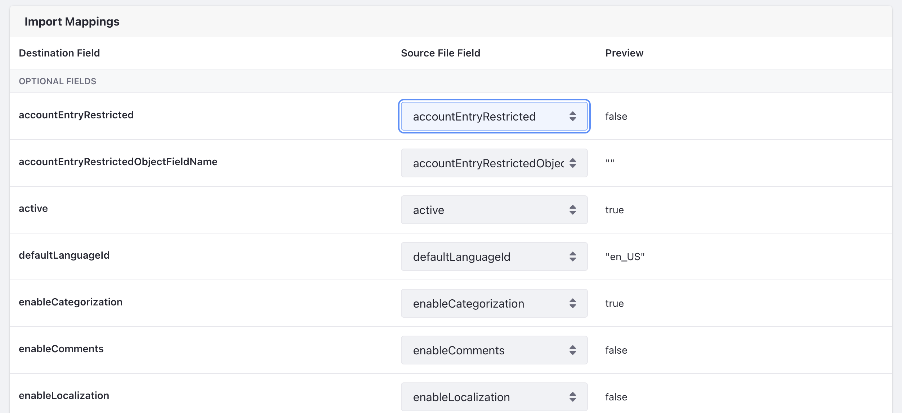

# Data Migration Center

{bdg-secondary}Liferay DXP/Portal 7.4+
{bdg-link-primary}`[Beta Feature](../../system-administration/configuring-liferay/feature-flags.md#beta-feature-flags)`

```{important}
The data migration center is a beta feature that currently only supports the import and export of object definitions and object entries.
```

The data migration center makes it easy for you to move your object definitions and object entries between Liferay installations. 

To enable the data migration center, add the following [portal properties](../../installation-and-upgrades/reference/portal-properties.md) to your `portal-ext.properties` file:

```properties
feature.flag.COMMERCE-8087=true
```

Or enable it in Docker with the following environment property:

```properties
LIFERAY_FEATURE_PERIOD_FLAG_PERIOD__UPPERCASEC__UPPERCASEO__UPPERCASEM__UPPERCASEM__UPPERCASEE__UPPERCASER__UPPERCASEC__UPPERCASEE__MINUS__NUMBER8__NUMBER0__NUMBER8__NUMBER7_=true
```

Start up Liferay and navigate to _Global Menu_ () &rarr; _Applications_ &rarr; _Data Migration Center_.


Click the _Import and Export_ tab to see a list of import and export tasks and their status. Click the _options_ () icon to download files from previous tasks.

Click the _Templates_ tab to see a list of import and export templates.

## Exporting Object Definitions 

To export object definitions,

1. Click _add_ () and select _Export File_.

1. (Optional) In the next page, select an export template if using a previously saved template.

1. Select _ObjectDefinition (v1_0 - Liferay Object Admin REST)_ as the entity type.

1. Select one of the export file formats. 

   ```{note}
   Note that the data migration center only supports the JSON and JSONL file format for importing.

   If exporting to use in conjunction with batch client extensions, select the JSONT file format. JSONT is required for `*.batch-engine-dat.json` files.
   ```
1. Under the fields section, select the object definition fields you wanted included in the export.

   

1. Click _Save as Template_ to save the export settings for future use. Give the template a name and click _Save_.

1. Finally, click _Export_ to export the object definitions.

1. A window will pop up to display the export process. When the job is completed, click _Download_ to download a zip file.

   

   The zip file is downloaded to your local machine.

## Exporting Object Entries

To export object entries,

1. Click _add_ () and select _Export File_.

1. (Optional) In the next page, select an export template if using a previously saved template.

1. Under entity type, select the object you wish to work with. See [creating and managing objects](../../building-applications/objects/creating-and-managing-objects.md) to learn more about objects.

1. Select one of the export file formats. 

1. Under the fields section, select the object definition fields you wanted included in the export.

1. Click _Save as Template_ to save the export settings for future use. Give the template a name and click _Save_.

1. Finally, click _Export_ to export the object entries.

1. A window will pop up to display the export process. When the job is completed, click _Download_ to download a zip file. The zip file is downloaded to your local machine.

## Importing Object Definitions

To import object definitions,

1. Click _add_ () and select _Import File_.

1. In the next page, input a name for the new import task.

1. (Optional) Select an import template if using a previously saved template.

1. Select _ObjectDefinition (v1_0 - Liferay Object Admin REST)_ as the entity type.

1. Use the checkbox to select whether to have the import task stop or continue upon error.

1. Under import strategy, select an option to either _Add or Update Records_ or _Only Add New Records_. Note, when _Only Add New Records_ is selected, if the entity already exists, the import task will result in an error. Select _Add or Update Records_ instead to have the data migration center overwrite the existing entity.

1. Under update strategy, select an option to either _Update Changed Record Fields_ or _Overwrite Records_. Note, when _Overwrite Records_ is selected, the whole entity will be updated. When _Update Changed Record Fields_ is selected, only the fields defined in the import file is updated while the rest of the existing values are left alone.

1. Under file settings, click _Choose File_ and locate the JSON file that contains the object definitions to import.

   

1. Under import mappings, make any mapping changes you wish by selecting the drop-down list under source file field. 

   

1. Click _Save as Template_ to save the export settings for future use. Give the template a name and click _Save_.

1. Click _Next_ to continue the import. In the pop up window, click _Start Import_.

1. The pop up window will show the progress of the import. Click _Close_ when completed. Note, if an error occurs in the import process, return to the main data migration page and click the _options_ () icon to download an error report.

1.  Navigate to _Global Menu_ () &rarr; _Control Panel_ &rarr; _Objects_ to verify the imported object.

## Importing Object Entries

To import object entries,

1. Click _add_ () and select _Import File_.

```{note}
Make sure your object exists before attempting to import its entries.
```

1. In the next page, input a name for the new import task.

1. (Optional) Select an import template if using a previously saved template.

1. Under entity type, select the object you wish to work with.

1. Use the checkbox to select whether to have the import task stop or continue upon error.

1. Under import strategy, select an option to either _Add or Update Records_ or _Only Add New Records_. Note, when _Only Add New Records_ is selected, if the entity already exists, the import task will result in an error. Select _Add or Update Records_ instead to have the data migration center overwrite the existing entity.

1. Under update strategy, select an option to either _Update Changed Record Fields_ or _Overwrite Records_. Note, when _Overwrite Records_ is selected, the whole entity will be updated. When _Update Changed Record Fields_ is selected, only the fields defined in the import file is updated while the rest of the existing values are left alone.

1. Under file settings, click _Choose File_ and locate the JSON file that contains the object definitions to import.

1. Under import mappings, make any mapping changes you wish by selecting the drop-down list under source file field. 

1. Click _Save as Template_ to save the export settings for future use. Give the template a name and click _Save_.

1. Click _Next_ to continue the import. In the pop up window, click _Start Import_.

1. The pop up window will show the progress of the import. Click _Close_ when completed. Note, if an error occurs in the import process, return to the main data migration page and click the _options_ () icon to download an error report.

## Related Topics

* [Creating and Managing Objects](../../building-applications/objects/creating-and-managing-objects.md)
* [Batch Client Extensions](../../building-applications/client-extensions/batch-client-extensions.md)
* [Batch Engine API Basics - Importing Data](./batch-engine-api-basics-importing-data.md)
* [Batch Engine API Basics - Exporting Data](./batch-engine-api-basics-exporting-data.md)