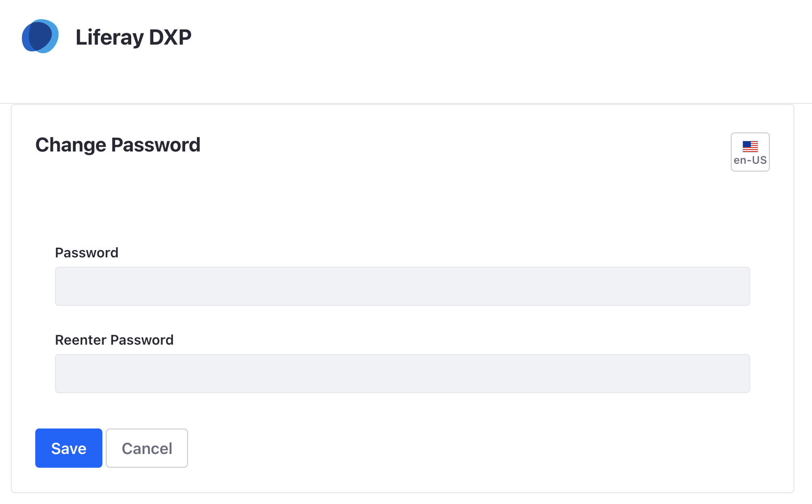

---
toc:
  - ./using-liferay-docker-images/container-lifecycle-and-api.md
  - ./using-liferay-docker-images/configuring-containers.md
  - >-
    ./using-liferay-docker-images/installing-apps-and-other-artifacts-to-containers.md
  - ./using-liferay-docker-images/licensing-dxp-in-docker.md
  - ./using-liferay-docker-images/patching-dxp-in-docker.md
  - ./using-liferay-docker-images/running-scripts-in-containers.md
  - ./using-liferay-docker-images/providing-files-to-the-container.md
  - ./using-liferay-docker-images/upgrading-to-a-new-docker-image.md
  - ./using-liferay-docker-images/docker-image-versions.md
uuid: 5bcfb2c0-360e-4bf4-826a-5dcea4c8c638
---
# Using Liferay Docker Images

```{toctree}
:maxdepth: 3

using-liferay-docker-images/container-lifecycle-and-api.md
using-liferay-docker-images/configuring-containers.md
using-liferay-docker-images/installing-apps-and-other-artifacts-to-containers.md
using-liferay-docker-images/licensing-dxp-in-docker.md
using-liferay-docker-images/patching-dxp-in-docker.md
using-liferay-docker-images/running-scripts-in-containers.md
using-liferay-docker-images/providing-files-to-the-container.md
using-liferay-docker-images/upgrading-to-a-new-docker-image.md
using-liferay-docker-images/docker-image-versions.md
```

Docker Hub hosts [Liferay DXP](https://hub.docker.com/r/liferay/dxp) and [Liferay Portal](https://hub.docker.com/r/liferay/portal) Docker images, bundled with Tomcat on Linux. The Liferay Docker Hub pages provide image details and tags for the different releases.

* [Liferay DXP Images](https://hub.docker.com/r/liferay/dxp)
* [Liferay Portal Images](https://hub.docker.com/r/liferay/portal)

These containers are standard Docker containers that can be started and stopped as such. The following examples use [Docker CLI (`docker`)](https://docs.docker.com/engine/reference/commandline/docker/), but you can use whatever Docker container tools you like.

## Starting a Container for the First Time

The containers listens on port `8080` and starts like all Docker containers.

1. [Run a container](https://docs.docker.com/engine/reference/commandline/run/) that maps a host port (e.g., `8080`) to the container's `8080` port.

    ```bash
    docker run -it -m 8g -p 8080:8080 [$LIFERAY_LEARN_PORTAL_DOCKER_IMAGE$]
    ```

    The container runs and prints log messages, including this Tomcat startup completion message:

    ```
    INFO [main] org.apache.catalina.startup.Catalina.start Server startup in [xx,xxx] milliseconds
    ```

    ```{note}
    Memory, CPUs, and other Docker container resources are configurable. The `-m 8g` command arguments above set the container's memory limit to eight gigabytes. See the [Docker runtime options](https://docs.docker.com/config/containers/resource_constraints/) for details.
    ```

1. Sign in to Liferay at `<http://localhost:8080>` using the email address _test@liferay.com_ and the password _test_. When prompted, change your password.

    

Liferay is ready to use.

```{note}
`docker container ls` lists each running container, including its ID and name. `docker container ls -a` lists all of your containers, including ones that aren't running.
```

## Viewing Logs

Liferay log messages and log files are available to view live and to copy to your host.

### `docker logs` commands

The [`docker logs`](https://docs.docker.com/engine/reference/commandline/logs/) command prints container log messages.

| Command | Result |
| :------ | :----- |
| `docker logs [container]` | Outputs all of the current log messages |
| `docker logs -f [container]` | Streams new log messages, like `tail -f [file]` does |
| `docker logs -t [container]` | Appends a time stamp to each log message |

### `docker cp` command

You can use a [`docker cp`](https://docs.docker.com/engine/reference/commandline/cp/) command like the one below to copy a log file to your host machine.

```bash
docker cp [container]:/opt/liferay/logs/liferay.[timestamp].log .
```

## Stopping a Container

Here are two ways to stop the container.

| Method | Pros | Cons |
| :----- | :--- | :--- |
| `docker exec [container] /opt/liferay/tomcat/bin/shutdown.sh` | Allows Liferay, Tomcat, and other apps to free resources. The container entry point runs any [post-shutdown scripts](./using-liferay-docker-images/container-lifecycle-and-api.md#post-shutdown-phase-api). | |
| `Ctrl-C` in the terminal session where you are running with the `-i` argument.<br><br>Note, this sends a [`SIGINT` or `SIGKILL` signal to the attached container](https://docs.docker.com/engine/reference/commandline/attach/#extended-description). | Fastest method to stop the container. | Liferay, Tomcat, and the container entry point stop immediately, without freeing resources. The entry point's [post-shutdown phase](./using-liferay-docker-images/container-lifecycle-and-api.md#post-shutdown-phase-api) is skipped. Don't use this method in production environments |

## Restarting a Container

The containers can be restarted like all Docker containers.

```bash
docker start [container]
```

```{warning}
When a container is restarted, its entry point runs again (Please see [Container Lifecycle and API](./using-liferay-docker-images/container-lifecycle-and-api.md#lifecycle)). Make sure any [scripts you're executing](./using-liferay-docker-images/running-scripts-in-containers.md) via the entry point can run again safely.
```

```{tip}
Run `docker container ls -a` to look up your container's name or ID.
```

Now you know the basics of starting, stopping, and monitoring a Liferay container.

## What's Next

If you want to know what the container entry point does and learn the container's API, see the [Container Lifecycle and API](./using-liferay-docker-images/container-lifecycle-and-api.md). If you want to start using the containers, exercise one of the following use cases:

* [Configuring Containers](./using-liferay-docker-images/configuring-containers.md)
* [Installing Apps and Other Artifacts to Containers](./using-liferay-docker-images/installing-apps-and-other-artifacts-to-containers.md)
* [Patching DXP in Docker](./using-liferay-docker-images/patching-dxp-in-docker.md)
* [Providing Files to the Container](./using-liferay-docker-images/providing-files-to-the-container.md)
* [Upgrading to a New Docker Image](./using-liferay-docker-images/upgrading-to-a-new-docker-image.md)
* [Docker Image Versions](./using-liferay-docker-images/docker-image-versions.md)
