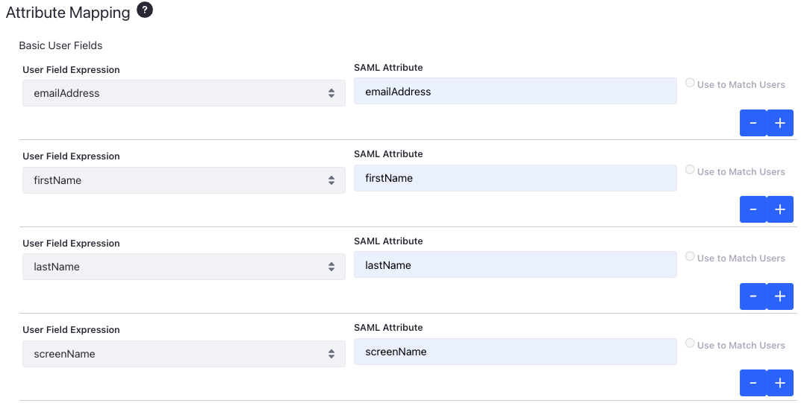

# Importing User Groups' Memberships from an External IdP through SAML

When using an external identity provider (IdP) for signing on to Liferay, you would want to import user groups' memberships also. To do this, register the IdP as a SAML Service Provider and configuring the necessary fields. This example uses Okta as the external IdP, but you can follow the instructions and apply it to other IdPs that send multi valued attributes using the same XML structure. Given below is the XML structure for user groups:

```xml
<saml2:Attribute Name="userGroup" NameFormat="urn:oasis:names:tc:SAML:2.0:attrname-format:unspecified">
      <saml2:AttributeValue xmlns:xs="http://www.w3.org/2001/XMLSchema"
                           xmlns:xsi="http://www.w3.org/2001/XMLSchema-instance"
                           xsi:type="xs:string"
                           >Okta-UserGroup2
      </saml2:AttributeValue>
      <saml2:AttributeValue xmlns:xs="http://www.w3.org/2001/XMLSchema"
                           xmlns:xsi="http://www.w3.org/2001/XMLSchema-instance"
                           xsi:type="xs:string"
                           >Okta-UserGroup1
      </saml2:AttributeValue>
</saml2:Attribute>
```

## Okta Configuration

### Creating a SAML 2.0 App

The following steps walk through the creation of a SAML 2.0 application on Okta and using it as the IdP to sign on to Liferay. This section assumes that you already have an account on Okta. 

1. Login to the Okta admin dashboard.

1. Navigate to *Applications* &rarr; *Applications*, and click *Create App Integration*. 

1. Select *SAML 2.0* and click *Next*.

1. Enter the name as *liferaysaml* and click *Next*.

1. Enter the following under *General*, in the *SAML Settings* section: 

   **Single sign-on URL:** `http://[IP_ADDRESS]:[PORT_NUMBER]/c/portal/saml/acs` (If you're running a local Liferay instance, this would be `http://localhost:8080/c/portal/saml/acs`)

   **Audience URI (SP Entity ID):** `okta-saml`

   **Name ID Format:** `EmailAddress`

   **Application username:** `Custom` (Set the next blank field as `user.email`)

   

1. Add the following under *Attribute Statements*: 

   **firstName (Unspecified):** `user.firstName`

   **lastName (Unspecified):** `user.lastName`

   **emailAddress (Unspecified):** `user.email`

   **screenName (Unspecified):** `user.firstName`

1. Add the following under *Group Attribute Statements*:

   **userGroup (Unspecified):** *Starts with* `Okta` (This assumes that your user groups on Okta start with the prefix `Okta`. For example: `Okta-UserGroup-1`)

   

1. Click *Next*.

1. Select one of the radio buttons based on what suits you best and click *Finish*. 

```{note}
The instructions above assume that you already have a set of users on Okta belonging to different groups (starting with the prefix `Okta`). Okta recommends using either [keywords or regex](https://support.okta.com/help/s/article/How-to-pass-a-user-s-group-membership-in-a-SAML-Assertion-from-Okta?language=en_US) to define group memberships. These groups are matched by their name to user groups in Liferay.
```

### Saving the Metadata

The last step before moving to your Liferay instance is to save the SAML metadata. 

1. Navigate to *Applications* &rarr; *Applications*, and select *liferaysaml*.

1. You can view the *Assignments* tab by default. Click on *Assign* and select *Assign to People*. Search for users that can login to Liferay using this SAML app and click *Assign*. You can also select by groups here. 

   

1. Click *Done*. 

1. Select the *Sign On* tab. 

1. On the right side, click on *View SAML setup instructions*. 

1. On the new screen, scroll down to the *Optional* section. Copy the entire block of XML code and paste it in a new file named `oktasamlmetadata.xml`.


## Liferay Configuration

Now, you must set Okta as a service provider in Liferay's SAML Admin. 

1. Open the *Global Menu* () and navigate to *Control Panel* &rarr; *SAML Admin*. 

1. In the General tab, enter *okta-saml* as the Entity ID. 

1. Click *Create Certificate*. 

1. In the new window, enter *okta-saml* as the *Common Name* and the *learn* as the *Key Password*.

1. Click *Save*.

1. Under *Identity Provider Connections*, click Add Identity Provider.

1. Enter *Okta* as the name. 

1. Copy the entity ID from the `oktasamlmetadata.xml` file and paste it here.

1. Check the *Enabled* checkbox. 

1. Under *Metadata*, click *Upload Metadata XML* and select the file created earlier.

1. Set *Email Address* as the *Name Identifier Format*. 

1. Under *Attribute Mapping*, create 3 new basic user fields to get a total of 4. Enter the information as shown in the image:

   

1. Under the *User Memberships* section, select `userGroups` from the dropdown and set its value as `userGroup`. 

   

1. Click *Save*.

Now you can go to your Liferay instance and click the Sign In button. This redirects you to the identity providers sign in page where you can sign in. If successful, you are redirected back to Liferay's homepage. You can also verify the user's user group membership by opening the *Global Menu* () and navigating to *Control Panel* &rarr; *User Groups*.

   

```{important}
Ensure that you have user groups in Liferay that correspond to the groups on Okta. Users are automatically assigned to user groups only if they are already present. If Okta sends the group information and the corresponding user group is not present in Liferay, the attribute is ignored. See [Creating and Managing User Groups](../../../../users-and-permissions/user-groups/creating-and-managing-user-groups.md) to learn how to create and manage user groups.
```

```{warning}
This feature is currently behind a [dev feature flag](../../../../system-administration/configuring-liferay/feature-flags.md#dev-feature-flags) (`LPS-180198`. You must not use this in production. Use it only for testing purposes.)
```
