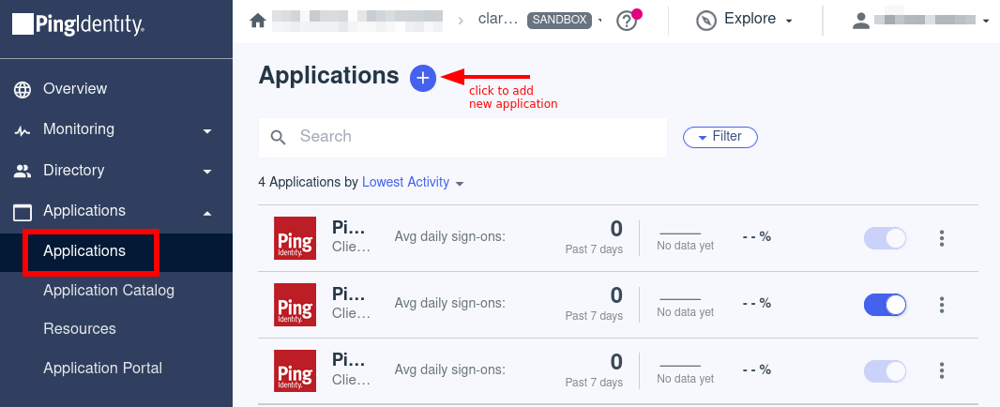
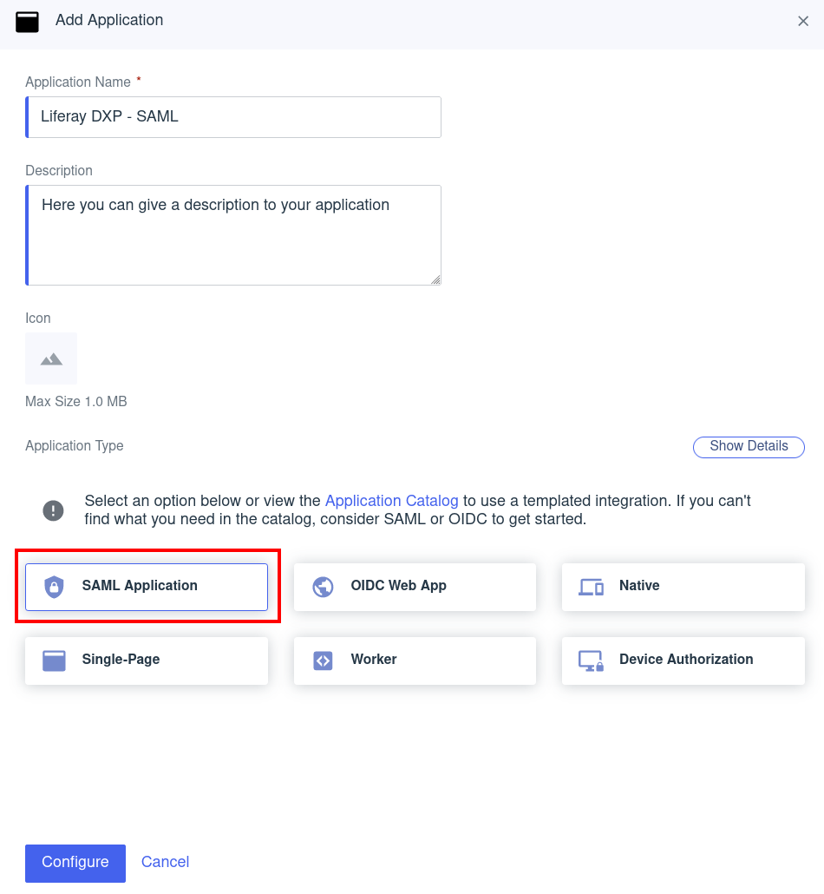
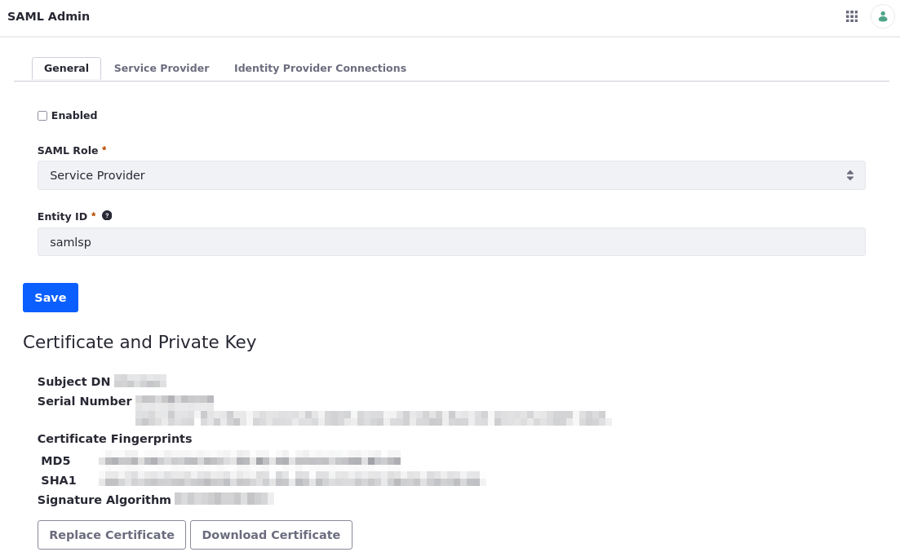
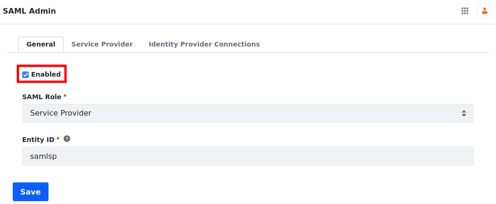
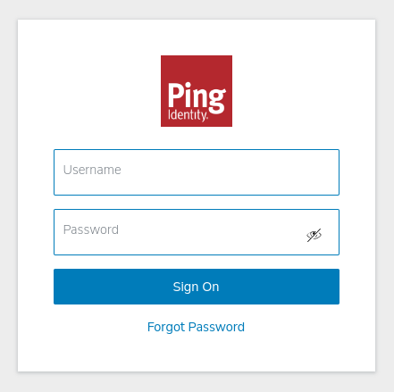
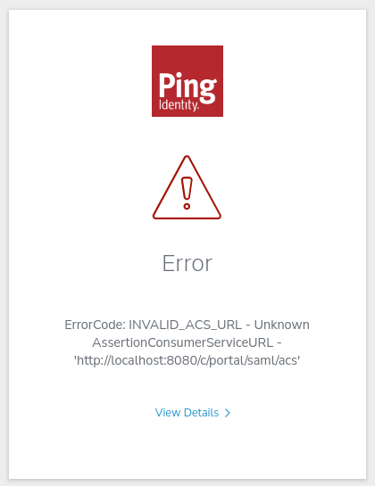

# Configuring Liferay Authentication With PingOne Using SAML

This tutorial guides you through the basic steps needed to integrate PingOne, your Identity Provider (IdP), with your Liferay environment using Security Assertion Markup Language (SAML).

## Prerequisites

- PingOne environment
- Liferay DXP environment
- A user who has administrative access to PingOne environment
- A user who has administrative access to Liferay's Control Panel

## PingOne Configuration

1. Sign in to your PingOne environment.

1. Go to Applications &rarr; Application, and click to add a new application.

    

1. Fill out the Application name and select the Application Type.

    1. Application Name: Liferay DXP - SAML

    1. Description: (Optional) Enter a description

    1. Icon: (Optional) Upload an icon

    1. Application Type: SAML Application

    

1. Click *Configure*.

1. In the SAML Configuration section, enter your application metadata.

    1. Provide Application Metadata: select `Manually Enter`

    1. ACS URL: `https://[your_instance_url]/c/portal/saml/acs`

    1. Entity ID: `samlsp`

    

1. Click *Save*.

1. Navigate to the *Configuration* tab and click the Edit icon.

    1. Signing Certificate: Choose between `Sign Response` or `Sign Assertion & Response` depending on your use case. See [Defining signature policy (SAML)](https://docs.pingidentity.com/r/en-us/pingfederate-120/help_spprotocolsettingstasklet_spsignaturepolicystate) from PingOne to learn more about these choices.

    1. Signing Algorithm: `RSA_SHA256`

    1. Encryption: Leave unchecked.

        !!! note
            We recommend the use of encryption, however for the purpose of this tutorial we are leaving this unchecked. Enabling encryption may require additional configuration with your infrastructure.

    1. SLO endpoint: `https://[your_instance_url]/c/portal/saml/slo`

    1. SLO binding: `HTTP POST`

    1. Assertion validity duration (in seconds): `3000`

1. Click *Save*.

1. Navigate to the Attribute Mappings tab and add the following attributes.

    | Attributes   | PingOne Mappings |
    |:-------------|:-----------------|
    | saml_subject | Email Address    |
    | emailAddress | Email Address    |
    | firstName    | Given Name       |
    | lastName     | Family Name      |
    | screenName   | User ID          |

1. Click *Save*.

    !!! note
        Create your users by navigating to Directory &rarr; Users.

1. Navigate to the *Configuration* tab, and download the Metadata .xml file. We will use it while configuring Liferay DXP

1. Enable the access to this application through the toggle switch on the top right.

    

## Liferay DXP Configuration

1. On your Liferay DXP instance, navigate to *Control Panel* &rarr; *Security* &rarr; *SAML Admin*.

1. Set the SAML Role to *Service Provider*, and Entity ID to *samlsp*. Click *Save*.

1. Click *Create Certificate* under the certificate and private key section. Import or create your certificate.

    

1. Go to the *Service Provider* tab.

    1. Sign Authn Requests? - Enable

    1. Sign Metadata? - Enable

    1. SSL Required - Enable

    1. Allow showing the login portlet. - Enable

    1. Enable “Require Assertion Signature?”, if you configured PingOne to `Sign Assertion & Response`

1. Click *Save*.

1. Click the *Identity Provider Connections* tab. Click *Add Identity Provider* and set the following:
    1. Name: *PingOne*
    1. Enter the entity ID (found as `entityID` in the xml file donwloaded on the previous section)
    1. Check the *Enabled* box
    1. Under the Metadata section, enter your IdP’s Metadata URL. This can be found under the Configuration tab, on your PingOne environment.
    1. Set *Name Identifier Format* to *Email Address*
    1. Enter the following attribute mappings under Basic User Fields:

        | User Field Expression | SAML Attribute |
        |:----------------------|:---------------|
        | emailAddress          | emailAddress   |
        | firstName             | firstName      |
        | lastName              | lastName       |
        | screenName            | screenName     |

    1. Click on *Save*

    

1. Go back to *General* tab and make sure the `Enabled` checkbox is checked. Click *Save*.

    

## Validation

1. Go to your Liferay instance, and open a new browser or sign out of your account.

1. Click on the *Sign In* button and you should be redirected to PingOne's login page.

    

1. Type in the username and password for your user. You have successfully logged in.

1. Sign back in with your Liferay administrator account. Navigate to *Control Panel* &rarr; *Users and Organizations*, and verify that the account came into Liferay

    

## Conclusion

Congratulations! Users may now authenticate to your environment by using PingOne.

## Tips and Troubleshooting

### INVALID_ACS_URL

If you encounter `ErrorCode: INVALID_ACS_URL`, verify that your ACS URLs are configured correctly in PingOne with the appropriate path and Hypertext Transfer Protocol (HTTP or HTTPS). You can find them in your PingOne account by navigating to the application you created &rarr; *Configuration* tab &rarr; *Edit icon*.

