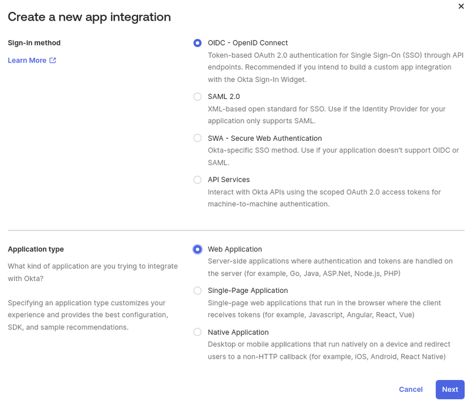
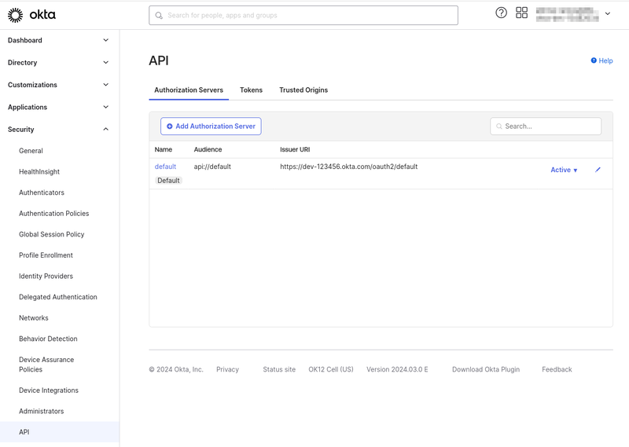
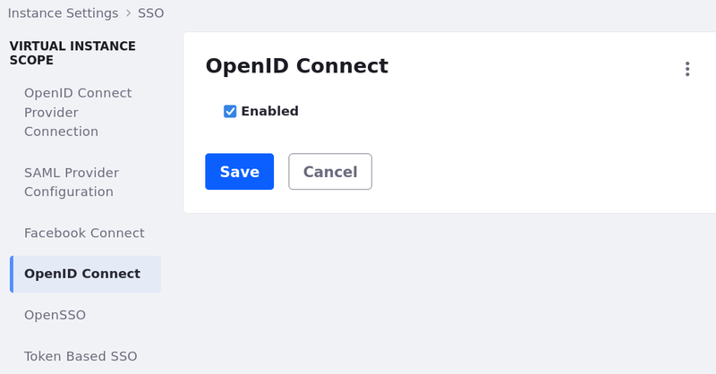

# Integrating Okta through OpenID Connect

Okta is an identity and access management platform that ensures secure user authentication and access to applications. Integrating with OpenID Connect, a reliable authentication protocol, Okta enables seamless verification of user identities across devices. Employees can conveniently access their applications using Okta's single sign-on feature, simplifying authentication while maintaining robust security.

## Okta Configuration

!!! note
    This tutorial requires you to have an existing Okta dev account to test with.

<!-- 1. Log in to [Okta Dev](https://developer.okta.com/login/) and navigate to *Applications* &rarr; *Add Application* (Shortcuts in the right menu) &rarr; *Create App Integration*.

1. Select *OIDC - OpenID Connect*, under Sign-in method, and *Web Application*, under Application type.

    

1. Enter *Liferay DXP - OIDC* as the app integration name.

1. For grant types, select *Authorization Code* and *Refresh Token*

1. Enter `https://[your_lifray_saas_environment]/c/portal/login/openidconnect` for the sign-in redirect URIs.

1. Enter `https://[your_lifray_saas_environment]` for the sign-out redirect URIs.

1. Under assignments, select *Skip group assignment for now*.

1. Click *Save*.

1. On the Assignments tab, assign users to this application.

### Obtaining endpoint URLs

1. Still in your admin okta account, go to the sidepanel and navigate to *Security* &rarr; *API*.

1. Under the “Authorization Servers” tab there should be one already created called `default`. Edit this server.

    

1. Click on the “Metadata URI” link, something like https://dev-123456.okta.com/oauth2/default/.well-known/oauth-authorization-server

    ```json
        issuer: "https://dev-123456.okta.com/oauth2/default"
        authorization_endpoint: "https://dev-123456.okta.com/oauth2/default/v1/authorize"
        token_endpoint: "https://dev-123456.okta.com/oauth2/default/v1/token"
        registration_endpoint: "https://dev-123456.okta.com/oauth2/v1/clients"
        jwks_uri: "https://dev-123456.okta.com/oauth2/default/v1/keys"
    ```

1. This will give you the necessary URL with the exception of the */userinfo* endpoint which can be constructed from your base URL and the Auth Server name, for example *https://dev-123456.okta.com/oauth2/default/v1/userinfo*. -->

## Configuring the OpenID Connect Provider Connection

1. On your DXP intance, navigate to *Global Menu* &rarr; *Control Panel* &rarr; *Instance Settings* &rarr; *Security* &rarr; *SSO*.

1. Go to *OpenID Connect Provider Connection* tab and add a new connection entry.

1. Fill out the fields with the requested data, as showed in the table below. These values you can find on the [endpoint URLs](#obtaining-endpoint-urls).

| Field                        | Data                                        |
|:-----------------------------|:--------------------------------------------|
| Provider Name                | Okta OIDC                                   |
| Scopes                       | `scopes_supported` url                      |
| Authorization Endpoint       | `authorization_endpoint` url                |
| Issuer URL                   | `issuer` url                                |
| JWKS URI                     | `jwks_uri` url                              |
| ID Token Signing Algorithms  | `id_token_signing_alg_values_supported` url |
| Subject Types                | `subject_types_supported` url               |
| Token Endpoint               | `token_endpoint` url                        |
| User Information Endpoint    | `userinfo_endpoint` url                     |
| OpenID Connect Client ID     | Under the *General* tab in Okta             |
| OpenID Connect Client Secret | Under the *General* tab in Okta             |

Once that is done, OpenID Connect needs to be enabled. To enable the OpenId Connect:

1. On your DXP intance, navigate to *Global Menu* &rarr; *Control Panel* &rarr; *Configuration* &rarr; *Instance Settings*.

1. Click on *SSO* under the security section.

1. Click the *Enabled* checkbox and click *Save*.



## Sign in to Liferay DXP with using Okta

1. Start your Liferay DXP instance

1. Click on the *Sign In* button and choose *OpenId Connect*.

    

1. Choose Okta from the list and sign in with your Okta account.