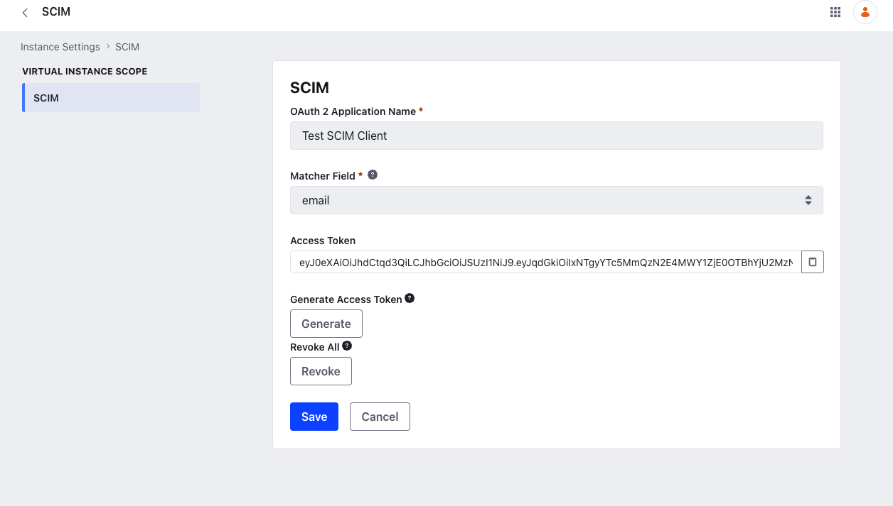

# Configuring System for Cross-domain Identity Management (SCIM)

{bdg-secondary}`Liferay DXP 2024.Q1+/Portal 7.4 GA112+`
{bdg-link-primary}`[Beta Feature](../../../system-administration/configuring-liferay/feature-flags.md#beta-feature-flags)`

System for Cross-domain Identity Management or SCIM, is an open standard designed to automate user provisioning. In other words, it's a standard way to create, update, and deactivate user identities. SCIM provides a unified, RFC compliant way to keep user/group data in sync between different applications. It consists of:

* A defined schema for representing users and groups
* A RESTful API to run CRUD operations on those users and groups to keep them in sync

!!! important
    This feature is currently behind a [beta feature flag](../system-administration/configuring-liferay/feature-flags.md#beta-feature-flags).

Using SCIM, you can securely automate the exchange of user identity information between your company's applications and service providers like Liferay. This is useful if your company uses multiple applications and wants to keep user data in sync without the need for custom implementations.

## Registering a SCIM Client

1. Open the *Global Menu* () and navigate to *Control Panel* &rarr; *Instance Settings* &rarr; *Security* &rarr; *SCIM*.

1. Enter a name in the *OAuth 2 Application Name* field.

   The name entered here is used to generate the SCIM client ID. This ID links users and groups with the SCIM client. If your SCIM client name is `Test SCIM Client`, the generated SCIM client ID will be `SCIM_test-scim-client`.

1. Set the *Matcher Field* to `userName` or `email`.

   The SCIM client uses this field to match the user data in the service provider and the connected application. This avoids issues with provisioning and prevents data duplication.

   

1. The *Access Token* field is empty at first. Click *Generate* and click *OK* to populate the field with an access token. An access token expires after 1 year unless revoked. If this is not the first time you're generating an access token, it'll overwrite the existing token but it remains valid for 10 more days. You can use this grace period to configure the new token in the client application.

   You can invoke the SCIM APIs by setting the access token in the `Authorization` request header. To revoke all access tokens, click *Revoke* and click *OK*.

1. Click *Save*.

!!! note
    A scheduler runs daily to retrieve all OAuth 2 applications that start with the `SCIM_` prefix. If the access token's expiry is 30 days, 7 days, or 1 day, all administrators are notified in Liferay and by email.

## Linking a User to a SCIM Client

To link a user to a SCIM client,

1. Open the *Global Menu* () and navigate to *Control Panel* &rarr; *Users and Organizations*.

1. Select a user from the Users tab.

1. Scroll down to the CUSTOM FIELDS section and enter the the SCIM client ID in the *Scimclientid* field.

1. Click *Save*.

## Linking a User Group to a SCIM Client

To link a user group to a SCIM client,

1. Open the *Global Menu* () and navigate to *Control Panel* &rarr; *Users Groups*.

1. Select a user group, click *Actions* () and select *Edit*.

1. Enter the SCIM client ID in the *Scimclientid* field.

1. Click *Save*.