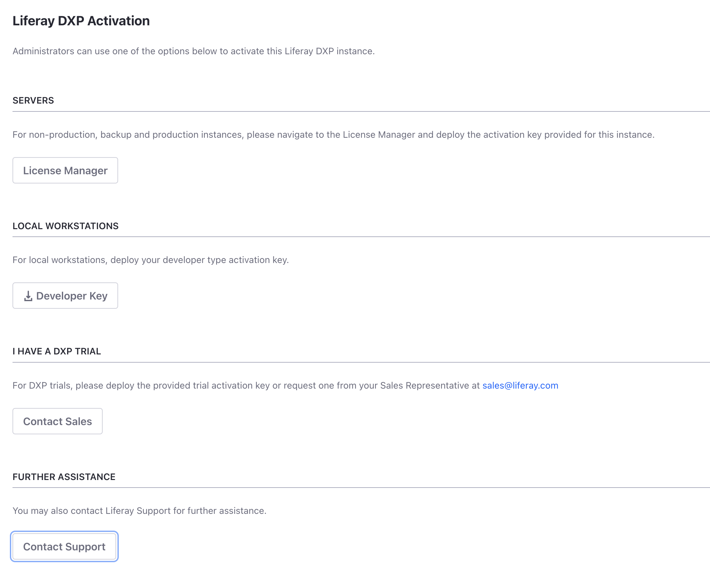

# Activating Liferay DXP

{bdg-primary}`Subscription Required`

Liferay DXP is activated using an XML (`.xml`) activation key. It specifies your DXP subscription terms or trial agreement. When you [run Liferay DXP for the first time](../installing-liferay/running-liferay-for-the-first-time.md), the license page appears and requests an activation key.



## Activating DXP Using a Key

If you have an activation key, copy it to the `deploy` folder in your [Liferay Home](../reference/liferay-home.md).

```
[LIFERAY_HOME]
    ├── data
    ├── deploy
    │   └── my-license.xml
    ├── license
    ├── logs
    ├── osgi
    ├── patching-tool
    ├── tools
    └── work
```

A message in the DXP console confirms the registration.

```bash
License registered ...
```

DXP is ready to use.

## Need a Key?

If you have an enterprise subscription, you can generate and manage keys on the [Customer Portal](http://support.liferay.com/). Only members with the Administrator role can generate and manage keys.

Trying out DXP? Get a [30 day trial activation key](https://www.liferay.com/products/dxp/30-day-trial).

## License Manager

The license manager page displays server and license information. To see the page, click *License Manager* on the activation page. Or if you have previously activated your Liferay instance, log in as an administrator and navigate to *Control Panel* &rarr; *License Manager*.


The status of the license is shown (e.g. active or expired), as well as other information such as license type and expiration date.

## Reactivating Liferay DXP

Here are the steps for reactivating DXP with your new key:

1. Stop the application server.

1. Delete the *contents* of your `[Liferay Home]/data/license` folder but preserve the folder.

1. Remove all `activation-key-[...].xml` files from your `[Liferay Home]/osgi/modules` folder.

1. Start the application server.

1. Copy your new activation key file to your `[Liferay Home]/deploy` folder.

A DXP console message confirms the registration.

```bash
License registered ...
```

You can continue using DXP.

!!! important
    If you're using a clustered environment, the whole cluster must be shut down so you can replace the keys on one node at a time.

If you have an enterprise subscription and need further assistance, contact [Account Support](https://help.liferay.com/hc/en-us/articles/360018414031) or create a [support ticket](https://help.liferay.com/hc/requests/new).
