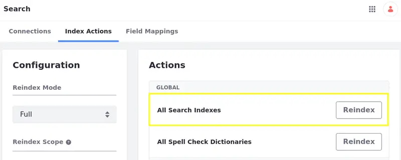

# Post-Upgrade Considerations

After upgrading the database, you should configure Liferay for production again and check up on feature changes that might affect your Liferay instance.

## Re-enable Production Settings

After upgrading your database, re-enable your production settings.

### Search Indexing

If you disabled search indexing for upgrading to 7.2, re-enable it by removing the `.config` file you used to disable it or by setting `indexReadOnly="false"` in the `.config` file. For example,

```bash
rm osgi/configs/com.liferay.portal.search.configuration.IndexStatusManagerConfiguration.config
```

Re-indexing search indexes is required for major version upgrades. When moving to a new update, applying a service pack, or upgrading to a new GA (rolling release) within the same Liferay version, consult the release highlights for the version to determine if a re-index is required. Here's how to re-index search indexes:

1. Click *Global Menu* () &rarr; *Control Panel*.

1. Click on *Search* in the Configuration section, select the *Index Actions* tab, and click *Reindex* for All Search Indexes. The re-index executes and displays a success message.



```{note}
If you upgraded from an older version (7.1 and below) consider [installing Elasticsearch](../../../using-search/installing-and-upgrading-a-search-engine/installing-a-search-engine.md) to handle search indexing.
```

### Database Configurations

If you tuned the database for the upgrade before upgrading it (see [Database Tuning for Upgrades](../upgrade-stability-and-performance/database-tuning-for-upgrades.md)), restore your production database settings.

```{note}
If you migrated from a sharded environment during data upgrade, you must make more adjustments to your configurations to complete the transition to virtual instances. See the [Upgrade and Update Properties](../other-upgrade-scenarios/upgrading-a-sharded-environment.md#Upgrade-and-Update-Properties) section for more information.
```

## Installing the Latest Marketplace Apps

Install the latest version of your [Marketplace apps](../../../system-administration/installing-and-managing-apps/installing-apps/downloading-apps.md) for your new Liferay version and use [Gogo shell commands](../upgrade-stability-and-performance/upgrading-modules-using-gogo-shell.md) to check for and execute any required database upgrades.

## Accounting for Feature Changes

Features and behaviors change with new Liferay versions. Review how the following features and behaviors change.

### Enable Web Content View Permissions

Prior to 7.1, all users could view web content articles by default. Now view permissions are checked by default. You can edit view permissions for each web content article per role.

```{note}
Prior to 7.4, you could open view permissions for all web content articles by navigating to *Control Panel* &rarr; *Configuration* &rarr; *System Settings* &rarr; *Web Content* &rarr; *Virtual Instance Scope* &rarr; *Web Content* and de-selecting *Article view permissions check enabled*.
```

<!-- This makes no sense to me. You only explain what to do on 7.4+ if there are only a few articles. If you're on 7.4+ and you have lots of web content articles, what do you do? Is there a bulk way to deal with them? -Rich -->

<!-- I talked to Lourdes Besada and she said there are initiatives to offer this bulk functionality in the UI. Russ also mentioned that we should document only one way to do this, so I should refactor the section a little. So, I decided to add this note to keep the method used prior to 7.4 and I did not offer other options as Lourdes mentioned that this is the only option throught the UI. Eric -->


### Check Web Content Images

Upgrading to 7.2 moves web content images to the [File Store](../../../system-administration/file-storage.md) (also known as the Document Library) and then deletes their former table, `JournalArticleImage`. If an image can't be migrated, Liferay reports the failure:

```
Unable to add the journal article image {filename} into the file repository
```

If there aren't any messages, your images should now be in your file store. Preview your web content articles to verify the images.

## Account for Deprecations and Features in Maintenance Mode

Review the [deprecations and features in maintenance mode](../reference/maintenance-mode-and-deprecations-in-7-3.md) and plan for handling how they affect your Liferay instance.

## Remove Obsolete Data

If you have data that's unnecessary and useless, you can remove it. Here are two common obsolete data situations and tools for removing it.

* Data from obsolete Liferay apps or modules. The [Data Cleanup](../reference/data-cleanup.md) tool removes it.

* Obsolete data from available Liferay apps and modules. The [Data Removal](../reference/data-removal.md) tool removes it.

## Conclusion

Once all necessary post-upgrade tasks are complete, your Liferay server is ready for normal operations as before. Congratulations!
