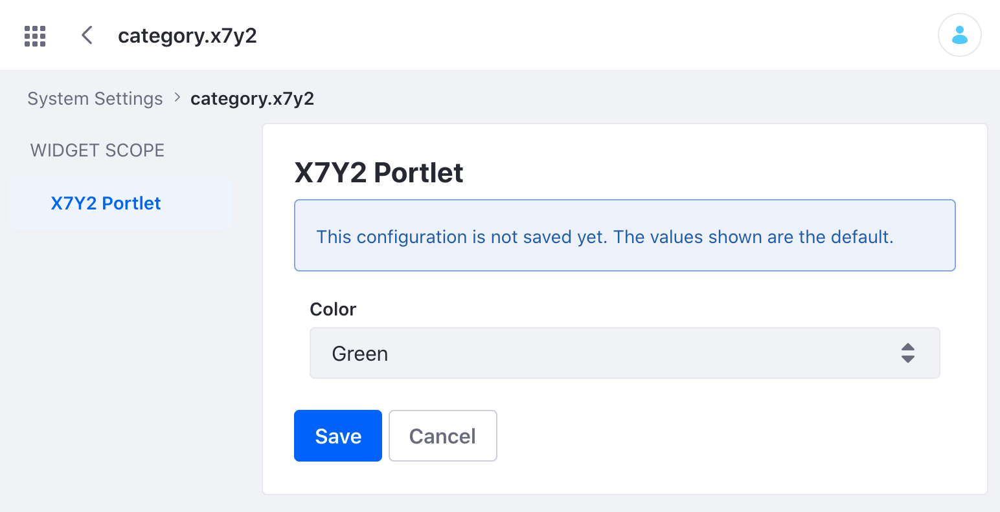

# Portlet Level Configuration

With the configuration framework, you can set your [application's configuration for different levels of scope](./scoping-configurations.md). Where Instance and Site-scoped configurations use `ConfigurationProvider`, portlet scoped configurations use `PortletDisplay` as shown in the example below.

The configuration framework can be used in conjunction with portlet preferences so that an app can have both a configuration UI in system settings as well a preference UI in the portlet's setup tab.

Note, an application's configuration is overridden if portlet preferences are implemented and set by a user. See [Portlet Preferences](../../building-applications/developing-a-java-web-application/using-mvc/portlet-preferences.md) to learn more.

## See the Example Code

```{include} /_snippets/run-liferay-portal.md
```

Then, follow these steps:

1. Download and unzip [Sharing Localized Messages](./liferay-x7y2.zip).

    ```bash
    curl https://resources.learn.liferay.com/dxp/latest/en/building-applications/core-frameworks/configuration-framework/liferay-x7y2.zip -O
    ```

    ```bash
    unzip liferay-x7y2.zip
    ```

1. From the module root, build and deploy.

    ```bash
    ./gradlew deploy -Ddeploy.docker.container.id=$(docker ps -lq)
    ```

    ```{note}
    This command is the same as copying the deployed jars to /opt/liferay/osgi/modules on the Docker container.
    ```

1. Confirm the deployment in the Liferay Docker container console.

    ```bash
    STARTED com.acme.x7y2.web_1.0.0 [1651]
    ```

1. Verify that the example module is working. Open your browser to `https://localhost:8080`

1. Deploy the X7Y2 Portlet to a page. You can find the example portlet under Sample Widgets. Notice that the default color is set to green.

1. Navigate to *Control Panel* &rarr; *Configuration* &rarr; *System Settings*. At the bottom under the Other section, click on the X7Y2 configuration.

    

    Select and save a different default color. Navigate back to the page with the deployed widget. The color variable is now updated.

1. Click the portlet's options icon () and click *Configuration*. The portlet's preferences window opens.

    

    Select and save a different color. Close the window and now the portlet preference appears. Note that the application configuration set in system settings is no longer shown after a portlet preference has been selected.

Let's examine how the application's configuration works together with portlet preferences.

## Create the Configuration Interface

First create the configuration interface file that auto-generates the configuration UI in system settings.

```{literalinclude} ./portlet-level-configuration/resources/liferay-x7y2.zip/x7y2-web/src/main/java/com/acme/x7y2/web/internal/configuration/X7Y2PortletInstanceConfiguration.java
:language: java
:lines: 7-24
```

In this example, the scope is set to `PORTLET_INSTANCE`. The interface also defines the configuration options available in the drop-down list.

Note that this example also works with scope set at higher levels (i.e. Site, Instance, system scope). A best practice is to mark an application that you intend to use with portlet preferences as portlet scope.

To learn more, see [Creating the Configuration Interface](./setting-and-accessing-configurations.md#Creating-the-Configuration-Interface).

```{note}
A `ConfigurationBeanDeclaration` is required for Liferay versions before DXP 7.4 U51 or Portal 7.4 GA51. See [ConfigurationBeanDeclaration with Previous Versions of Liferay](./setting-and-accessing-configurations.md#configurationbeandeclaration-with-previous-versions-of-liferay).
```

## Read the Configuration with PortletDisplay

Similar to [reading configuration values from the Configuration Provider API](./setting-and-accessing-configurations.md#Reading-the-Configuration-from-the-Application), you can access the configuration values in your application with the Portlet Display API.

```{literalinclude} ./portlet-level-configuration/resources/liferay-x7y2.zip/x7y2-web/src/main/java/com/acme/x7y2/web/internal/portlet/X7Y2Portlet.java
:language: java
:lines: 20-63
```

The `X7Y2PortletInstanceConfiguration` method uses `PortletDisplay` to obtain the portlet instance configuration. The `render()` method adds the configuration to the request object so that it can be read from the request of the JSP file.

## Set up Portlet Preferences

For the portlet to have portlet preferences, you must also add a configuration JSP file and configuration action to your application. To learn more about how these files work in a portlet, see [Portlet Preferences](../../../liferay-development/building-applications/developing-a-java-web-application/using-mvc/portlet-preferences.md).

## Related Information

* [Scoping Configuration](./scoping-configurations.md)
* [Portlet Preferences](../../developing-a-java-web-application/using-mvc/portlet-preferences.md)
