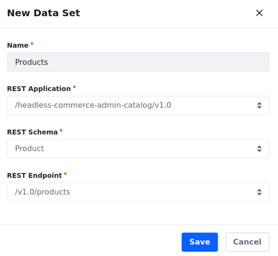
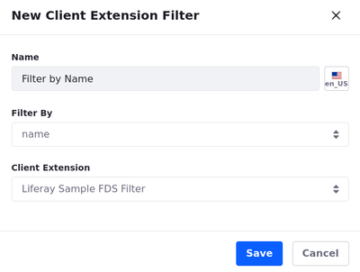
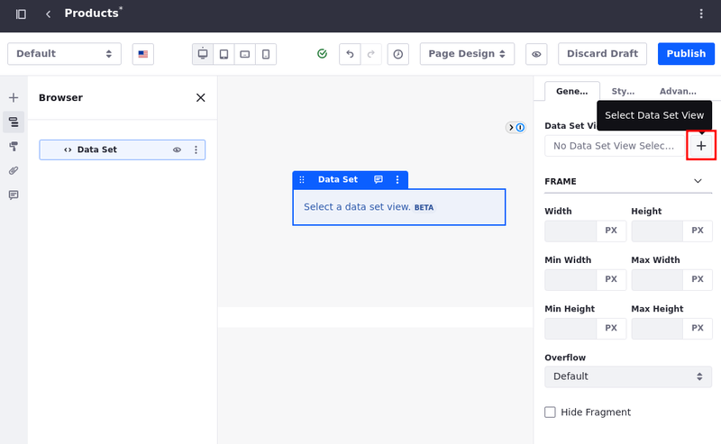
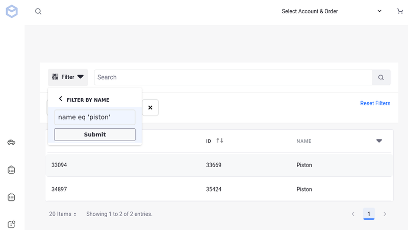

# Using a Custom Filter Client Extension

{bdg-secondary}`Liferay DXP 2024.Q2+/Portal 7.4 GA120+`

Custom filter client extensions define JavaScript functions for creating customizable filter interfaces. These extensions can be added to [data set views](../data-sets/data-set-views/data-set-view-filters.md), enhancing the user experience by providing tailored filtering capabilities.

## Prerequisites

1. Install Java (JDK 8 or JDK 11).

   !!! note
       Check the [compatibility matrix](https://help.liferay.com/hc/en-us/articles/4411310034829-Liferay-DXP-7-4-Compatibility-Matrix) for supported JDKs, databases, and environments. See [JVM Configuration](../../installation-and-upgrades/reference/jvm-configuration.md) for recommended JVM settings.

1. Download and unzip the sample workspace:

   ```bash
   curl -o com.liferay.sample.workspace-latest.zip https://repository.liferay.com/nexus/service/local/artifact/maven/content\?r\=liferay-public-releases\&g\=com.liferay.workspace\&a\=com.liferay.sample.workspace\&\v\=LATEST\&p\=zip
   ```

   ```bash
   unzip com.liferay.sample.workspace-latest.zip
   ```

Now you have the tools to deploy your first custom filter client extension.

## Examine and Modify the Custom Filter Client Extension

The custom filter client extension is in the sample workspace's `client-extensions/liferay-sample-fds-filter/` folder. It's defined in the `client-extension.yaml` file:

```yaml
liferay-sample-fds-filter:
    name: Liferay Sample FDS Filter
    type: fdsFilter
    url: index.*.js
```

The client extension has the ID `liferay-sample-fds-filter` and contains the key configurations for a Custom Element client extension, including the `type` and the `url` properties that define the JavaScript resource file's location.

It also contains the `assemble` block:

```yaml
assemble:
    - from: build/static
      into: static
```

This specifies that everything in the `build/static` folder should be included as a static resource in the built client extension `.zip` file. The JavaScript files in a client extension are used as static resources in Liferay.

### Understand the Code

<!-- I'm not sure if this is the best approach, but I decided to eliminate the whole code as I was going to break it down later. I also focused on the functions instead of covering all the code. Eric -->

The `src/index.ts` file defines three main JavaScript functions that provide a customizable filter interface: `descriptionBuilder`, `htmlElementBuilder`, and `oDataQueryBuilder`, which are responsible for describing the filter's state, rendering the filter's UI, and building the OData query respectively.

The `descriptionBuilder()` function takes the filter's internal state (`selectedData`) and returns it as a human-readable string. Here, it returns the OData query string entered by the user.

```javascript
function descriptionBuilder(selectedData: FilterData): string {
	return selectedData;
}
```

The `htmlElementBuilder()` function renders the UI shown to the user when configuring the filter. It creates an input field for the OData query string, a submit button, and attaches an event handler to the button to update the filter's state using the `setFilter` callback.

It creates a `div` element, assigns it the class name `dropdown-item`, appends the input field and button to this div, and then returns the div.

```javascript
	const div = document.createElement('div');
	div.className = 'dropdown-item';

	div.appendChild(input);
	div.appendChild(button);

	return div;
```

The `oDataQueryBuilder()` function takes the filter's internal state (`selectedData`) and returns it as the OData query string for filtering the data set.

```javascript
function oDataQueryBuilder(selectedData: FilterData): string {
	return selectedData;
}
```

Then, an object `fdsFilter` is created that implements the `FDSFilter` interface, incorporating the three main functions defined above. And this object is exported as the default export of the module.
```javascript
const fdsFilter: FDSFilter<FilterData> = {
	descriptionBuilder,
	htmlElementBuilder,
	oDataQueryBuilder,
};

export default fdsFilter;
```

Now, deploy the client extension.

## Deploy the Custom Element Client Extension to Liferay

```{include} /_snippets/run-liferay-portal.md
```

Once Liferay starts, run this command from the client extension's folder in the sample workspace:

```bash
../../gradlew clean deploy -Ddeploy.docker.container.id=$(docker ps -lq)
```

This builds your client extension and deploys the zip to Liferay's `deploy/` folder.

!!! note
    To deploy your client extension to Liferay SaaS, use the Liferay Cloud [Command-Line Tool](https://learn.liferay.com/w/liferay-cloud/reference/command-line-tool) to run [`lcp deploy`](https://learn.liferay.com/w/liferay-cloud/reference/command-line-tool#deploying-to-your-liferay-cloud-environment).

!!! tip
    To deploy all client extensions in the workspace simultaneously, run the command from the `client-extensions/` folder.

Confirm the deployment in your Liferay instance's console:

```
STARTED liferaysamplecustomelement1_7.4.13
```

Now that your client extension is deployed, check if the filter is working properly.

## Add the Custom Filter Client Extension to a Data Set View

{bdg-link-primary}`[Beta Feature](../../system-administration/configuring-liferay/feature-flags.md#beta-feature-flags)`

!!! important
    Currently, this feature is behind a [beta feature flag](../../system-administration/configuring-liferay/feature-flags.md#beta-feature-flags) (LPS-164563).

Start by setting up the environment:

1. Enable the `LPS-164563` [beta feature flag](../../system-administration/configuring-liferay/feature-flags.md#beta-feature-flags).

1. [Create a site](../../getting-started/creating-your-first-site.md) using the `Minium` template.

   This populates the database with products to be displayed in the data set view.

   

Create the data set and the data set view:

1. [Create a Data Set](../data-sets/creating-data-sets.md) using these settings:

   | Field            | Content                                 |
   | :--------------- | :-------------------------------------- |
   | Name             | `Products`                              |
   | REST Application | `/headless-commerce-admin-catalog/v1.0` |
   | REST Schema      | `Product`                               |
   | REST Endpoint    | `/v1.0/products`                        |

   

1. [Create a Data Set View](../data-sets/data-set-views.md#creating-data-set-views), name it `Products Data Set View`, and click *Save*.

1. Click on the *Products Data Set View* to start editing it.

   Alternatively, click *Actions* () next to the view and select *Edit* ().

1. Select the *Visualization Modes* tab.

1. Click *Add* () and select the `catalogId`, `id`, and `name` fields.

   This adds the three fields to the table visualization mode displayed in the data set view.

   

1. Select the *Filters* tab.

1. Click *Add* () and select *Client Extension*. Fill in the information using these settings:

   | Field            | Content                     |
   | :--------------- | :-------------------------- |
   | Name             | `Filter by Name`            |
   | Filter By        | `name`                      |
   | Client Extension | `Liferay Sample FDS Filter` |

   

Add the data set view to a content page:

1. [Create a new page](../../site-building/creating-pages/adding-pages/adding-a-page-to-a-site.md) or [Start editing](../../site-building/creating-pages/using-content-pages/adding-elements-to-content-pages.md) one.

1. In the Fragments and Widgets menu on the left, search for Data Set under fragments. Drag and drop the fragment in your editing area.

1. Click on your fragment. In the General tab on your right, there is a field where you can select a Data Set View. Click *Add* () and select the *Products Data Set View*.

   

1. Publish the page.

Navigate to the page to test the filter:

1. Next to the page's name, click *Actions* () and select *View* ().

1. Click *Filter* and select the *Filter by Name* option under the search bar.

1. Select the search field, type in `name eq 'Piston'`, and click *Submit*.

   The table displays only the products named *Piston*.

   

You have successfully deployed and used a custom filter client extension in Liferay. Next, try [using data set view actions](../data-sets/data-set-views/using-data-set-view-actions.md) and customize your data set even further.

## Related Topics

- [Integrating External Applications](../integrating-external-applications.md)
- [Client Extensions UI Reference](./client-extensions-ui-reference.md)
- [Data Set Views](../data-sets/data-set-views.md)
- [Data Set View Filters](../data-sets/data-set-views/data-set-view-filters.md)
