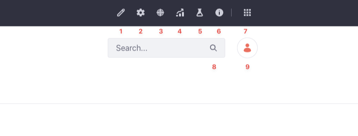
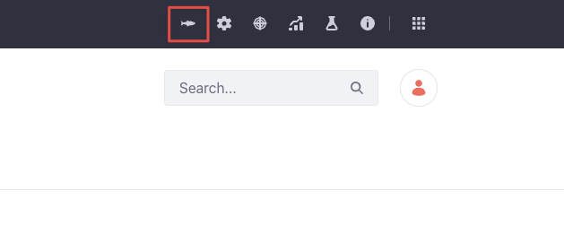

# Using a Theme Sprite Map Client Extension

{bdg-secondary}`Liferay 7.4 2023.Q4+/GA100+`

With a theme sprite map client extension, you can override the default [Clay](https://clayui.com/docs/components/icon.html) sprite map used for icons on a page. Start with the [sample workspace](https://github.com/liferay/liferay-portal/tree/master/workspaces/liferay-sample-workspace) to build and deploy your client extension.

```{note}
An SVG sprite map is an image that contains several icons grouped together, each with a unique ID. You can load the SVG and reference the individual icons by ID. This provides a slight performance improvement, as you can download and cache the sprite map once to display all the site icons.
```

## Prerequisites

To start developing client extensions,

1. Install Java (JDK 8 or JDK 11).

    ```{note}
    Check the [compatibility matrix](https://help.liferay.com/hc/en-us/articles/4411310034829-Liferay-DXP-7-4-Compatibility-Matrix) for supported JDKs, databases, and environments. See [JVM Configuration](../../installation-and-upgrades/reference/jvm-configuration.md) for recommended JVM settings.
    ```

1. Download and unzip the sample workspace:

   ```bash
   curl -o com.liferay.sample.workspace-latest.zip https://repository.liferay.com/nexus/service/local/artifact/maven/content\?r\=liferay-public-releases\&g\=com.liferay.workspace\&a\=com.liferay.sample.workspace\&\v\=LATEST\&p\=zip
   ```

   ```bash
   unzip com.liferay.sample.workspace-latest.zip
   ```

Now you have the tools to deploy your first theme sprite map client extension.

## Examine the Theme Sprite Map Project

The theme sprite map client extension is in the sample workspace's `client-extensions/liferay-sample-theme-spritemap-1/` folder. It is defined in the `client-extension.yaml` file:

```yaml
liferay-sample-theme-spritemap-1:
    name: Liferay Sample Theme Spritemap 1
    type: themeSpritemap
    url: spritemap.svg
```

The client extension has the ID `liferay-sample-theme-spritemap-1` and contains the key configurations for a theme sprite map client extension, including the type and the sprite map file to add. See the [Theme Sprite Map YAML Configuration Reference](./using-a-theme-spritemap-client-extension/theme-sprite-map-yaml-configuration-reference.md) for more information on the available properties.

It also contains the `assemble` YAML block:

```yaml
assemble:
    - from: assets
      into: static
```

This specifies that everything in the `assets/` folder should be included as a static resource in the built client extension `.zip` file. The SVG sprite map in a theme sprite map client extension is used as a static resource in Liferay.

```{important}
The sample project's `assets/spritemap.svg` is a copy of the [Clay icons](https://clayui.com/docs/components/icon.html) sprite map used in Liferay. You won't notice any changes in the UI as all the icons used in Liferay are present in the example sprite map.

Since a sprite map client extension replaces the entire sprite map on the selected page, make sure that you have all the necessary icons with their corresponding IDs to avoid missing icons.
```

## Modify the Sprite Map

To change a specific icon, you must find the ID of the icon. You can inspect the HTML element to find this.



Given below are the IDs of the icons used on the top navbar.

| Number | Icon                                                                          | ID                     |
| :----- | :---------------------------------------------------------------------------- | :--------------------- |
| 1      |                          | pencil                 |
| 2      |                                   | cog                    |
| 3      |                     | simulation-menu-closed |
| 4      |                       | analytics              |
| 5      |                     | test                   |
| 6      |  | info-circle            |
| 7      |             | grid                   |
| 8      |       | search                 |
| 9      |         | user                   |

To swap the pencil icon for a fish,

1. Find the `<symbol>` tag corresponding to the ID of `pencil` inside `assets/spritemap.svg`. You must open the SVG file in a text editor to view this.

   ```html
   <symbol id="pencil" viewBox="0 0 512 512">
      <path class="lexicon-icon-body" d="M490.9,363.4l-2.8-5.1C468.3,322.4,359.9,304,358.9,304l-2.4-0.1l-10.8,1.5c-16.9,3.9-31,15.7-50.5,33.8c-25.2-14.7-52.4-37.6-68.7-54.3c-16.7-17.1-39.9-47.7-52.4-71.6c22-21.6,37.4-38.7,38.4-61.7c0-1-13.8-110.1-48.9-131.7l0,0l-5.1-3.1c-9.6-5.7-27.5-16.4-49.3-16.4c-5.4,0-10.8,0.7-17,2.3c-6.9,2-13.3,4.8-20,9.1C55.9,23,26.2,46.7,11.7,78c-13.5,30.8-4.4,187.9,113.4,311c111.6,116.8,241.2,122.7,266.1,122.7c6.4,0,15.1-0.3,22.4-1.6l2.8-0.1l6.7-2.5c32.2-13.2,56.9-41.7,68.4-57.2C518.4,415.5,497.8,376.6,490.9,363.4L490.9,363.4z" fill="none"></path>
      <path class="lexicon-icon-outline" d="M490.9,363.4l-2.8-5.1C468.3,322.4,359.9,304,358.9,304l-2.4-0.1l-10.8,1.5c-16.9,3.9-31,15.7-50.5,33.8c-25.2-14.7-52.4-37.6-68.7-54.3c-16.7-17.1-39.9-47.7-52.4-71.6c22-21.6,37.4-38.7,38.4-61.7c0-1-13.8-110.1-48.9-131.7l0,0l-5.1-3.1c-9.6-5.7-27.5-16.4-49.3-16.4c-5.4,0-10.8,0.7-17,2.3c-6.9,2-13.3,4.8-20,9.1C55.9,23,26.2,46.7,11.7,78c-13.5,30.8-4.4,187.9,113.4,311c111.6,116.8,241.2,122.7,266.1,122.7c6.4,0,15.1-0.3,22.4-1.6l2.8-0.1l6.7-2.5c32.2-13.2,56.9-41.7,68.4-57.2C518.4,415.5,497.8,376.6,490.9,363.4L490.9,363.4z M445.4,415.1c-10.5,14-27.3,31.3-42.6,38c-1.5,0.2-5.4,0.6-11.6,0.6c-20.7,0-128.8-5.1-224.1-104.8C67,244.3,62.6,119,65.5,100c6.6-12.7,21.2-27.7,38.7-39.8c0.5-0.3,1.9-1.1,3.4-1.6c5.5-1.4,15.6,4.6,21,7.8l2.4,1.5c8.1,13.5,20.6,63.6,23.3,81.2c-3.8,6.4-19.2,21.4-27.7,29.8l-1,1.1c-11.9,12.8-15.5,31.2-8.9,47.3c14.2,32.9,45.9,75.3,68.4,98.3c22.1,22.8,59.4,53.4,93.2,70.6c16.3,8.1,36.3,4.8,49.1-7.5c10.1-9.4,25-23.4,30.6-26.3c17.6,3.4,67.7,18.2,80.8,26.7l1.1,2C446.9,404.3,448.5,411,445.4,415.1L445.4,415.1z"></path>
   </symbol>
   ```

2. Replace this with a custom icon and give it the same ID (`pencil`). Use the below `symbol` for a fish icon.

   ```html
   <symbol id="pencil" viewBox="0 26 100 48">
      <path d="M98.5,47.5C96.5,45.5,81,35,62,35c-2.1,0-4.2,0.1-6.2,0.3L39,26c0,4.5,1.3,9,2.4,12.1C31.7,40.7,23.3,44,16,44L0,34
      c0,8,4,16,4,16s-4,8-4,16l16-10c7.3,0,15.7,3.3,25.4,5.9C40.3,65,39,69.5,39,74l16.8-9.3c2,0.2,4.1,0.3,6.2,0.3
      c19,0,34.5-10.5,36.5-12.5S100.5,49.5,98.5,47.5z M85.5,50c-1.4,0-2.5-1.1-2.5-2.5s1.1-2.5,2.5-2.5s2.5,1.1,2.5,2.5
      C88,48.9,86.9,50,85.5,50z"/>
   </symbol>
   ```

## Deploy the Sprite Map Client Extension

```{include} /_snippets/run-liferay-portal.md
```

Next, run this command from the client extension project's folder in the sample workspace:

```bash
../../gradlew clean deploy -Ddeploy.docker.container.id=$(docker ps -lq)
```

This builds your client extension and deploys the zip to Liferay's `deploy/` folder.

```{note}
To deploy your client extension to Liferay SaaS, use the Liferay Cloud [Command-Line Tool](https://learn.liferay.com/w/liferay-cloud/reference/command-line-tool) to run [`lcp deploy`](https://learn.liferay.com/w/liferay-cloud/reference/command-line-tool#deploying-to-your-liferay-cloud-environment).
```

```{tip}
To deploy all client extensions in the workspace simultaneously, run the command from the `client-extensions/` folder.
```

Confirm the deployment in your Liferay instance's console:

```bash
STARTED liferay-sample-theme-spritemap-1_1.0.0
```

## Use the New Sprite Map on a Page

Configure a page to use your deployed client extension:

1. Go to the page, then click _Edit_ () at the top.

1. In the sidebar, navigate to the Page Design Options menu () and click _Configuration_ () at the top of the menu.

1. In the Theme Sprite Map Client Extension section, click _Add_ ().

1. Select the newly deployed sprite map, _Liferay Sample Theme Spritemap 1_.

   

1. Scroll down and click _Save_.

1. Go back to the page. In the navbar, a fish icon has replaced the pencil () for the edit functionality.



## Next Steps

You have successfully used a theme sprite map client extension. Next, try deploying other client extension types.

* [Using a CSS Client Extension](./using-a-css-client-extension.md)
* [Using a JS Client Extension](./using-a-javascript-client-extension.md)
* [Using a Theme Favicon Client Extension](./using-a-theme-favicon-client-extension.md)

## Related Topics

[Theme Spritemap YAML Configuration Reference](./using-a-theme-spritemap-client-extension/theme-sprite-map-yaml-configuration-reference.md)
