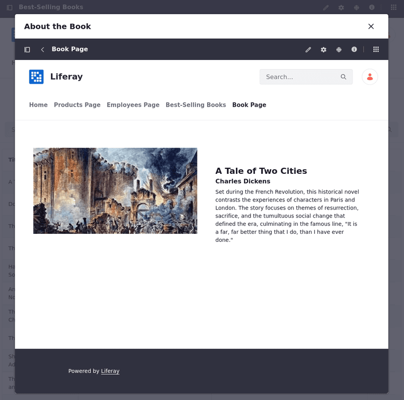
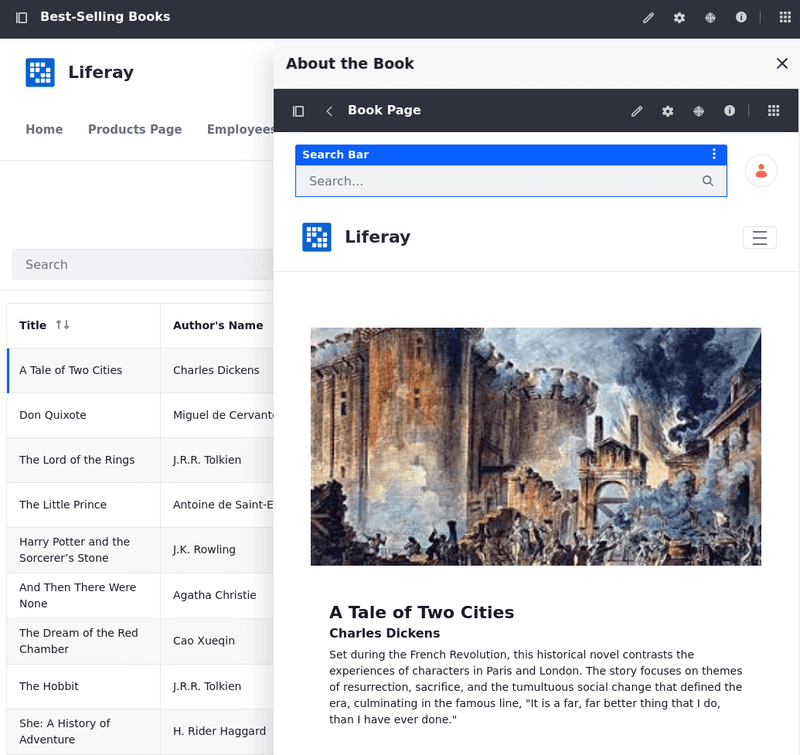

# Data Set View Actions

{bdg-secondary}`Liferay DXP 2024.Q1+/Portal 7.4 GA112+`
{bdg-link-primary}`[Beta Feature](../../../system-administration/configuring-liferay/feature-flags.md#beta-feature-flags)`

While managing data set views, define actions to be used in the data set fragment. There are two types of actions: item and creation.

Use *Item Actions* to perform actions on items in the data set.

Use *Creation Actions* to add new data.

Begin by [adding an action to the data set view](#adding-actions-to-the-data-set-view) and configure it as an [item or creation action](#configuring-item-and-creation-actions).

## Adding Actions to the Data Set View

1. Open the *Global Menu* (), select the *Control Panel* tab, and click *Data Sets* under Object.

1. Click the *Name* of the data set you want to access.

   Alternatively, click *Actions* () next to the data set entry and select *Edit*.

1. Click the *Name* of the data set view to start editing it.

1. Select the Actions tab, open the [*Item Actions* or the *Creation Actions*](#configuring-item-and-creation-actions) tab, and click *Add* (); a page appears where you must configure your action before creating it.

Under the Display Options section, you can find general settings common to all actions.

1. Fill in the Label and, optionally, [localize](./data-set-view-visualization-modes.md#editing-and-localizing-labels) it.

1. (Optional) Choose an icon to show in your Data Set fragment.

   <!-- Choose from a list of out-of-the-box icons or type in the name of an icon registered through the SVG sprite map client extension. The custom icon requires configuring the client extension. - This is to be added once the article about this client extension is on. Eric -->|

   !!! tip
       When an item has a single action, its label appears as text inside a button component if no icon is selected. If multiple actions exist, an action menu icon () appears, revealing available actions on click.

   

Under the Action Behavior section, select the action type. You can find specific configurations for each action you choose. See [Configuring Item and Creation Actions](#configuring-item-and-creation-actions) to learn more about each action type.

Once the action is configured, click *Save*.

## Configuring Item and Creation Actions

{bdg-secondary}`Liferay DXP 2024.Q2+/Portal 7.4 GA120+`

You can further customize your data set view with item and creation actions.

With item actions, set actions (e.g., delete, edit, or display the details of items) users can perform for each of the data set items.

There are five item action types: [Async](#async-action), [Headless](#headless-action), [Link](#link-action), [Modal](#modal-action), and [Side Panel](#side-panel-action)

With creation actions, create new items for the data set. You can direct users to a URL where the new entry is created and choose whether to open the link directly or in a modal or side panel.

There are three creation action types: [Link](#link-action), [Modal](#modal-action), and [Side Panel](#side-panel-action).

For hands-on examples of how to implement these actions, read [Using Data Set View Actions](./using-data-set-view-actions.md).

Before creating actions for your data set, review the [General Observations](#general-observations) section for additional guidance.

### General Observations

- API Information: Access action keys and endpoint details through the [API Explorer](../../../headless-delivery/consuming-apis/consuming-rest-services.md).

- Confirmation Messages: These are only available for item actions.

- Permissions: When an action is associated with a headless endpoint, the user must have the necessary permissions to use the endpoint (e.g. to edit the document). The information returned by the endpoint may vary depending on the user's permissions.

- URL Interpolation: Use interpolated parameters in URLs to send information dynamically to the API. Enclose parameterized values in curly braces `{}`.

   For example, replace static values like `(...)externalReferenceCode=9ad3e87f-0a7b-4624(...)` with `externalReferenceCode={externalReferenceCode}` so the value is retrieved dynamically based on the item.

- URL Best Practices: Use relative URLs and try to make them as universal as possible.

   Avoid including the hostname/port in the action URL.

   Avoid specifying site names whenever possible.

   Do not use `p_p_auth` values in URLs, as they are session-specific and are not valid in different contexts.

### Async Action

Async actions operate behind the scenes, allowing complex or time-consuming operations to be carried out in the background while users continue interacting with the application.

To create an async action,

1. Under Action Behavior, select *Async* as the Type.

1. Specify the *URL* for the REST endpoint where the selected method is implemented and select the *Method*: Delete, Get, Patch, or Post.

1. (Optional) Enter a *Headless Action Key* to link an action with a headless endpoint and verify if users have the required permissions for the specific action method. Ensure the key matches or is compatible with the selected method.

   !!! important
       If no key is defined, the action still works, but becomes visible to all users, as there are no validation or restrictions in place.

1. (Optional) [Set *Confirmation* and *Status Messages*](#setting-confirmation-and-status-messages) for your async action.

Once configured, use the async action to invoke and execute the selected method.

### Headless Action

Headless actions are controlled via a *Headless Action Key*, which determines the specific permissions and functionalities that can be executed through the API. For example, a headless action with the key *delete* would allow an API to carry out a deletion operation on a specific resource.

To create a headless action,

1. Under Action Behavior, select *Headless* as the Type.

1. Enter a *Headless Action Key*. With the key, administrators can associate an action to a headless endpoint.

1. (Optional) [Set *Confirmation* and *Status Messages*](#setting-confirmation-and-status-messages) for your headless action.

Once configured, use the headless action to initiate and manage the associated API call.

### Link Action

Link actions direct users to a specified URL. They can be used both as item actions, which facilitate operations such as deleting, modifying, or viewing details of data set items, and as creation actions to add new items to the data set.

The primary distinction is the specific purpose of the URL and whether you can set a confirmation message, which is only available for item actions.

To create a link action,

1. Under Action Behavior, select *Link* as the Type.

1. Specify the URL.

!!! note
    When you set a URL in a link action, the Data Set component automatically adds `redirect` and `backURL` parameters, with the `backURL` parameter set to the URL of the Data Set's page. If you can't navigate back to the Data Set from the destination page, ensure that the destination page handles the parameters correctly.

1. (Optional) Enter a *Headless Action Key*. With the Action key, administrators can associate an action to a headless endpoint (e.g. GET, POST, and DELETE).

   For example, use `replace` to modify an entry as an item action or use `create` to add a new entry as a creation action.

   

1. (Optional) If you are using the Link action as an item type, you can [set a *Confirmation Message*](#setting-confirmation-and-status-messages) for it.

Once configured, users are directed to the designated URL upon clicking the action button or icon.

### Modal Action

Modal actions send users to a specified URL that is rendered in a modal. You can use modal actions as item or creation actions, but remember that only item actions include confirmation messages.

!!! important
    When using a Modal action, make sure the destination URL works well inside a modal.

To create a modal action,

1. Under Action Behavior, select *Modal* as the Type.

1. Select a *Variant* for your modal: Full Screen, Large, or Small.

1. [Enter a *Title* for your modal.](#using-titles-with-modal-and-side-panel-actions).

1. Specify the URL.

1. (Optional) Enter a *Headless Action Key*. With the Action key, administrators can associate an action to a headless endpoint (e.g. GET, POST, and DELETE).

   For example, use `replace` to modify an entry as an item action or use `create` to add a new entry as a creation action.

1. (Optional) If you are using the Modal action as an item type, you can [set a *Confirmation Message*](#setting-confirmation-and-status-messages) for it.

Once configured, users are directed to the chosen URL rendered in a modal when they click the action button or icon.

### Side Panel Action

Side Panel actions send users to a specified URL that is rendered in a side panel. You can use side panel actions as item or creation actions, but remember that only item actions include confirmation messages.

!!! important
    When using a Side Panel action, make sure the destination URL works well inside a side panel.

To create a side panel action,

1. Under the Action Behavior section, select *Side Panel* as the Type.

1. [Enter a *Title* for your side panel](#using-titles-with-modal-and-side-panel-actions).

1. Specify the URL to which the user should be taken.

1. (Optional) Enter a Headless Action Key. With the Action key, administrators can associate an action to a headless endpoint (e.g. GET, POST, and DELETE).

   For example, use `replace` to modify an entry as an item action, or use `create` to add a new entry as a creation action.

1. (Optional) If you are using the Side Panel action as an item type, you can [set a *Confirmation Message*](#setting-confirmation-and-status-messages) for it.

Once configured, users are directed to the chosen URL rendered in a side panel when they click the action button or icon.

### Setting Confirmation and Status Messages

You can display confirmation or success/failure messages before executing an action.

!!! tip
    Both fields are optional. If the confirmation message is empty, no message appears, and the action is performed immediately. Similarly, if the status message is left empty, a generic success or error message appears.

To create confirmation messages for item actions,

1. Follow the steps to [create a data set view *Item Action*](#adding-actions-to-the-data-set-view).

1. Under Action Behavior, enter a *Confirmation Message*.

1. Choose the *Message Type*: Warning, Info, Secondary, Success, and Danger.

To create status messages for [async](#async-action) and [headless](#headless-action) actions,

1. Follow the steps to [create a data set view *Item Action*](#adding-actions-to-the-data-set-view).

1. Select *Async* or *Headless* as the type.

1. Under Status Messages, select the *Success* tab and enter a success message.

1. Select the *Error* tab and enter an error message.

!!! tip
    Confirmation and status messages can be localized. Read [Editing and Localizing Labels](./data-set-view-visualization-modes.md#editing-and-localizing-labels) to learn more.

## Using Titles with Modal and Side Panel Actions

{bdg-secondary}`Liferay DXP 2024.Q3+/Portal 7.4 GA132+`

Side Panel and Modal actions open on top of the current page, so users can interact with the content without navigating away. When you add a `Title` field to these actions, a bar with the title and a close button appears at the top of the component. Users can close the modal/side panel and return to the original page.

If the Side Panel or Modal action points to a URL that already includes a title, adding one in the action configuration is unnecessary. The existing title from the target URL appears along with a close button. Adding another title in the action configuration results in two overlapping bars.

If neither the action nor the URL includes a title, nothing appears.

## Related Topics

- [Data Set Views](../data-set-views.md)
- [Creating Data Sets](../creating-data-sets.md)
- [Using Data Set View Actions](./using-data-set-view-actions.md)
