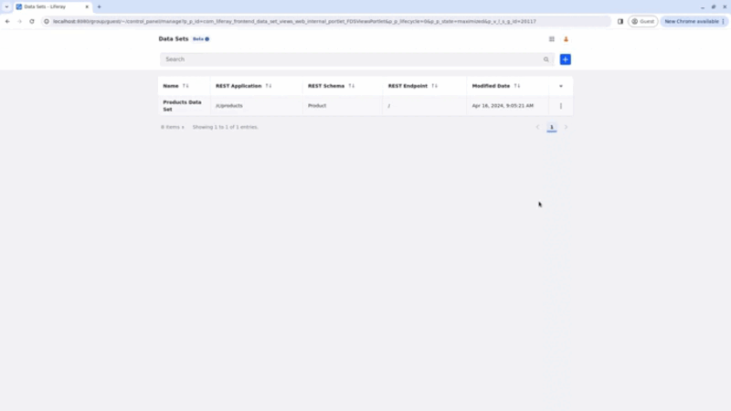
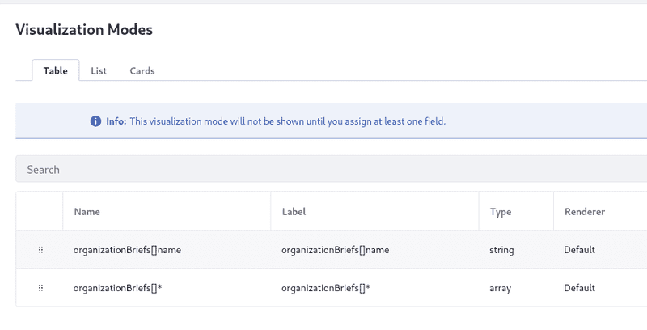

# Data Set View Visualization Modes

{bdg-secondary}`Liferay DXP 2024.Q1+/Portal 7.4 GA112+`
{bdg-link-primary}`[Beta Feature](../../../system-administration/configuring-liferay/feature-flags.md#beta-feature-flags)`

To customize the data display in your data set view, use the data set manager to select fields and manage visualization modes. There are three visualization modes: [table](#displaying-data-as-a-table), [list, and cards](#displaying-data-as-a-list-or-in-cards).

With the table visualization mode, you can add and customize any number of fields and select how to render them. With lists and cards, you have a restricted number of elements that can be mapped to fields.

After setting up the visualization modes, access a page with a [data set fragment](./using-data-set-view-actions.md#using-a-data-set-fragment-in-a-content-page) and choose your preferred mode using *Show View Options*

## Displaying Data as a Table

Use the table visualization mode to add, delete, order, edit, and map fields to columns and display data as a table in a [data set fragment](./using-data-set-view-actions.md#using-a-data-set-fragment-in-a-content-page).

To configure a table visualization mode,

1. Open the *Global Menu* (), select the *Control Panel* tab, and click *Data Sets* under Object.

1. Click the name of the *data set* you want to access.

   Alternatively, you can click *Actions* () next to the data set entry and select *Edit*.

1. Click the name of the *data set view* to start editing it.

1. Select the *Visualization Modes* tab.

1. Select the *Table* tab.

1. Click *Add* () to [add fields to the table](#adding-fields-to-visualization-modes).

1. Select the fields to be displayed.

   Select one or more fields. You can also use the search bar to find specific fields or leave the search bar empty to see all available fields.

1. Click *Save*.

With the fields in place, you can reorder them by using the drag icon on the left to drag and drop the field into the desired position.

### Adding Fields to Visualization Modes

When adding fields to visualization modes, you can select available fields from a tree structure shown in a modal. Those fields are displayed in your data set view.

(1) Navigate through the structure's levels and click on the checkbox next to a field to add it to your visualization mode.

(2) Alternatively, you can use the search bar at the top of the modal. Only matching fields are shown, and fields related to the search query are highlighted. To view the entire structure again, clear the search field or click `x` at the end of the search bar.

(3) Click *Deselect All* to clear all selections at once.

Click *Save* to save the fields and close the modal. To discard changes and close the modal, click *Cancel* or `x` in the top right corner.

Here are some important details to keep in mind when adding a field to visualization modes:

- Grayed out checkboxes indicate that the field is unavailable for the selected visualization mode.

- Users can select fields with scalar array information (e.g., a list of tags applied to a blog post). In the Table visualization mode, their values are separated by comma. In List/Card visualization modes, the values are concatenated without separators.

- Users can select fields with complex array information (e.g., an object entry). In the Table visualization mode, these fields can be selected at any level of the tree view. In List/Card visualization modes, only child fields can be selected.

- A complete complex array field appears as a stringified JSON object when using the default renderer.

   

<!-- - A cell renderer that displays a user-friendly version for the stringified JSON object can be developed and added as a client extension.

In case a document is added telling users how to do that. Eric  -->

-  The `[]*` notation follows the complex array field's name (e.g., organizationBriefs[]*). Fields belonging to a complex array are identified using the `[]` notation between the parent and child fields (e.g., organizationBriefs[]name).

   ![The `[]` notation is used to identify complex array fields and child fields.](./data-set-view-visualization-modes/images/06.png)

### Editing Fields in a Table

Now you can edit your fields to alter and localize their labels, select a renderer, and define if they are sortable.

To edit a field, click *Actions* () next to the field and select *Edit*.

   

### Editing and Localizing Labels

Once you start editing a field, you can change the label and localize it (1).

1. Click the *flag icon* next to the Label field and choose a *language*.

1. Enter the translated text in the Label field (2).

   The translated text is saved automatically.

   The localization status label next to the flag changes to `Translated` to indicate that localization was successful.

   

!!! note
    The localized text appears if users have the respective language applied to their portal.

### Selecting a Renderer for the Field

A renderer (3) is a structured way to customize how a component appears. You enter a raw value, and the renderer assumes the most typical format and UI for it.

!!! important
    To ensure your data appears correctly, the field type must be compatible with the selected renderer.

Below on the left, the status, date, and date and time fields have the default renderer applied. On the right, the status, date, and date and time renderers are applied to the respective fields.

<!-- once I have more information about renderers, I'll add a link to another section where I'll explain the types of renderers and what they do or what kind of structure/data/data type they need to work. -->

### Defining the Field as Sortable

When a field is marked as sortable, users can sort the elements while using the data set fragment in a content page.

Initially, users can sort entries based on the integer field. However, when the sortable checkbox is unchecked, sorting entries using the integer field as a filter becomes impossible (see below).

## Displaying Data as a List or in Cards

{bdg-secondary}`Liferay DXP 2024.Q2+/Portal 7.4 GA120+`

!!! note
    The List and Cards visualization modes are hidden until you map at least one field to an element in these modes.

Use the list and cards visualization modes to map fields to the visualization mode elements (i.e., title, description, image, and symbol) and display data as a list or in cards in a [data set fragment](./using-data-set-view-actions.md#using-a-data-set-fragment-in-a-content-page).

1. Open the *Global Menu* (), select the *Control Panel* tab, and click *Data Sets* under Object.

1. Click the name of the *data set* you want to access.

   Alternatively, you can click *Actions* () next to the data set entry and select *Edit*.

1. Click the name of the *data set view* to start editing it.

1. Select the *Visualization Modes* tab.

1. Open the *List* or *Cards* tab.

   Both visualization modes are configured similarly; The only difference is how the data appears.

1. To assign a field to an element, click *Add* () and select a field.

   The available elements are Title, Description, Image, and Symbol. Note that the image element overrides the symbol element; therefore, you only assign one of them.

   !!! tip
       To use the Symbol element, you must create [a text-type object field](../../objects/creating-and-managing-objects/fields.md) with values that match icon names from the [Clay Icon Reference](https://clayui.com/docs/components/icon.html).

       For example, if you want to use a shopping cart symbol, create the object definition, add a text field, name it however you want, and enter `shopping-cart` in the field when creating the object entry. Once you assign the field to the Symbol element, the shopping-cart symbol appears.

Below, you can see the same data shown in cards using images and as a list using clay icons as symbols.

## Defining a Default Visualization Mode

You can define a default visualization mode to be shown first once a data set fragment is used in a page.

1. Open the *Global Menu* (), select the *Control Panel* tab, and click *Data Sets* under Object.

1. Click the name of the *data set* you want to access.

   Alternatively, you can click *Actions* () next to the data set entry and select *Edit*.

1. Click the name of the *data set view* to start editing it.

1. Select the *Settings* tab.

1. Choose the *Default Visualization Mode*.

!!! note
    You can only set a visualization mode as default if it's visible. If you have a default mode and it becomes hidden, the first mode in alphabetical order is selected automatically as the default.

## Related Topics

- [Creating Data Sets](../creating-data-sets.md)
- [Data Set Views](../data-set-views.md)
- [Data Set View Actions](./data-set-view-actions.md)
- [Data Set View Filters](./data-set-view-filters.md)
