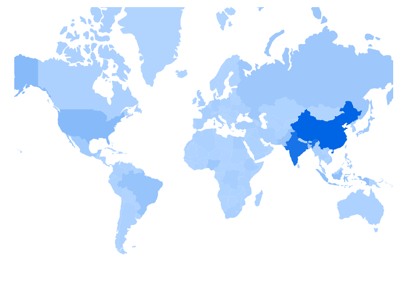
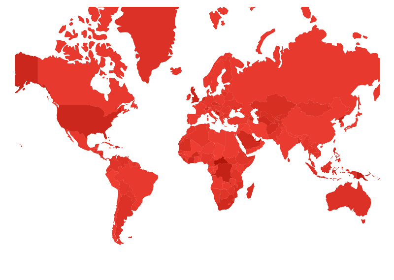

# Geomap Charts

A Geomap Chart lets you visualize data based on geography, given a specified color range---a lighter color representing a lower rank and a darker a higher rank usually. The default configuration comes from the Clay charts geomap component <!--[geomap component](https://github.com/liferay/clay/blob/develop/packages/clay-charts/src/Geomap.js#L233-L276)-->: which ranges from light-blue (#b1d4ff) to dark-blue (#0065e4) and ranks the geography based on the location's `pop_est` value (specified in the geomap's JSON file).



Follow these steps to configure your portlet to use geomap charts.

1. Import the chart taglib along with the `GeomapConfig`, `GeomapColor`, and `GeomapColorRange` classes into your bundle's `init.jsp` file:

    ```jsp
    <%@ taglib prefix="chart" uri="http://liferay.com/tld/chart" %>
    <%@ page import="com.liferay.frontend.taglib.chart.model.geomap.GeomapConfig" %>
    <%@ page import="com.liferay.frontend.taglib.chart.model.geomap.GeomapColor" %>
    <%@ page import="com.liferay.frontend.taglib.chart.model.geomap.GeomapColorRange" %>
    ```

1. Add the following Java scriptlet to the top of your `view.jsp`. The colors---a color for minimum and a color for maximum---are completely configurable, as shown in the second example configuration below: `_geomapConfig2`. Create a new `GeomapColorRange` and set the minimum and maximum color values with the `setMax()` and `setMin()` methods. Specify the highlight color---the color displayed when you mouse over an area---with the `setSelected()` method. use the `geomapColor.setValue()` method to specify the JSON property to determine the geomap's ranking. Specify the JSON filepath with the `setDataHREF()` method. The example below displays a geomap based on the length of each location's name:

    ```java
    <%
    GeomapConfig _geomapConfig1 = new GeomapConfig();
    GeomapConfig _geomapConfig2 = new GeomapConfig();

    GeomapColor geomapColor = new GeomapColor();
    GeomapColorRange geomapColorRange = new GeomapColorRange();

    geomapColorRange.setMax("#b2150a");
    geomapColorRange.setMin("#ee3e32");

    geomapColor.setGeomapColorRange(geomapColorRange);

    geomapColor.setSelected("#a9615c");

    geomapColor.setValue("name_len");

    _geomapConfig2.setColor(geomapColor);

    StringBuilder sb = new StringBuilder();

    sb.append(_portletRequest.getScheme());
    sb.append(StringPool.COLON);
    sb.append(StringPool.SLASH);
    sb.append(StringPool.SLASH);
    sb.append(_portletRequest.getServerName());
    sb.append(StringPool.COLON);
    sb.append(_portletRequest.getServerPort());
    sb.append(_portletRequest.getContextPath());
    sb.append(StringPool.SLASH);
    sb.append("geomap.geo.json");

    _geomapConfig1.setDataHREF(sb.toString());
    _geomapConfig2.setDataHREF(sb.toString());
    %>
    ```

1. Add the `<chart>` taglib to the `view.jsp` along with any styling information for the geomap, such as the size and margins as shown below:

    ```html
    <style type="text/css">
    	.geomap {
    		margin: 10px 0 10px 0;
    	}
    	.geomap svg {
    		width: 100%;
    		height: 500px !important;
    	}
    </style>

    <chart:geomap
    	config="<%= _geomapConfig1 %>"
    	id="geomap-default-colors"
    />

    <chart:geomap
    	config="<%= _geomapConfig2 %>"
    	id="geomap-custom-colors"
    />
    ```



Awesome! Now you know how to create geomap charts for your apps.

## Related Topics

* [Bar Charts](./bar-chart.md)
* [Pie Charts](./pie-chart.md)
* [Combination Charts](./combination-chart.md)