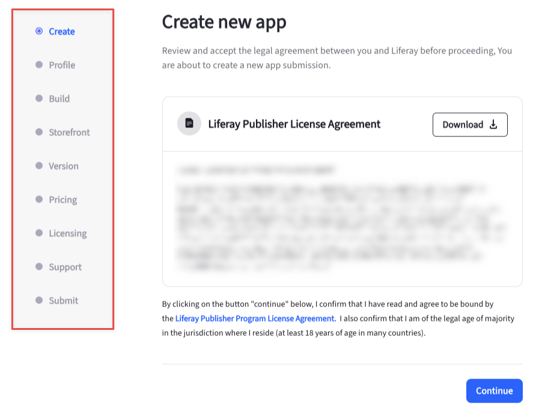
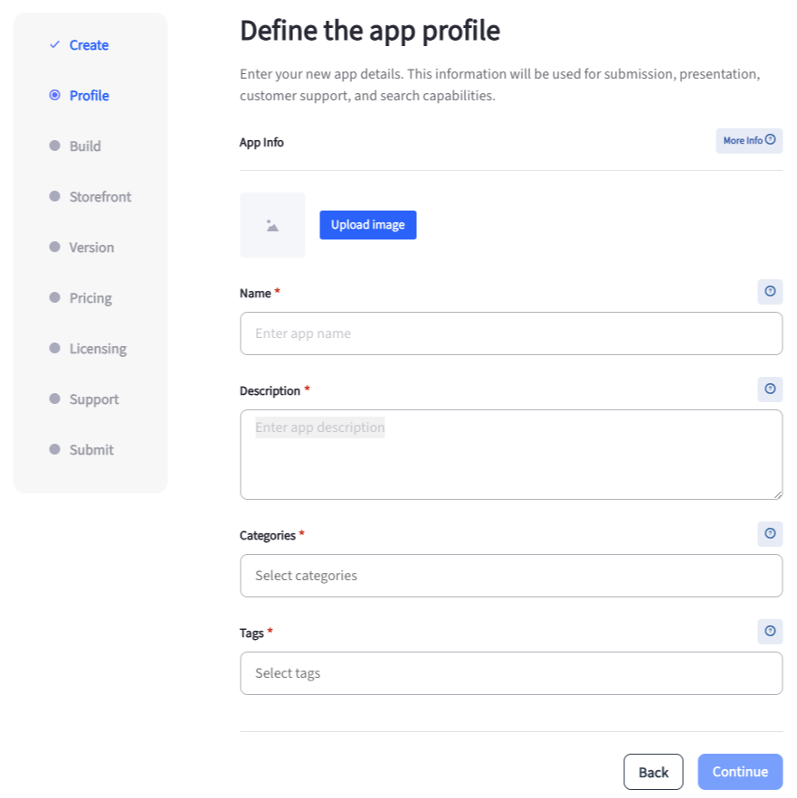

# Publishing Apps in Marketplace

The Liferay Marketplace contains both DXP apps (for Liferay PaaS and Liferay Self-Hosted) and Cloud apps (for Liferay SaaS). As a publisher, you may want to publish your DXP apps on the Marketplace. The process of publishing a DXP app differs slightly. If you haven't signed up to become a publisher, see [Become a Publisher](./become-a-publisher.md) for more information.

After becoming a publisher,

1. Log in to your Liferay account at [marketplace.liferay.com](https://marketplace.liferay.com/).

1. Open the *Dashboard* dropdown and select *Publisher*.

1. Click *New App*.

   In the new page that appears, you can download the Liferay Publisher License Agreement. Ensure that you've gone through it fully before continuing.

   

1. Click *Continue*.

1. In the Profile step, Enter a name and description for your app. You must also choose one or more categories and tags.

   

1. In the Build step, you can choose whether the app is cloud compatible. Choose *No* for a DXP app and *Yes* for a Cloud app. This opens up more options for configuring your app.

   

   For Cloud apps, you must set the Resource Requirements by entering the number of required CPUs and RAM (in GB).

   

1. In the Compatible Offering section, choose if the app is compatible with the *Self-Hosted*, *Self-Managed*, or *Fully-Managed* offering from Liferay. You can choose multiple options here.

1. In the App Build section, click *Add Package(s)* and choose one or more compatible versions of Liferay. For each version you select, you must upload a `JAR/WAR` file.

   For Cloud apps, click *Add Package(s)* and choose one or more compatible versions of Liferay. For each version you select, you must upload a `ZIP` file.

1. To upload a `JAR/WAR` file (for DXP apps) or `ZIP` file (for Cloud apps), drag and drop it to the specified area or click *Select File* to upload one from your file system. You can remove a version by clicking on *Remove Version*.

1. In the Storefront step, you can add up to 10 images that appear in the storefront. Drag and drop the images to the specified area or click *Select File* to upload them from your file system. You must upload at least one image. After uploading an image, you can enter an optional description for it.

1. In the Version step, enter a version and notes about the specific version. The customer sees when they purchase or update the app.

1. In the Pricing step, select if the app is *Free* or *Paid*. For paid apps, ensure that you're a business and that you've entered payment information on your Marketplace profile.

   

1. In the Licensing step, select if the app comes with a *Perpetual License* or a *Subscription License*. In the section below, choose whether you provide a 30-day free trial. For free apps, there's no option for a subscription license or a 30-day trial.

   For paid apps, you can select a license type and then choose the unit price for a license. You can also set price tiers for multiple quantities if needed.

   

1. In the Support step, enter details for the following:

   * Support URL
   * Publisher Website URL
   * Support Email
   * Support Phone
   * App Usage Terms (EULA) URL
   * App documentation URL
   * App installation and uninstallation guide URL

1. In the Submit step, review all the information you've entered. Check the box to confirm that you cannot edit these details once submitted and click *Submit App*.

An administrator receives your request after submission. Once approved, your customers can start using your app from the Marketplace.

## Related Topics

* [Become a Publisher](./become-a-publisher.md)