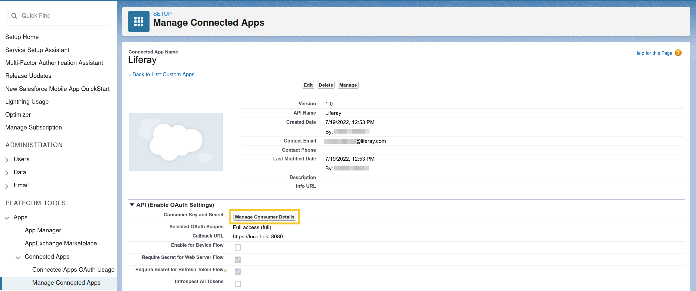
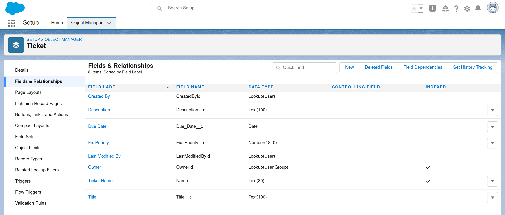
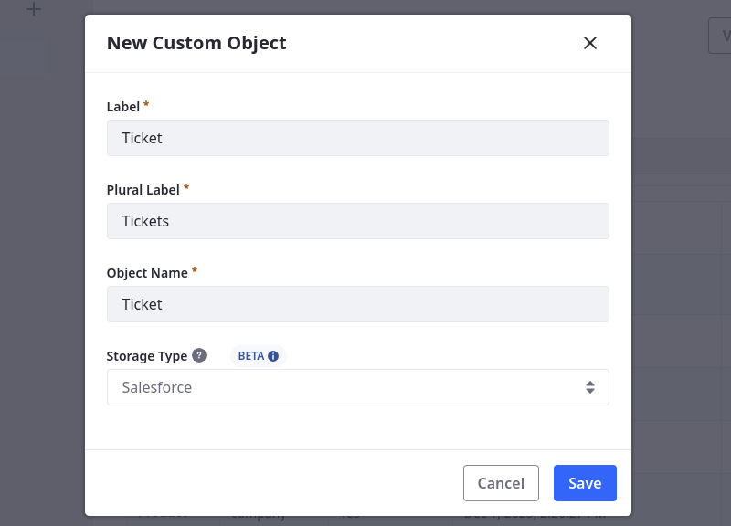
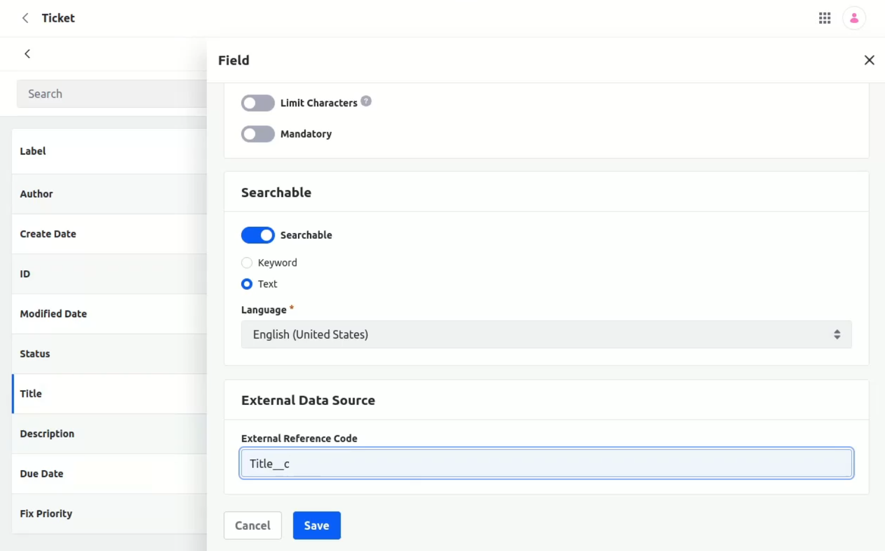

# Using Objects with Salesforce

{bdg-link-primary}`[Beta Feature](../../../../system-administration/configuring-liferay/feature-flags.md#beta-feature-flags)`

With Liferay, you can create objects that integrate with [Salesforce objects](https://help.salesforce.com/s/) and use Salesforce as an external storage system. Once integrated, the Liferay object's data is only stored in Salesforce and both systems are automatically updated whenever users add, update, or delete entries in either context.

Using this integration requires a standard or custom Salesforce object, as well as a Salesforce connected app for Liferay with OAuth enabled. See [Preparing Salesforce](#preparing-salesforce) for more information.

!!! note
    To use this feature, enable the Proxy Object (LPS-135430) [feature flag](../../../../system-administration/configuring-liferay/feature-flags.md)

## Preparing Salesforce

Salesforce [connected apps](https://help.salesforce.com/s/articleView?id=sf.connected_app_overview.htm&type=5) are frameworks for allowing external applications to integrate with your Salesforce account via APIs and standard protocols (e.g., SAML, OAuth). Before proceeding, [create a connected app](https://help.salesforce.com/s/articleView?id=sf.connected_app_create.htm&type=5) to enable your Liferay instance to integrate with Salesforce.

When setting up the connected app in Salesforce, [enable and configure OAuth](https://help.salesforce.com/s/articleView?id=sf.connected_app_create_api_integration.htm&type=5) for the API integration with Liferay. During this process, be sure to copy the OAuth consumer key and secret. These details are necessary when [configuring your Liferay instance](#configuring-your-liferay-instance).

Before creating your Liferay object, ensure your [standard](https://help.salesforce.com/s/articleView?id=sf.extend_click_find_objectmgmt_parent.htm&type=5) or [custom](https://help.salesforce.com/s/articleView?id=sf.dev_objectedit.htm&type=5) Salesforce object includes all desired fields. These fields must be defined before you can link Liferay object fields to them.

## Configuring Your Liferay Instance

Follow these steps to connect your Liferay instance to Salesforce:

1. Open the *Global Menu* (), go to the *Control Panel* tab, and click *Instance Settings*.

1. Click *Third Party* and go to the *Salesforce Integration* tab.

1. Enter your Salesforce login info and OAuth credentials for the [Liferay connected app](https://help.salesforce.com/s/articleView?id=sf.connected_app_overview.htm&type=5).

   For *Login URL*, you can use `https://login.salesforce.com/` or the login URL for your Salesforce domain.

   

1. Click *Save*.

## Creating a Liferay Object with the Salesforce Storage Type

Creating a Liferay object for storing data in Salesforce follows the same standard process for creating any a standard custom object. The only difference is you must select the *Salesforce* storage type during draft creation. This configures the object to use Salesforce as an external storage system. See [Creating Objects](../../creating-and-managing-objects/creating-objects.md) for detailed instructions.

!!! note
    Currently, the Salesforce storage type only supports custom [fields](../../creating-and-managing-objects/fields.md), [views](../../creating-and-managing-objects/views.md), and [layouts](../../creating-and-managing-objects/layouts.md).

After creating the object draft, [add fields](../../creating-and-managing-objects/fields/adding-fields-to-objects.md) for each custom field in the Salesforce object. To prevent data loss, ensure each field corresponds to a custom field in the desired Salesforce object. Then edit each field and add external reference codes that link to the desired Salesforce fields. For each ERC, use the name of the corresponding custom Salesforce field (e.g., `Title_c`, `Due_Date__c`).

Once published, the Liferay object's data is only stored in Salesforce. Both systems are automatically updated whenever users add, update, or delete entries on either side of the relationship.

## Related Topics

* [Creating Objects](../../creating-and-managing-objects/creating-objects.md)
* [Adding Fields](../../creating-and-managing-objects/fields/adding-fields-to-objects.md)
