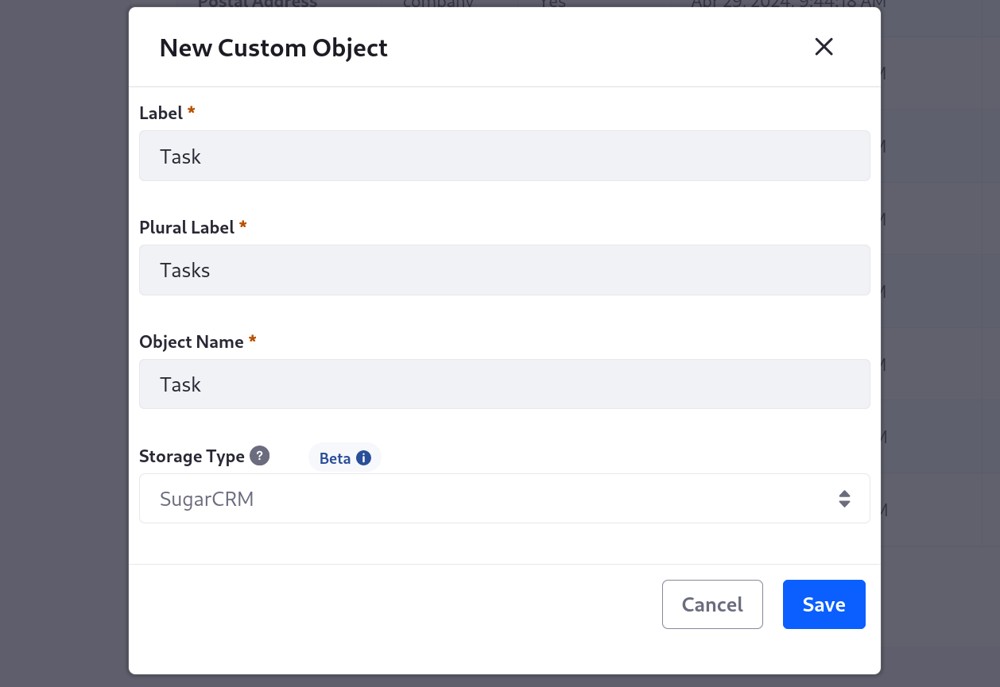

# Using Objects with SugarCRM

{bdg-link-primary}`[Beta Feature](../../../../system-administration/configuring-liferay/feature-flags.md#beta-feature-flags)`

You can create objects that map to [SugarCRM](https://support.sugarcrm.com) objects (e.g., [Leads](https://support.sugarcrm.com/knowledge_base/accounts_contacts_leads/)), using SugarCRM as an external storage system. Once integrated, the Liferay object's data is only stored in SugarCRM. Both systems are automatically updated whenever users add, update, or delete entries in either context.

!!! note
    To use this feature, enable the Proxy Object (LPS-135430) [feature flag](../../../../system-administration/configuring-liferay/feature-flags.md).

## Preparing SugarCRM

In SugarCRM , you must generate an [OAuth key](https://support.sugarcrm.com/documentation/sugar_versions/14.0/sell/administration_guide/system/#OAuth_Keys) to configure API integration with Liferay. After that you can connect Liferay to Sugar CRM.

### Gathering Information to Connect SugarCRM with Liferay

Gather the information Liferay needs to retrieve an access token and connect to your SugarCRM instance using an OAuth password grant:

* The URL to your instance's [root API endpoint](https://support.sugarcrm.com/documentation/sugar_developer/sugar_developer_guide_14.0/integration/web_services/rest_api/#How_to_Access_the_REST_Service)
* The URL to the endpoint for retrieving the [OAuth token](https://support.sugarcrm.com/documentation/sugar_developer/sugar_developer_guide_14.0/integration/web_services/rest_api/#Authentication)
* The Consumer Key to the [generated OAuth Key](https://support.sugarcrm.com/documentation/sugar_versions/14.0/sell/administration_guide/system/#OAuth_Keys_Fields)
* The user name and password of a [SugarCRM administrative user](https://support.sugarcrm.com/documentation/sugar_versions/14.0/sell/administration_guide/system/#OAuth_Keys_Fields)

After establishing the connection, gather some information about the SugarCRM object.

### Gathering Information about the SugarCRM Object

Before creating your Liferay object, ensure the SugarCRM object includes all desired fields. Define any missing fields before linking with Liferay object fields.

In addition, use the SugarCRM API to inspect the object and its fields. You must obtain the following information in order to map your Liferay object to your SugarCRM object:

* An [OAuth token](https://support.sugarcrm.com/documentation/sugar_developer/sugar_developer_guide_14.0/integration/web_services/rest_api/#Authentication) to make authenticated requests to the REST API
* The [GET endpoint of the object](https://support.sugarcrm.com/documentation/sugar_developer/sugar_developer_guide_14.0/integration/web_services/rest_api/endpoints/module_get/#Overview) (known as a module in SugarCRM), to use as the object definition ERC in Liferay
* Each field's name as returned by the object's GET API endpoint, to use as the ERC in the Liferay object's corresponding fields

## Configuring Your Liferay Instance

Connect your Liferay instance to SugarCRM:

1. Open the *Global Menu* (), go to the *Control Panel* tab, and click *Instance Settings*.

1. Click *Third Party* and go to the *SugarCRM Integration* entry.

1. Fill out the configuration form with the details gathered from your SugarCRM instance.

   **Access Token URL:** The URL to your instance's root API endpoint

   **Base URL:** The URL to the endpoint for retrieving the OAuth token

   **Client ID:** The Consumer Key to the OAuth Key

   **Grant Type:** `password`

   **Password:** The password of a user that can authenticate to SugarCRM

   **User Name:** The user name of a user that can authenticate to SugarCRM

   

1. Click *Save*.

## Creating an Object with the SugarCRM Storage Type

To create a proxy object for storing data in SugarCRM, follow the [usual process](../../creating-and-managing-objects.md), but select the *SugarCRM* storage type. This configures the object to use SugarCRM as an external storage system.



!!! note
    Currently, the SugarCRM storage type only supports custom [fields](../../creating-and-managing-objects/fields.md), [views](../../creating-and-managing-objects/views.md), and [layouts](../../creating-and-managing-objects/layouts.md).

While creating the Liferay object draft, edit the ERC to match the last part of the SugarCRM object's REST endpoint resource path. For example, if the endpoint ends with `/Contacts`, you must use `Contacts` as the ERC.

[Add object fields](../../creating-and-managing-objects/fields/adding-fields-to-objects.md) for every field in the SugarCRM object to prevent data loss. Ensure each field corresponds to a field in the SugarCRM object. Then edit each field and add external reference codes that link to the desired SugarCRM fields. For each ERC, use the name of the corresponding custom SugarCRM field (e.g., `last_name`, etc.).

You must ensure each Liferay object field's ERC matches the field name returned by the SugarCRM REST API for the corresponding object. For example, a First Name field in the Liferay object must use `first_name` as the ERC to map to the first name in this theoretical SugarCRM object JSON:

```json
{
   "name": "Lord Voldermort",
   "first_name": "Tom",
   "last_name": "Riddle",
   "title": "Lord"
}
```


Once published, the Liferay object's data is only stored in SugarCRM. Both systems are automatically updated whenever users add, update, or delete entries on either side of the relationship.

## Related Topics

* [Creating Objects](../../creating-and-managing-objects/creating-objects.md)
* [Adding Fields](../../creating-and-managing-objects/fields/adding-fields-to-objects.md)
