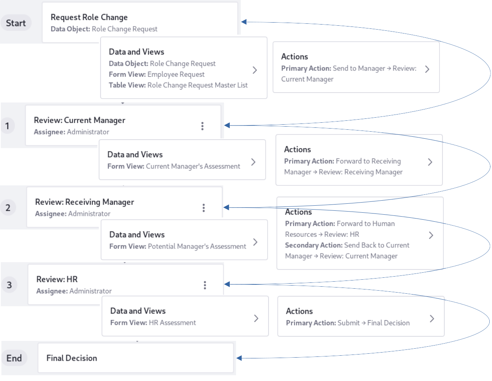

# Creating the Role Change Request App

> **Subscribers**

The Role Change Request App starts with the employee submitting a request form. Processing then proceeds to the Current Manager, then to the Receiving Manager, and finally to Human Resources. At each step a different form is presented, and the object accumulates data. By the end of the process the whole data object is complete.



Before proceeding, create the backing object, form views, and table views. See [Creating the Role Change Request Object](./creating-the-role-change-request-object.md) for details. Here, you'll create the Workflow Powered App based the backing object presented there.

A Standard app can be created from within the Object Control Panel entry, but not a Workflow Powered app. Instead use the _Apps_ Control Panel Entry:

1. Open the Applications Menu () and navigate to Control Panel &rarr; App Builder &rarr; Apps.

1. Click the _Workflow Powered_ tab. Any existing Workflow Powered apps are displayed. 

1. Click the Add button () to open the New Workflow Powered App canvas.

   

1. The first step of the workflow is in place---rename it to _Request Role Change_. The first step represents the submission of the first form that kicks off the application's process. After renaming the step, configure the Data and Views:

   - Main Data Object: Select the _Role Change Request_ object.
   - Form View: Select the _Employee Request_ form.
   - Table View: Select the _Role Change Request Master List_ (this table view isn't used for this step).

   Configure the Action:

   - Rename the current action to _Send to Manager_.

   Save the application.

1. Re-open the app and add a step to the workflow by clicking the _plus_ icon.

   Name it _Review: Current Manager_ and assign it to the _Administrator_ Role. Each step you add for the Role Change Request App corresponds to a different form. Together, all the steps/forms fill out all the fields of the backing object.

   Now configure the Data and Views:

   - Form View: _Current Manager's Assessment_. Make it editable.

   Go back to the Step Configuration screen and configure the Actions:

   - Rename the action to _Forward to Receiving Manager_.

   Save the app. If you see a warning message about applying the updates to existing app data, click _Save_ in the dialog box. This is a new app that doesn't currently have any data records, and the warning is informational.

1. Re-open the app, click on the last step added, and add a new step by clicking the _plus_ icon.

   Name it _Review: Receiving Manager_ and assign it to the _Administrator_ Role.

   Now configure the Data and Views:

   - Form View: _Potential Manager's Assessment_. Make it editable.

   Go back to the Step Configuration screen and configure the Actions:

   - Rename the existing action to _Forward to Human Resources_. It transitions to the next step in the workflow.

   - Add a secondary action, named _Send Back to Current Manager_. It transitions back to the previous workflow step, enabling the two managers to collaborate on the details until it's ready for HR review.

1. Re-open the app, click on the last step added, and add a new step by clicking the plus icon.

   Name it  _Review: HR_ and assign it to the _Administrator_ Role.

   Now configure the Data and Views:

   - Form View: _HR Assessment_. Make it editable.

   Go back to the Step Configuration screen and configure the Actions:

   - Leave the action named _Submit_.

## Deploying the App

Now the app is ready for use. It just needs to be [deployed](./creating-a-standard-application.md#deploying-the-application) so its users can begin sending data.

The Role Change Request app can be deployed as a standalone app with a dedicated link. This is the type of app that should be used after reading some procedures, perhaps in a [Wiki](../../../collaboration-and-social.md#wiki) or a company's employee handbook [document](../../../content-authoring-and-management/documents-and-media.md). Keeping the link there ensures that employees read the appropriate documentation before kicking off a Role Change Request.

## Using the App

As with any workflow item, the task must be assigned to a User to fill out and submit the form. The way you do this depends on how you access the workflow task.

Once the Employee Request form is submitted, the Role assigned to the next step receives a [notification](../../../collaboration-and-social/notifications-and-requests/user-guide/managing-notifications-and-requests.md). Click on it to see the next form view, Review: Current Manager. Assign the task to a User by clicking the Change icon ().


Alternatively, you can manage the workflow process of the app's entries from the table view for the app. The app's default view is its table view, so for a standalone app like the Role Change Request, use its dedicated link to go to the app. Click an entry's Actions button ().


To assign the task to a User, use the _Assign To_ menu item. After that you can access the appropriate form by choosing the _Edit_ menu option.

```{note}
You cannot use the [My Workflow Tasks](../../../process-automation/workflow/using-workflows/reviewing-assets.md#assigning-the-review-task) app to manage the steps of a Workflow Powered App.
```

## Going Further with the Role Change Request App

Add enhancements to make the Role Change Request app fully functional:

1. [Create Roles](../../../users-and-permissions/roles-and-permissions/understanding-roles-and-permissions.md) for the managers and HR. Assign the appropriate steps to each Role, rather than using the Administrator Role. 

2. Create a Standard app so those with proper permissions can see the master list table from the Role Change Request object. Administrators can also kick off a form for an employee since they can access the first form, _Employee Request_.

## Related Information

- [App Builder Overview](../app-builder.md)
- [Creating a Standard Application](./creating-a-standard-application.md)
- [Workflow](../../../process-automation/workflow/introduction-to-workflow.md)
- [Roles and Permissions](../../../users-and-permissions/roles-and-permissions/understanding-roles-and-permissions.md)
