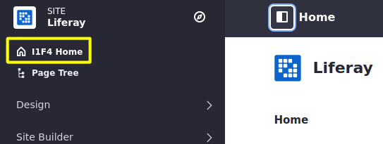
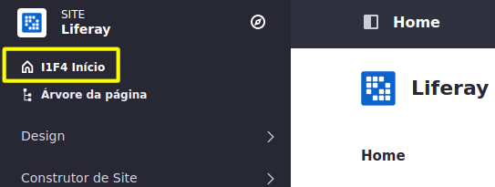

# Overriding Global Language Translations with Language Properties

Liferay DXP/Portal implements headings, labels, and messages for the default locale and many other locales using language translations. You can override these translations for any of the locales using new language translation values in a module.

!!! note
    The [Language Override tool](../../../system-administration/configuring-liferay/changing-translations-with-language-override.md) is the recommended approach for overriding language translations. This tool is available in Liferay DXP 7.4 U4 (Update 4) and above or Liferay Portal 7.4 GA8 and above. Continue reading for the previous way.

## Examining the Global Language Translations

The global language translations are in the source code and the [DXP/Portal bundle](../../../installation-and-upgrades/installing-liferay.md).

In the source:

- [`liferay-[dxp|portal]/portal-impl/src/content/Language[_xx_XX].properties`](https://github.com/liferay/liferay-portal/tree/[$LIFERAY_LEARN_PORTAL_GIT_TAG$]/portal-impl/src/content)
- [`liferay-[dxp|portal]/modules/apps/portal-language/portal-language-lang/src/main/resources/content/Language[_xx_XX].properties`](https://github.com/liferay/liferay-portal/tree/[$LIFERAY_LEARN_PORTAL_GIT_TAG$]/modules/apps/portal-language/portal-language-lang/src/main/resources/content)

In the bundle:

- `portal-impl.jar#content/Language[_xx_XX].properties`
- `Liferay Foundation - Liferay Portal Language - Impl.lpkg` &rarr; `com.liferay.portal.language.lang-[version].jar#content/Language[_xx_XX].properties`

Language translations for different languages and locales can be identified by the filename ending. For example, `Language_ja.properties` is for Japanese.

These language translation files contain properties that you can override, like the language settings properties:

```properties
...
lang.user.name.field.names=prefix,first-name,middle-name,last-name,suffix
lang.user.name.prefix.values=Dr,Mr,Ms,Mrs
lang.user.name.required.field.names=last-name
lang.user.name.suffix.values=II,III,IV,Jr,Phd,Sr
...
```

There are also many simple translations you can override for messages and labels.

```properties
...
category.admin=Admin
category.alfresco=Alfresco
category.christianity=Christianity
category.cms=Content Management
...
```

## Overriding Language Translations Programmatically

In Liferay DXP/Portal 7.4+, you can declare overrides using metadata. In earlier versions, Java classes declare the overrides.

If your version is earlier than 7.4, skip ahead to [Overriding in Earlier Versions](#overriding-in-earlier-versions).

## Deploy the Example for 7.4+

This example changes the `home` language translation setting to this:

```{literalinclude} ./overriding-global-language-translations-with-language-properties/resources/liferay-i2f4.zip/i2f4-impl/src/main/resources/content/Language_en_US.properties
:language: properties
```

```{include} /_snippets/run-liferay-portal.md
```

Then, follow these steps to deploy the example:

1. Download and unzip the `liferay-i2f4.zip` example project.

    ```bash
    curl https://resources.learn.liferay.com/dxp/latest/en/liferay-internals/extending-liferay/liferay-i2f4.zip -O
    ```

    ```bash
    unzip liferay-i2f4.zip
    ```

1. Build and deploy the project module.

    ```bash
    cd liferay-i2f4
    ```

    ```bash
    ./gradlew deploy -Ddeploy.docker.container.id=$(docker ps -lq)
    ```

    !!! note
        This command is the same as copying the deployed jars to `/opt/liferay/osgi/modules` on the Docker container.

1. Confirm the deployment in the Liferay Docker container console.

    ```bash
    STARTED com.acme.i2f4.impl_1.0.0 [3209]
    ```

1. Verify the example module's customization. Open your browser to `https://localhost:8080`.

1. Click the menu icon (). The home icon label uses the custom language translation value.

    

1. The example includes custom language translation values for multiple locales. For example, use the language selector to select Brazilian Portuguese or Japanese to see the customization in that locale. The module overrides language translations for these locales too.

    

Now that you've seen the example, here's how it works.

## Create a Language Properties File

Select the translations you want to override. The example module overrides the `home` language translation.

```{literalinclude} ./overriding-global-language-translations-with-language-properties/resources/liferay-i2f4.zip/i2f4-impl/src/main/resources/content/Language_en_US.properties
:language: properties
```

!!! important
    The values for the language translations you declare override the values for those existing translations. All other existing language translation settings are preserved.

Once you've decided which translations to override, create a language properties file in your module's `src/main/resources/content` folder. Use the file name `Language.properties` to override the default locale's language translations. To override a specific locale's translations, use the language properties file naming convention: `Language[_xx_XX].properties`.

For example, if you're overriding Japanese, use `Language_ja.properties`.

## Declare the Override in the Bnd File

In your module's `bnd.bnd` file, specify your language resource provider capability. Here is the example's `Provide-Capability` header:

```{literalinclude} ./overriding-global-language-translations-with-language-properties/resources/liferay-i2f4.zip/i2f4-impl/bnd.bnd
:lines: 4-6
```

!!! note
    The example omits a service ranking---it uses OSGi's default ranking `0`, which is higher than the default global resource bundle service ranking `-1`.

Global language translation overrides are easiest to manage when they're in the same module.

Although we don't recommend using multiple modules to override global language translations, if you override the same translation in multiple modules, the language resource provider with the highest service ranking wins.

For example, if you want your module's language translations to take priority over translations from a provider that has service ranking `1`, set your ranking to `2` or higher.

```properties
Provide-Capability:\
	liferay.language.resources;\
		resource.bundle.base.name="content.Language";\
		service.ranking:Long="2"
```

Deploy the module to see your new language translation values.

## Overriding in Earlier Versions

On Liferay DXP/Portal versions earlier than 7.4, overriding global language translations requires a [language properties file](#create-a-language-properties-file) and a `java.util.ResourceBundle` for each translation being customized. Learn more by deploying the following example and examining its code.

!!! note
    Many of the language translations are in the global language translation files, but some may be located in specific application modules. The process of [overriding module language translation in earlier versions](./overriding-module-language-translations.md) is different from overriding the global translations.

### Deploy the Example for Earlier Versions

This example changes the `publish` language translation setting to this:

```{literalinclude} ./overriding-global-language-translations-with-language-properties/resources/liferay-x8f3.zip/x8f3-impl/src/main/resources/content/Language_en_US.properties
:language: properties
```

Here's how to deploy the example:

1. Download and unzip the `liferay-x8f3.zip` example project.

    ```bash
    curl https://resources.learn.liferay.com/dxp/latest/en/liferay-internals/extending-liferay/liferay-x8f3.zip -O
    ```

    ```bash
    unzip liferay-x8f3.zip
    ```

1. Build and deploy the project module.

    ```bash
    cd liferay-x8f3
    ```

    ```bash
    ./gradlew deploy -Ddeploy.docker.container.id=$(docker ps -lq)
    ```

1. Confirm the deployment in the Liferay Docker container console.

    ```bash
    STARTED com.acme.x8f3.impl_1.0.0 [3209]
    ```

1. Open your browser to `https://localhost:8080` and sign in.

1. Navigate to a Site page and click the edit icon (). The publish button shows the custom language translation.

    

1. Use the language selector to select Brazilian Portuguese or Japanese to see the custom language translation. The module overrides language translations for each locale you include in the module.

    

Like the 7.4+ example, this module specifies custom values in language translation files. Instead of using metadata (a `bnd.bnd` file header) to declare the override, however, the module uses `ResourceBundle` classes.

### Create Resource Bundle Classes

Each locale you're overriding requires a class that extends `java.util.ResourceBundle`. Here's the example resource bundle class for the `en_US` locale:

```{literalinclude} ./overriding-global-language-translations-with-language-properties/resources/liferay-x8f3.zip/x8f3-impl/src/main/java/com/acme/x8f3/internal/language/X8F3EnglishResourceBundle.java
:language: java
:lines: 10-26
```

The class's `_resourceBundle` field is assigned a `ResourceBundle`. The call to `ResourceBundle.getBundle` needs two parameters. The `content.Language_en_US` parameter is the language file's qualified name with respect to the module's `src/main/resources/content` folder. The second parameter is a `control` that sets the language syntax of the resource bundle. To use language syntax identical to Liferay's syntax, import Liferay's `com.liferay.portal.kernel.language.UTF8Control` class and set the second parameter to `UTF8Control.INSTANCE`.

The class's `@Component` annotation declares it an OSGi `ResourceBundle` service component. Its `language.id` property designates it for the `en_US` locale.

```{literalinclude} ./overriding-global-language-translations-with-language-properties/resources/liferay-x8f3.zip/x8f3-impl/src/main/java/com/acme/x8f3/internal/language/X8F3EnglishResourceBundle.java
:language: java
:lines: 10
```

The class overrides these methods:

**`handleGetObject`:** Looks up the translation in the module's resource bundle (which is based on the module's language properties file) and returns the key's value as an `Object`.

**`getKeys`:** Returns an `Enumeration` of the resource bundle's keys.

Your resource bundle service component redirects the default language translation to your module's language translation overrides.

Global language translation overrides for multiple locales require a separate resource bundle class for each locale. For example, the tutorial code has one for Brazilian Portuguese, English, and Japanese. Each resource bundle must specify its locale in the `language.id` component property definition and in the language file qualified name parameter. For example, here is what they look like for the Japanese locale.

Component definition:

```{literalinclude} ./overriding-global-language-translations-with-language-properties/resources/liferay-x8f3.zip/x8f3-impl/src/main/java/com/acme/x8f3/internal/language/X8F3JapaneseResourceBundle.java
:language: java
:lines: 10
```

Resource bundle assignment:

```{literalinclude} ./overriding-global-language-translations-with-language-properties/resources/liferay-x8f3.zip/x8f3-impl/src/main/java/com/acme/x8f3/internal/language/X8F3JapaneseResourceBundle.java
:dedent: 1
:language: java
:lines: 23-24
```

Deploy your module to see your new language translation values.

!!! note
    When you're ready to upgrade to DXP 7.4+, you can continue to use your language translation override module. Optionally, you can simplify the module by removing the `ResourceBundle` class and specifying the `Provide-Capability` header in your `bnd.bnd` file as demonstrated [above](#declare-the-override-in-the-bnd-file).

## Related Topics

- [Overriding Module Language Translations in Earlier Versions](./overriding-module-language-translations.md)
- [Changing Translations with Language Override](../../../system-administration/configuring-liferay/changing-translations-with-language-override.md)
- [Using Localized Messages in an MVC Portlet](../../../liferay-development/building-applications/developing-a-java-web-application/using-mvc/using-localized-messages-in-an-mvc-portlet.md)
- [Upgrading Language Key Overrides](../../../installation-and-upgrades/upgrading-liferay/upgrading-custom-development/upgrading-language-key-overrides.md)