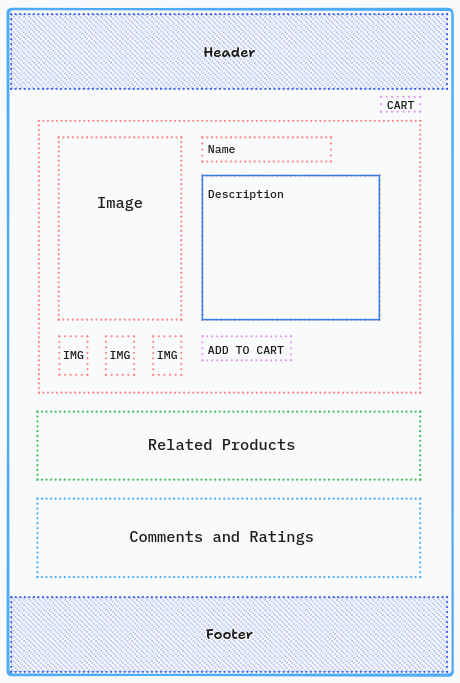

# Micro Frontends

## What are Micro Frontends?

Micro Frontends extend the concept of microservices to the front-end side of development. The idea is to build a fully-featured and powerful browser application on top of a microservice architecture while breaking the application down into smaller parts. This approach allows separate teams to develop it using the necessary technologies/frameworks.

Think of a website or web app as a puzzle. In the past, it required a whole team to assemble its pieces and create the entire application. This was known as a monolith.

Now, consider breaking down this puzzle into smaller pieces. Different teams, each with their own expertise and using different frameworks, can work on these smaller puzzles. Then, they seamlessly piece them together to create a great user experience. This is the essence of Micro Frontends.


## Micro Frontends at Liferay

In Liferay, users can apply the concept of Micro Frontends using [Front-end client extensions](../building-applications/client-extensions/front-end-client-extensions.md) in addition to all the available customizable out-of-the-box solutions (e.g., [fragments](../site-building/creating-pages/page-fragments-and-widgets/using-fragments.md) and [widgets](../site-building/creating-pages/page-fragments-and-widgets/using-widgets.md)).

Developers are fully able to create or extend applications within Liferay DXP using different frameworks and then connect them to Liferay using client extensions.

One of the available front-end client extensions is the [basic custom element](../building-applications/client-extensions/front-end-client-extensions/tutorials/creating-a-basic-custom-element.md). Basic custom elements use Liferay's front-end infrastructure to register external, remote applications with the Liferay platform and render them as widgets. This way, users can develop the applications separately, create basic custom elements using client extensions, and add them to a page.

```{note}
Custom element client extensions can use any technology, regardless of how it’s built, packaged, or hosted.
```

See some example cases below to better illustrate the concept.

### Case 1: Raylife

[Raylife](https://marketplace.liferay.com/p/liferay-insurance-agent-portal-accelerator#solutions-details-video) is an agent portal solution built on Liferay. It works as an accelerator that can be customized according to the user's needs.

In this example (see image below), Raylife requires 4 separate applications: a [React based client extension](../building-applications/developing-a-javascript-application/using-react.md) as base application where you can display a list of insurance claims with different fields; fragment blocks that display information using different visualizations (they can also be replaced by other blocks to show different visualizations); a header; and a side menu bar.

The elements in the page communicate through events triggered by the DOM and they can maintain synchronous communication and share resources among themselves.

All data on the screen is obtained through [headless API](../building-applications/objects/objects-tutorials/managing-objects-with-headless-apis.md) and [objects](../building-applications/objects.md) for data persistence.

Different teams worked on the project at the same time. Each team was responsible for an application. As client extensions were used, they were able to maintain the team code isolated and, while one of the applications used React as its main framework, others were created via custom fragments using HTML, CSS, and JavaScript.


### Case 2: Commerce Application

Imagine you need to create a website to be used by an e-store. The website must have a header, a footer, and four applications: a main display application where users find information about the product (the name of the product, pictures, and a description); a cart/checkout application (including the Add to Cart button); a related products application to show products related to the one in the main display; and a comments/ratings section that contains customer's comments about the product and a star rating system to evaluate the product.

You can [use layout elements](../site-building/creating-pages/page-fragments-and-widgets/using-fragments/using-layout-elements.md) to customize your page's layout, use customizable OOTB fragments and widgets in your page (such as the header and the footer fragments), and add the other applications through client extensions.

Different teams can work on those different applications independently. They can use different frameworks, those applications may or may not communicate with each other, and they can all benefit from Liferay's native APIs (whether they are headless API or global JavaScript API).




