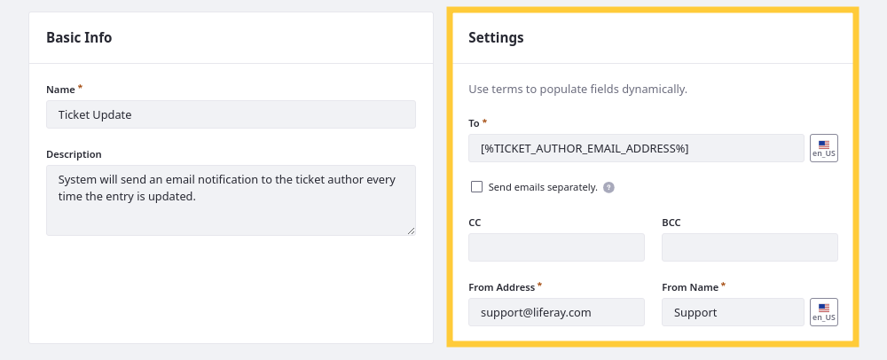
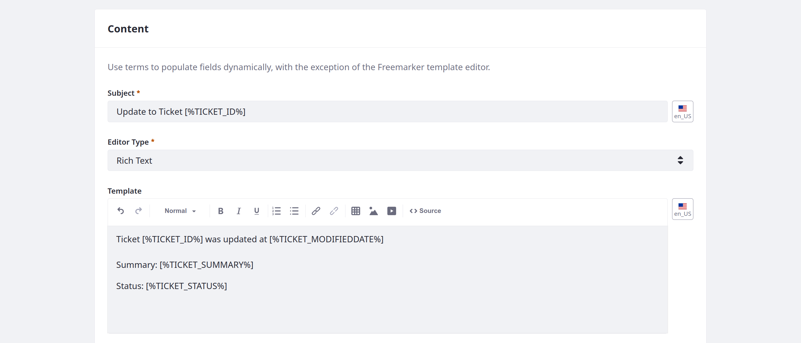

# Creating Notification Templates

{bdg-secondary}`Available Liferay 7.4 U33+ and GA33+`

With the Notification Templates application, you can design automated email notifications for Liferay services. Each template identifies a sender, recipients, and message content. While designing the template, you can search supported entities and add field references that dynamically insert their data into emails.

Currently, the Notification Templates application only supports Object actions. However, Commerce Channels include built-in notification template capabilities for Channel events. See [Store Emails](https://learn.liferay.com/commerce/latest/en/store-management/sending-emails/store-emails.html) for more information.

```{note}
To use email notifications, your instance must have a configured [mail server](../../installation-and-upgrades/setting-up-liferay/configuring-mail.md). Once configured, you can access additional [email notification settings](../../system-administration/configuring-liferay/virtual-instances/email-settings.md) at the instance level.
```

Follow these steps to create a notification template for custom Object actions:

1. Open the *Global Menu* (), go to the *Control Panel* tab, and click *Notification Templates*.

1. Click the *Add* button ().

1. In the Basic Info section, enter a *name* and *description*.

   

1. In the Settings section, enter contact information for the email *sender* and *recipients*.

   To add multiple recipients, separate email addresses with a comma (e.g., `test@liferay.com,test2@liferay.com`)

   

1. In the Content section, enter a *subject* and craft the *body* of the email.

   

   During this process, you can search custom Objects and add references to Object fields. This dynamically populates the email with Object entry data.

   ```{important}
   You can only dynamically include field values from Object entries involved in the notification action.
   ```

   

1. (Optional) Select Object attachment fields to include their assets in email notifications.

   ```{important}
   You can only attach assets from Object entries involved in the notification action.
   ```

   

1. Click *Save*.

Once created, you can use notification templates with Object actions. See [Defining Object Actions](../../building-applications/objects/creating-and-managing-objects/defining-object-actions.md) for more information.

## Additional Information

* [Configuring Mail](../../installation-and-upgrades/setting-up-liferay/configuring-mail.md)
* [Email Settings](../../system-administration/configuring-liferay/virtual-instances/email-settings.md)
* [Notifications](../notifications.md)
