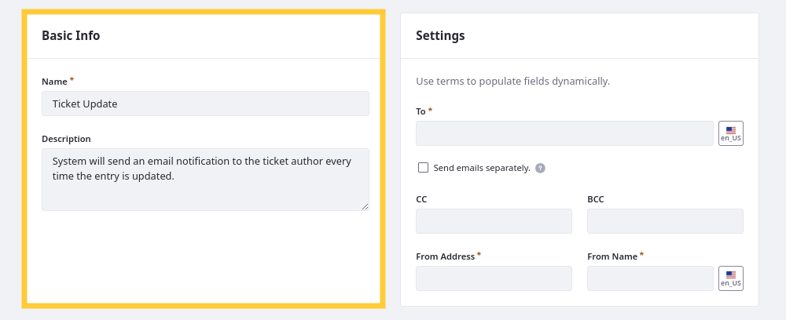
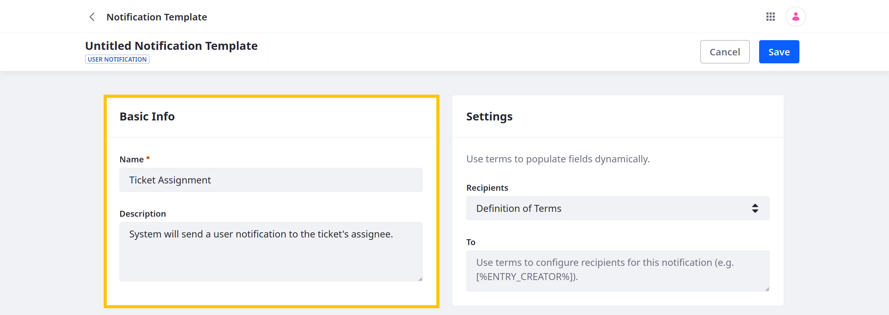
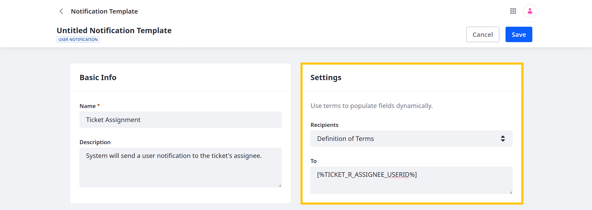

---
taxonomy-category-names:
- Platform
- Notifications and Notification Templates
- Liferay Self-Hosted
- Liferay PaaS
- Liferay SaaS
uuid: 23945a81-3dac-4a80-a0e3-a05b113bba7e
---
# Creating Notification Templates

{bdg-secondary}`Liferay 7.4 2023.Q4+/GA102+`

With Notification Templates, you can design automated email and user notifications for Liferay services. Each template identifies a sender, recipients, and message content. While designing the template, you can search supported entities and add field references that insert their data dynamically into emails.

Currently, notification templates only support [object actions](../../liferay-development/objects/creating-and-managing-objects/actions/defining-object-actions.md). However, Commerce Channels include built-in notification template capabilities for channel events. See [Store Emails](https://learn.liferay.com/w/commerce/store-management/sending-emails) for more information.

!!! important
    To use email notifications, your instance must have a configured [mail server](../../installation-and-upgrades/setting-up-liferay/configuring-mail.md). Once configured, you can access additional [email notification settings](../../system-administration/configuring-liferay/virtual-instances/email-settings.md) at the instance level.

If the out-of-the-box notification types don't meet your needs, you can create custom notification types using client extensions. See [Microservice Client Extensions](../../building-applications/client-extensions/microservice-client-extensions.md) for more information.

## Adding Email Notification Templates

1. Open the *Global Menu* (), go to the *Control Panel* tab, and click *Notification Templates*.

1. Click *Add* () and select *Email*.

   

   You can use field references to populate messages dynamically with entry and user data. In the Definition of Terms section you can select an object definition to reference its supported fields. In the General Terms section you can find terms for referencing fields for the user who triggers the notification action. Use these reference terms in the template fields as desired. See [Definition of Terms Reference](#definition-of-terms-reference) for more information.

   

1. In Basic Info, enter a name and description for the template.

   

1. In Settings, enter contact information for the email sender and recipients.

   To add multiple recipients, separate email addresses with a comma or space (e.g., `test@liferay.com,learn@liferay.com`, `[%TICKET_AUTHOR_EMAIL_ADDRESS%] [%CURRENT_USER_EMAIL_ADDRESS%]`).

   

1. Determine whether to send emails separately or together.

   When sent together, emails include the full list of recipients from the To field. Sending emails separately hides the list of recipients.

   !!! tip
       Sending emails together can facilitate transparency and collaboration. Sending emails separately can help preserve privacy.

1. In Content, enter a subject, select an editor type, and create the body of the email.

   For type, select Rich Text or FreeMarker Template.

   

1. (Optional) Select object attachment fields to include their assets in email notifications.

   ```{important}
   You can only attach assets from object entries involved in the notification action.
   ```

   

1. Click *Save*.

Once created, you can use notification templates with object actions. See [Defining Object Actions](../../liferay-development/objects/creating-and-managing-objects/actions/defining-object-actions.md) for more information.

## Adding User Notification Templates

1. Open the *Global Menu* (), go to the *Control Panel* tab, and click *Notification Templates*.

1. Click *Add* () and select *User Notification*.

   

   You can use field references to populate messages dynamically with entry and user data. In the Definition of Terms section you can select an object definition to reference its supported fields. In the General Terms section you can find terms for referencing fields for the user who triggers the notification action. Use these reference terms in the template fields as desired. See [Definition of Terms Reference](#definition-of-terms-reference) for more information.

   

1. In Basic Info, enter a name and description for the template.

   

1. In Settings, determine the notification's recipients.

   You can use defined terms, user names, or user roles. To add multiple recipients, separate values with a comma or space (e.g., `[%TICKET_AUTHOR_ID%]`, `[%TICKET_R_ASSIGNEE_USERID%]`).

   !!! important
       If you set the recipients dynamically, only users with [permission to add object entries](../../liferay-development/objects/understanding-object-integrations/permissions-framework-integration.md#creating-entries) can receive the notification.

   

1. In the Content section, enter the notification's message.

   You can use defined terms to populate values dynamically.

   

1. Click *Save*.

Once created, you can use notification templates with object actions. See [Defining Object Actions](../../liferay-development/objects/creating-and-managing-objects/actions/defining-object-actions.md) for more information.

## Definition of Terms Reference

You can use reference terms to access user and entry data, dynamically populating a template's fields. You can reference any entries and users involved in the event triggering the [notification action](../../liferay-development/objects/creating-and-managing-objects/actions/understanding-action-types.md#notification). You can also reference fields in related object entries if the current entry is on the child side of a one-to-many relationship. References to related entry fields use this pattern, `[%RELATIONSHIPNAME_PARENTOBJECTNAME_OBJECTFIELD%]`.

Consider a scenario with a custom Ticket object that is on the child side of a one-to-many relationship with the User system object. This relationship determines the ticket's assignee. If you add a notification action to the Ticket object for notifying the assignee on entry update, the template used for this action can access data for both the updated ticket and the assignee.

Terms are available for both custom and default object fields.

!!! important
   You can only reference fields for entries and users directly involved in the event that triggers the notification action. 

### Default Terms for Current Entry

Use these terms to access information about the current object entry.

| Label                   | Term                                   |
|:------------------------|:---------------------------------------|
| Author Email Address    | `[%OBJECTNAME_AUTHOR_EMAIL_ADDRESS%]`  |
| Author First Name       | `[%OBJECTNAME_AUTHOR_FIRST_NAME%]`     |
| Author ID               | `[%OBJECTNAME_AUTHOR_ID%]`             |
| Author Last Name        | `[%OBJECTNAME_AUTHOR_LAST_NAME%]`      |
| Author Middle Name      | `[%OBJECTNAME_AUTHOR_MIDDLE_NAME%]`    |
| Author Prefix           | `[%OBJECTNAME_AUTHOR_PREFIX%]`         |
| Author Suffix           | `[%OBJECTNAME_AUTHOR_SUFFIX%]`         |
| Create Date             | `[%OBJECTNAME_CREATEDATE%]`            |
| External Reference Code | `[%OBJECTNAME_EXTERNALREFERENCECODE%]` |
| ID                      | `[%OBJECTNAME_ID%]`                    |
| Modified Date           | `[%OBJECTNAME_MODIFIEDDATE%]`          |
| Status                  | `[%OBJECTNAME_STATUS%]`                |

### Default Terms for Current User

Use these terms to access information about the current user triggering the notification action.

| Label                      | Term                             |
|:---------------------------|:---------------------------------|
| Current User Email Address | `[%CURRENT_USER_EMAIL_ADDRESS%]` |
| Current User First Name    | `[%CURRENT_USER_FIRST_NAME%]`    |
| Current User Prefix        | `[%CURRENT_USER_PREFIX%]`        |
| Current User Last Name     | `[%CURRENT_USER_LAST_NAME%]`     |
| Current User Middle Name   | `[%CURRENT_USER_MIDDLE_NAME%]`   |
| Current User ID            | `[%CURRENT_USER_ID%]`            |
| Current User Suffix        | `[%CURRENT_USER_SUFFIX%]`        |

## Related Topics

* [Configuring Mail](../../installation-and-upgrades/setting-up-liferay/configuring-mail.md)
* [Email Settings](../../system-administration/configuring-liferay/virtual-instances/email-settings.md)
* [Notifications](../notifications.md)
