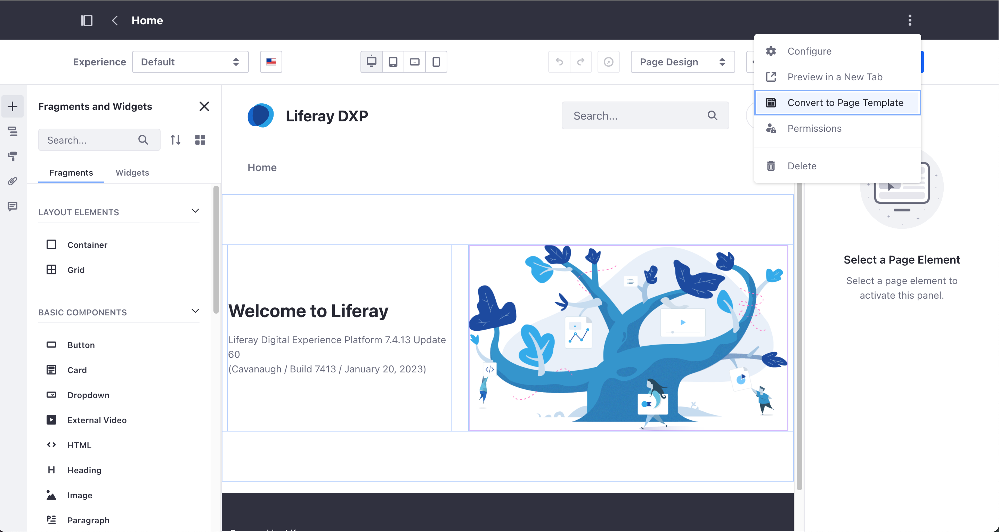
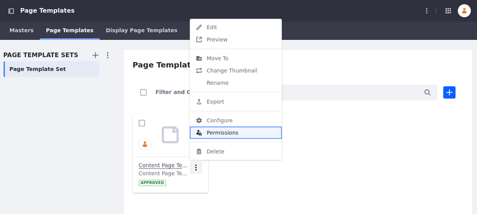

# Creating a Page Template

> Available: Liferay DXP/Portal 7.3+

Page Templates help you efficiently create pages based on predefined layouts and content. There are several basic page templates available out-of-the-box.


You may also create your own [Content Page](../using-content-pages.md) Templates and [Widget Page](../understanding-pages/understanding-pages.md#widget-pages) Templates, as described below.

```{note}
For Liferay DXP 7.4+, Page Template Collections are called Page Template Sets in the Liferay UI.
```

## Creating a New Page Template

The steps below show how to create and use Widget and Content Page Templates.

1. Open the Product Menu and go to *Design* &rarr; *Page Templates*.

1. Select the *Page Templates* tab.

1. Click *New* and create a new Page Template Set to organize your Page Templates.

    

1. Click the *Plus* icon () and select either *Widget Page Template* or *Content Page Template*. You can edit the Page Template at any time by clicking the *Actions* icon () next to the Page Template in the Set and selecting *Edit*.

1. Enter a Name.

1. Click *Save*.

1. You're automatically brought to the new Page Template. Follow the instructions in [Widget Pages](../understanding-pages/understanding-pages.md#widget-pages) to create your Widget Page Template. Likewise, see [Building Content Pages](../using-content-pages/adding-elements-to-content-pages.md) to configure your Content Page Template.

## Creating a Page Template from an Existing Page

You can also create a Page Template from a page while you are editing it. The new Page Template keeps all of the same configurations for Fragments and widgets when it is created. This saves you time making more templates for pages that you may decide to reuse as you expand your Site.

Follow these steps to make a Page Template from a page:

1. While editing the page, click the *Actions* icon () and select *Convert to Page Template*

     <!--TASK: UPDATE IMG FOR LRDOCS-10856-->

1. In the modal that appears on the screen, select an existing page set or select *Save in New Set* to create a new Page Template Set for the Page Template.

    

1. Click Save.

The chosen Page Template Set now has a new Page Template based on the page you are currently editing, as a draft. *You must publish this Page Template draft to use it for new pages.*

## Sharing a New Page Template

By default, only the creator of the Page Template can use it.

To give other users access to a newly created page template follow these steps:

1. Select *Permissions* from the Page Template's Actions menu.

    

1. Check the *View* permission for the Roles that you want to have access to the Page Template. If you want any user who can create a page to be able to use the Page Template, check the *View* permission for the *User* Role.

1. Click *Save*.

Users with the roles specified now have access to the page template.

## Additional Information

### Propagating Changes for Widget Pages

When creating a page from a Widget Page Template, changes are inherited from the Page Template by default, so future changes are *automatically* propagated to the pages that use the Page Template. Site Administrators can disable this behavior through the [settings for the individual page](../page-settings/configuring-individual-pages.md#general).

### Propagating Changes for Content Pages

Changes for Content Pages **are not automatically propagated** when created using a Content Page Template. However, you can propagate changes to Fragments used on a Content Page. See [Propagating Fragment Changes](../page-fragments-and-widgets/using-fragments/propagating-fragment-changes.md) for more information.

### Sharing Page Templates With Other Sites

You can share your Page Templates with other sites using the same process as you would for pages. Follow the instructions in [Exporting/Importing Site Pages and Content](../../sites/exporting-importing-site-pages-and-content.md) to learn how.

### Staging and Page Templates

```{important}
Staging functionality is in [maintenance mode](../../../installation-and-upgrades/upgrading-liferay/reference/maintenance-mode-and-deprecations-in-7-3.md) as of 7.3 GA1+.
```

If staging has been enabled, changes to the Widget Page Template are automatically propagated to the *staged* page. These changes must still be approved before the page is published to the live site. For this reason, the automatic propagation of Widget Page Template changes to the staged page cannot be turned off and the *Inherit Changes* selector does not appear.

## Additional Information

- [Adding a Page to a Site](./adding-a-page-to-a-site.md)
- [Exporting and Importing Page Templates](./exporting-and-importing-page-templates.md)
- [Using the Full Page Application Page Type](./using-the-full-page-application-page-type.md)