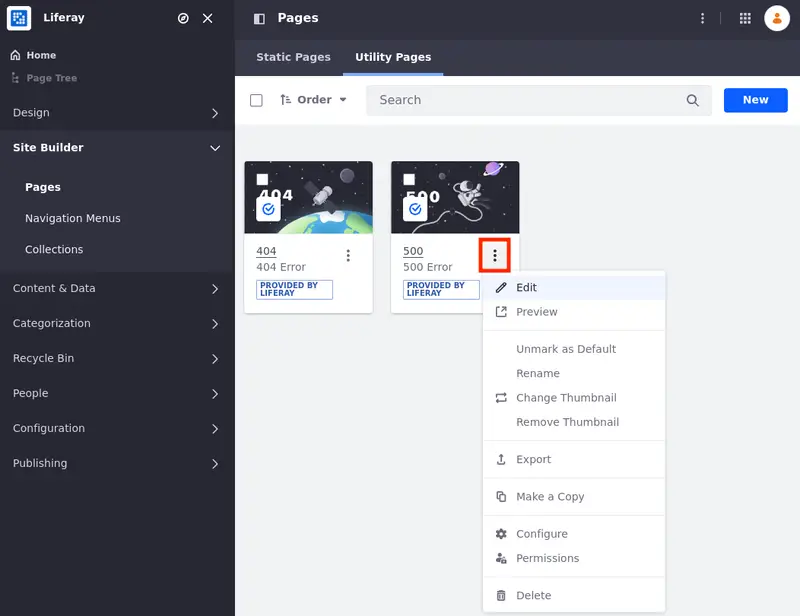

# Using Utility Pages

In Liferay, you can customize system-level pages from the UI using utility pages. 

Utility pages serve specific operational tasks and actions, usually essential for users to interact with a website or application effectively (e.g. sign-in, terms of use, and 404 pages).

To enhance the user's experience, Liferay provides [out-of-the-box solutions](#out-of-the-box-utility-pages) that are easily customizable without the need to engage a developer. You can also [create your own pages](#creating-a-new-utility-page) from scratch.


## Out-of-the-box Utility Pages

The provided out-of-the-box utility pages can be edited, previewed, or copied.

1. Open the *Product Menu* (  ) and  navigate to *Site Builder* &rarr; *Pages* &rarr; *Utility Pages* tab.

    The out-of-the-box pages are marked with the `PROVIDED BY LIFERAY` tag

1. Choose a page and click *Actions* (  ) to view and select one of the available options (e.g. *Edit*, *Preview*, or *Make a Copy*).

```{tip}
Edit the error utility page the same way you would edit a [content page](../using-content-pages/adding-elements-to-content-pages.md).
```

## Creating a New Utility Page

1. Open the *Product Menu* (  ) and  navigate to *Site Builder* &rarr; *Pages* &rarr; *Utility Pages* tab.

1. Select *Add* (  ).

1. Choose the type of utility page you want to create.

1. Select *Blank* for an empty content page or choose an available master page template.

## Selecting a Utility Page as Default

1. Open the *Product Menu* (  ) and  navigate to *Site Builder* &rarr; *Pages* &rarr; *Utility Pages* tab.

1. Select the Actions menu (  ) for the utility page. 

1. Select *Mark as Default*. 



```{note}
If a site contains no pages, the default 404 error page is shown even if a utility page is applied.
```

## Types of Utility Pages

Here are some common types of utility pages provided by Liferay:

| Type of Utility Page | Available Pages |
| :--- | :--- |
| [Error Utility Pages](#error-utility-pages) | 404 and 500 error pages |

### Error Utility Pages

Error utility pages are web pages designed to inform the user that something went wrong and to provide helpful information about the error. There are several standard HTTP status codes. Each code corresponds to a specific type of error.

Two of the most common status codes are 404 and 500. 404 error ("Page Not Found") pages appear when users navigate to a page that does not exist. 500 error ("Internal Server Error") pages appear when a web server encounters an issue while processing a request.

With Liferay DXP you can [use customizable out-of-the-box 404 and 500 error pages](#out-of-the-box-utility-pages) or you can [create your own error pages](#creating-a-utility-page) from scratch.

<!-- TASK: LPS-155184 Document 404 Error pages can be added to custom site initializers -->