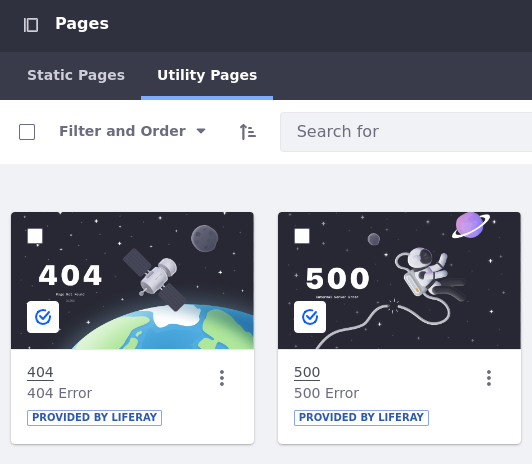
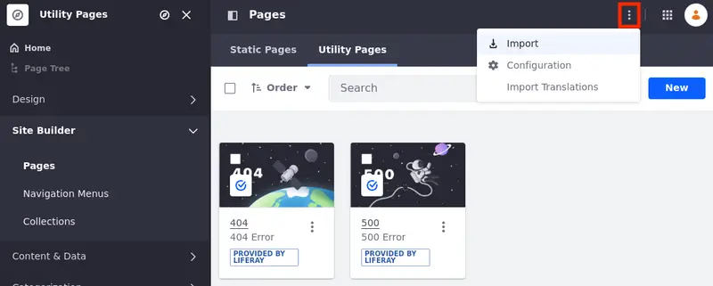

# Using Utility Pages

{bdg-secondary}`7.4 U86+ and GA86+`

Utility pages serve specific operational tasks and actions and are usually essential for users to interact with a website or application effectively. Utility pages can be configured for a site's 500 and 404 error pages. In the future, this capability will expand to include other common pages (e.g. sign-in and terms of use pages).

Liferay provides [out-of-the-box utility pages](#viewing-utility-pages) that are easily customizable. You can also [create utility pages](#creating-a-new-utility-page) from scratch.



## Viewing Utility Pages

You can edit, preview, or copy utility pages.

1. Open the *Product Menu* (  ) and navigate to *Site Builder* &rarr; *Pages* &rarr; *Utility Pages* tab.

    The out-of-the-box pages are marked with a `PROVIDED BY LIFERAY` tag.

1. Choose a page and click *Actions* (  ) to view and select one of the available options (e.g. *Edit*, *Preview*, or *Make a Copy*).

```{tip}
Edit the utility page the same way you would edit a [content page](../using-content-pages/adding-elements-to-content-pages.md).


```

## Creating a New Utility Page

To create a new Utility Page, follow these steps:

1. Open the *Product Menu* (  ) and  navigate to *Site Builder* &rarr; *Pages* &rarr; *Utility Pages* tab.

1. Select *Add* (  ).

1. Choose the type of utility page you want to create.

1. Select *Blank* for an empty content page or choose an available master page template.

1. Name the utility page and click *Save*.

You can edit the newly created utility page the same way you would edit a [content page](../using-content-pages/adding-elements-to-content-pages.md).

## Selecting a Utility Page as Default

To select a new Utility Page as default, follow these steps:

1. Open the *Product Menu* (  ) and  navigate to *Site Builder* &rarr; *Pages* &rarr; *Utility Pages* tab.

1. Select the Actions menu (  ) for the utility page.

1. Select *Mark as Default*.



```{note}
If a site contains no pages, the default 404 error page is shown even if a utility page is applied.
```

## Utility Page Permissions

Utility Pages have permissions that govern their use.

| Permission Name | Description |
| --- | --- |
| Add Utility Page | Required to add a Utility Page. |
| Assign Default Utility Page | Required to assign a Utility Page a default page. |

<!-- TASK: LPS-155184 Document 404 Error pages can be added to custom site initializers -->