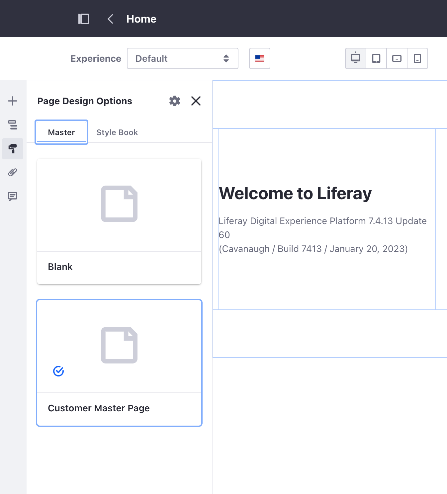
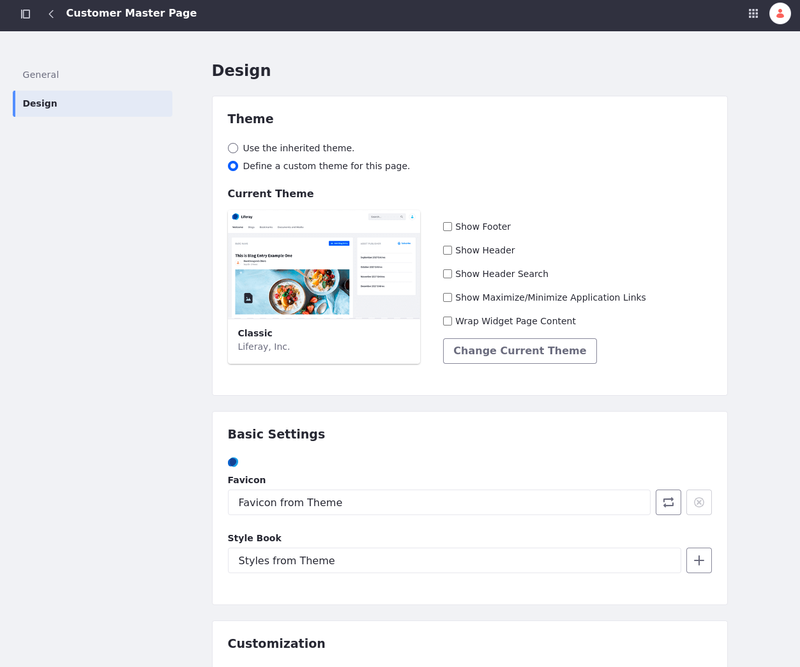

# Managing Master Page Templates

> Available: Liferay DXP/Portal 7.3+

To manage a master page template, follow these steps:

1. Open the *Site Menu* (  ) and navigate to *Design* &rarr; *Page Templates*

1. Select the *Masters* tab.

1. Click *Actions* (  ) for a master page template and select one of the options.

    

**Edit:** Configure the master page template.

**Change Thumbnail:** Select a thumbnail image to display for the master page template's card.

**Mark as Default:** This makes the template the default master page for widget pages. This option is available with approved master page templates.

**Rename:** Change the name of the template.

**Export:** Export and download the master page template definition. This option is available with approved master page templates.

**Make a Copy:** Duplicate the master page template. The copy uses the same name with "Copy" appended to the end.

**Permissions:** Define permissions for the template.

**Delete:** Remove the master page template. You can also delete multiple master page templates at once by checking the box for each template and selecting *Trash* (  ) from the management toolbar.

**Discard Draft:** Discard the master page draft. This option is available with drafts.

```{note}
After changes are made and published, they are propagated to all pages that use the master page template.
```

## Changing the Master Page Template of a Page

You can change the master page template of a page in the [content page editor](../using-content-pages/content-page-editor-ui-reference.md). Follow these steps to change the template of a page:

1. Navigate to the page where you want to change the master page template.

1. Click *Edit* (  )

1. In the editing sidebar, click the *Page Design Options* menu (  ).

1. Under the masters section, select the master page template you want to use.

   

## Changing a Master Page Template's Design

To manage a master page templates' design and other options, follow these steps:

1. Open the *Site Menu* (  ) and navigate to *Design* &rarr; *Page Templates*.

1. Select the *Masters* tab.

1. Click *Actions* (  ) for the master page template you want to configure &rarr; *Edit*.

1. Click the *Page Design Options* menu (  ) &rarr; *More Page Design Options*(  )

   

1. In the Design tab, you can alter the style of your master page template.

    

**Theme:** Select whether to use theme from pages of a site or select a specific theme for the current master page template.

**Favicon:** Change the default favicon applied from the theme.

**Style Book:** Change the default style book applied from the theme.

**Theme CSS Client Extension:** Add [theme CSS client extensions](../../../building-applications/client-extensions/front-end-client-extensions.md#theme-css-client-extensions) to fully replace the default CSS from a theme without deploying an entire theme.

**CSS Client Extensions:** Add [CSS client extensions](../../../building-applications/client-extensions/front-end-client-extensions.md#css-client-extensions) to override CSS styling of a content page that uses the master page template.

**Custom CSS:** Custom CSS can also be applied and is loaded after the theme. Custom CSS is disabled when using the inherited theme.

**JavaScript Client Extension and Custom JavaScript:** [JavaScript client extentions](../../../building-applications/client-extensions/front-end-client-extensions.md#javascript-client-extensions) can be added to have JavaScript run when the page using this master page template is visited. Custom JavaScript code can be added that is executed at the bottom of the page.

```{note}
A theme is applied to a content page through a master page template. When a master page template is applied to a content page, the design of the content page is defined by the master page template.
```

## Related Topics

[Master Pages Templates](./master-page-templates.md)

[Creating a Master Page Template](./creating-a-master-page-template.md)
