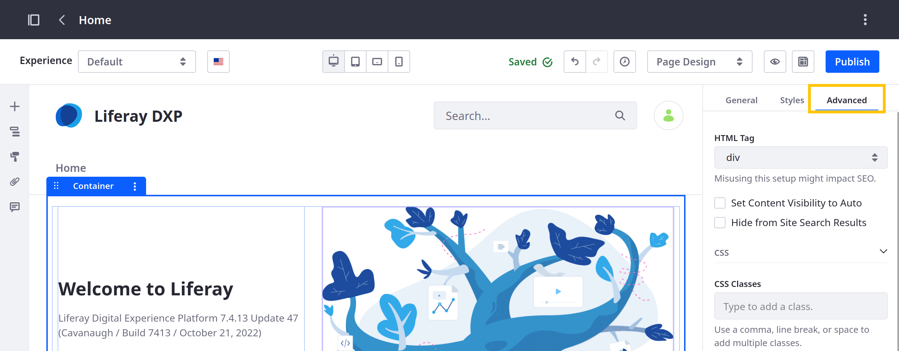

# Advanced Settings Reference

{bdg-secondary}`Available 7.4 DXP U23+ or 7.4 GA23+`

The *Advanced* Settings tab for Page Fragments provides fields for more complex or technical configurations. For example, advanced settings may alter the way web browsers handle the Fragment's HTML.

Follow these steps to access a Fragment's Advanced Settings menu:

1. Begin editing a Page or Template that supports Fragments.

1. Open the *Browser* panel () in the sidebar menu and select the desired *Fragment* under Page Elements.

   Alternatively, you can click on the desired Fragment in the Page or Template to open this menu.

1. Click the *Advanced* tab in the Page Elements side menu.



## HTML Tag

Several HTML tags exist that allow web scrapers, browsers, and site renderers to more easily find and retrieve what kind of content is on a page. *Container* Page Fragments provide the option to choose which tag is generated for the Container Fragment's HTML element on the page.

| Field | Description |
| :--- | :--- |
| HTML Tag | Choose the HTML tag generated for the Fragment (Container Fragments only). The available options are `div` (default), `header`, `nav`, `section`, `article`, `main`, `aside`, and `footer`. |

```{note}
The tag chosen only applies to the Container Fragment itself, not to any other Fragments or content nested within it.
```


## Custom CSS

{bdg-secondary}`Available 7.4 DXP U34+ or 7.4 GA34+`

You can add custom CSS fo fragments under *CSS* in the Advanced configuration tab, in the *Custom CSS* text box. Using this field requires the UPDATE permission for fragments.

By default, the Custom CSS text box contains this placeholder CSS:

```css
.[$FRAGMENT_CLASS$] {

}
```

`[$FRAGMENT_CLASS$]` is a CSS class variable that represents the unique class name of the fragment you are configuring. Use this to apply CSS specifically to that fragment. When the page renders, this is replaced with the fragment's actual class name on the back-end (like `lfr-layout-structure-item-01d752e4-32e3-ed4a-9cd6-fcaf483d0c34`).

```{tip}
Click the *Expand* icon above the text box to open a modal on the screen, to give you more space to edit the custom CSS for your fragment.
```

Use the *CSS Classes* text box above to add classes for use in your custom CSS (separating them with a space, comma, or line break). Classes that you add in this field can be reused for any other fragments on the same page. Suggestions for classes that you have added to other fragments on the same page appear while you type.


```{note}
Only CSS classes that you have added yourself appear as suggestions in the CSS Classes text box. Pre-existing classes or variables (such as `[$FRAGMENT_CLASS$]`) do not appear, and do not need to be added to this field.
```

You can also use variables in your custom CSS that come from the [Style Book](../../../../site-appearance/style-books/using-a-style-book-to-standardize-site-appearance.md) you are currently using. This example shows using the *Info* color from a Style Book to set a fragment's background color:


## Hiding Content from Search Results

You may want to hide a Page Fragment from search results on your Site. This configuration especially helps to prevent irrelevant or repeated search results if a Fragment is commonly reused on many pages, or otherwise is not relevant for content searches.


## Additional Information

* [General Settings Reference](./general-settings-reference.md)
* [Using Fragments](../../using-fragments.md)
* [Creating a Style Book](../../../../site-appearance/style-books/using-a-style-book-to-standardize-site-appearance.md)
* [Style Book Token Definitions](../../../../site-appearance/style-books/developer-guide/style-book-token-definitions.md)
