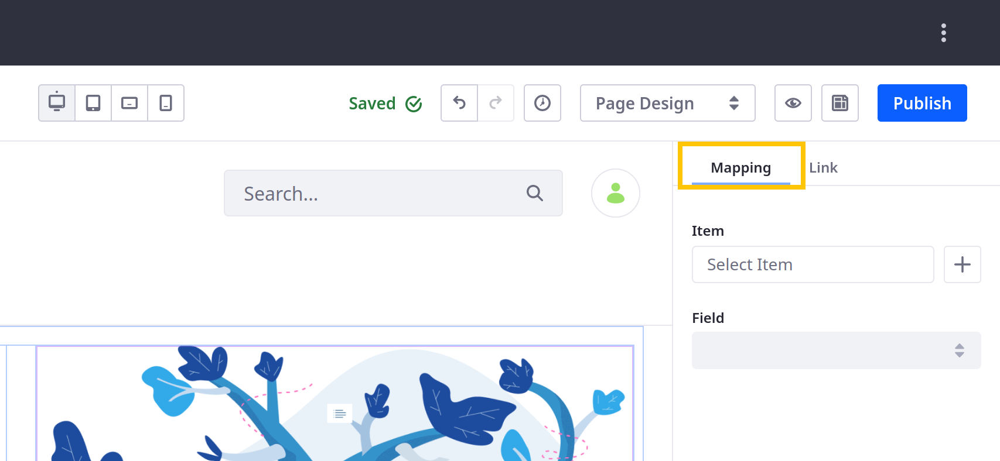
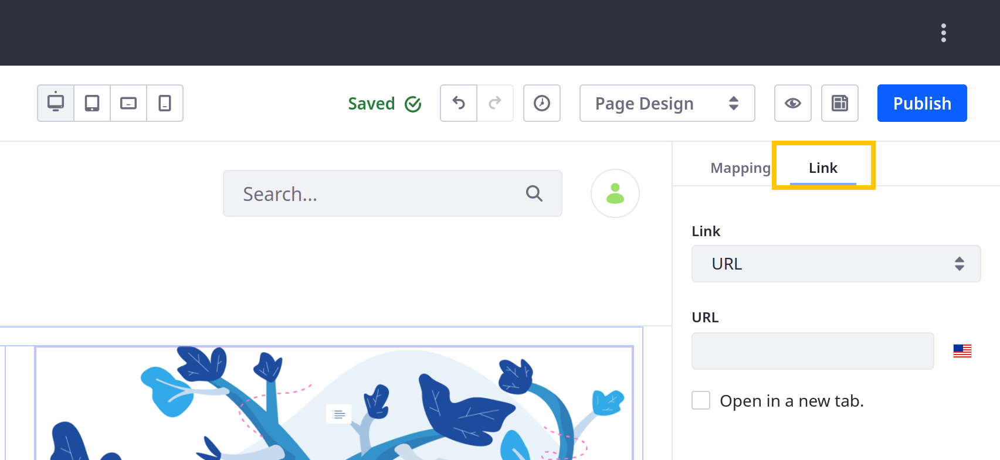

# Fragment Sub-Elements Reference

In addition to [General](./general-settings-reference.md) and [Style](./styles-reference.md) settings, many fragments include sub-elements with their own configuration options. To access these options, begin editing a page or template (  ), click the desired fragment, and select one of its sub-elements in the Browser (  ) sidebar menu.

Available options depend on the sub-element's type and are organized into tabs: Mapping, Image Source, and Link.

| Sub-Element Type | [Mapping Tab](#mapping-settings) | [Image Source Tab](#image-source-settings) | [Link Tab](#link-settings) |
| :--- | :--- | :--- | :--- |
| Simple Text Element (  ) | &#10004; | | &#10004; |
| Rich Text Element (  ) | &#10004; | | |
| Link Element (  ) | &#10004; | | &#10004; |
| HTML Element (  ) | &#10004; | | |
| Image Element (  ) | | &#10004; | &#10004; |

## Mapping Settings

Map the selected element to a field in an existing asset.

| Field | Description |
| :--- | :--- |
| Item  | Select an asset from Documents and Media, Web Content, Blogs, or Categories. The selected asset provides fields for mapping. |
| Field | Map the element to the desired field from the selected item. |

## Image Source Settings

Configure the image displayed in the selected image element.

| Field | Description |
| :--- | :--- |
| Source Selection | Select whether the image element uses *Direct* or *Mapping* for its source. When using Direct, you can select an image from Documents and Media or enter an image URL. When using Mapping, you can select an asset from Documents and Media, Web Content, Blogs, or Categories, and then map the image element to a field from the selected asset. |
| Image (*for Direct*) | Select the desired image from the Document Library or enter an image URL. |
| Resolution (*for Direct*) | Select a resolution for the image. By default, Liferay includes the following options: Auto, Thumbnail (300px), or Preview (1000px). However, you can use Adaptive Media to generate alternative resolutions. <!--TASK: Link to article when finished.--> |
| Image Description (*for Direct*) | Enter a localizable image description. To set a description for other languages, first switch the language for the page or template via the editing bar. Then, enter the desired text. See [Localizing Fragment Configuration Fields](./localizing-fragment-configuration-fields.md) for more information. |
| Item (*for Mapping*) | Select an asset from Documents and Media, Web Content, Blogs, or Categories. The selected asset provides fields for mapping. |
| Field (*for Mapping*) | Map the image element to the desired field from the selected item. |
| Enable Lazy Loading | Enable [lazy loading](https://developer.mozilla.org/en-US/docs/Web/Performance/Lazy_loading) to render the image only when needed. While enabled, off screen images are not loaded during the page's initial rendering. This can shorten the critical rendering path and improve page load times. By default, lazy loading is disabled. |

## Link Settings

Set a URL, page reference, or asset mapping to add a clickable link to the selected element.

| Field | Description |
| :--- | :--- |
| Link | Determine whether the field uses a *URL*, *Page*, or *Mapped URL*. |
| URL (*for URL*) | Enter a localizable URL for the element. To set a URL for other languages, first switch the language for the page or template via the editing bar. Then, enter the desired URL. See [Localizing Fragment Configuration Fields](./localizing-fragment-configuration-fields.md) for more information. |
| Page (*for Page*) | Select a Liferay page for the element. |
| Item (*for Mapped URL*) | Select an asset from Documents and Media, Web Content, Blogs, or Categories. The selected asset provides fields for mapping. |
| Field (*for Mapped URL*) | Map the element to an available URL field from the item. Selecting a valid field automatically populates the URL field. |
| URL (*for Mapped URL*) | This field is auto-populated by the mapped URL field. |
| Open in New Tab | Determine whether clicking the link opens a new tab. |

## Additional Information

* [Configuring Fragments](../configuring-fragments.md)
* [General Settings Reference](./general-settings-reference.md)
* [Fragment Styles Reference](./styles-reference.md)
