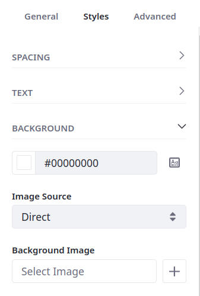
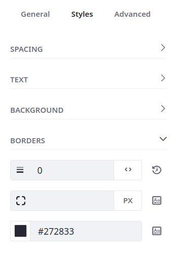

# Styles Reference

Liferay page fragments include convenient style settings so you can configure their look and feel via the Liferay UI. Many of these options correspond to CSS classes and have defined tokens supported by Style Books. See [General Settings Reference](./general-settings-reference.md) and [Fragment Sub-Elements Reference](./fragment-sub-elements-reference.md) for additional fragment configuration options.

```{note}
By default, Liferay applies style configurations to the entire fragment. This means elements contained in the fragment inherit these changes if their CSS allows it; otherwise, the inner elements are ignored. If desired, you can create and configure custom fragments to only apply style changes to some inner elements. See [Applying Styles to Fragments](../../../developer-guide/developing-page-fragments/applying-styles-to-fragments.md) for more information.
```

Follow these steps to access a fragment's *Styles* menu:

1. Begin editing a page or template that supports fragments.

1. Open the *Browser* panel () in the sidebar menu and select the desired *fragment*.

   Alternatively, you can click the desired fragment in the page or template to open this menu.

1. Click the *Styles* tab in the Page Elements side menu.

   ```{note}
   All fragments have Styles settings except for the Collection Display fragment.
   ```


Many styles have defined tokens supported by style books. See [Creating a Style Book](../../../../site-appearance/style-books/using-a-style-book-to-standardize-site-appearance.md) and [Style Book Token Definitions](../../../../site-appearance/style-books/developer-guide/style-book-token-definitions.md) for more information.

```{note}
For Liferay 7.4 U31+/GA31+, you can configure fragment styles for individual viewports by clicking the device buttons at the top of the screen or setting up [adaptive media](../../../../../content-authoring-and-management/documents-and-media/publishing-and-sharing/serving-device-and-screen-optimized-media/how-adaptive-media-works.md) for background images. For earlier versions, you can only configure text and spacing styles for different devices.
```

## Spacing

{bdg-secondary}`For Liferay 7.4 U47+/GA47+`

Click the button for the spacing dimension you want to configure. The inner buttons determine the fragment's *padding*, while the outer buttons determine its *margins*. In this context, *padding* refers to the space between a fragment's frame and its content, while *margin* refers to the space between the fragment's frame and the end of its surrounding context.


Clicking one of the padding or margin buttons opens a menu where you can select from existing tokens or enter a custom value. The predefined tokens come from the numbered *Spacer* fields in the style book's [Spacing](../../../../site-appearance/style-books/using-a-style-book-to-standardize-site-appearance.md#spacing) category. If you enter a custom value, you can select the unit used for it (e.g., `px`, `rem`). During configuration, you can also click the *Reset* button (  ) to restore the field to its initial value.

```{note}
For 7.4 U46/GA46 and earlier versions, if your style book uses a unit other than pixel to define spacing values (e.g., `rem`), they are converted to pixels during fragment configuration.
```

## Text

Format the fragment's text.

| Field | Description |
| :--- | :--- |
| Font Family (  ) | Specifies the font for an element. |
| Font Weight (  ) | Sets how thick or thin characters in text should be displayed. |
| Font Size (  ) | Sets the size of a font. |
| Text Color (  ) | Choose a color for the text. The available color palette can be configured by the fragment developer. See [Fragment Configuration Types Reference](../../../../developer-guide/reference/fragments/fragment-configuration-types-reference.md) for more information. |
| Text Align (     ) | Specifies the horizontal alignment of text in an element. Choose from *Left*, *Center*, *Right*, or *Justify*. |


## Background

Configure the fragment's background.

| Field | Description |
| :--- | :--- |
| Background Color (  ) | Choose a background color from the palette. The available color palette can be configured by the fragment developer. See [Fragment Configuration Types Reference](../../../../developer-guide/reference/fragments/fragment-configuration-types-reference.md) for more information. |
| Image Source | If set to *Direct*, users can upload a background image. If set to *Mapping*, users can choose from Documents and Media, Web Content, Blogs, or Categories. |
| Background Image (*Direct*) | Select an image  from your library or enter an image URL. |
| Item (*Mapping*) | Map the background to a specific item from Documents and Media, Web Content, Blogs, or Categories. Once selected, click the *Actions* button () to edit the item and its permissions, or view its usages. |
| Field (*Mapping*) | Determine which of the item's fields is used for the background image. |



```{note}
When mapping the background to an item's field, you can only select from fields in its structure. For example, if you've selected a Web Content item, you can only select from image fields in its structure and not from images in it's content field.
```

## Borders

Determine the width, radius, and color of the fragment's border.

| Field | Description |
| :--- | :--- |
| Border Width (  ) | Sets the width of an element's four borders. Click the *Units* button (  ) to select the desired unit for the border width (e.g., `px`, `rem`). Click the *Reset* button (  ) to revert the field to its initial value. |
| Border Radius (  ) | Defines the radius of the element's corners and allows you to add rounded corners. |
| Border Color (  ) | Sets the color of an element's four borders. The available color palette can be configured by the fragment developer. See [Fragment Configuration Types Reference](../../../../developer-guide/reference/fragments/fragment-configuration-types-reference.md) for more information. |



## Effects

Set the fragment's opacity and determine whether it has a shadow.

| Field | Description |
| :--- | :--- |
| Opacity | Sets the transparency level; 100 is default and 0 is transparent. |
| Shadow (  ) | Adds a shadow around the box; can choose from a small, medium, or large shadow. |


## Liferay 7.4 U20 and Older

For 7.4 U20/GA20 and earlier versions, spacing configurations are divided into the *Margin* and *Padding* sections.

### Margin

Configure the space between a fragment's frame and the end of its surrounding context (e.g., between the frame and the edge of the page, or between the frame and the edge of its Container or Grid).

| Field | Description |
| :--- | :--- |
| Margin Top | Sets the top margin of an element. |
| Margin Bottom | Sets the bottom margin of an element. |
| Margin Left | Sets the left margin of an element. |
| Margin Right | Sets the right margin of an element. |

### Padding

Configure the space between a fragment's frame and its content.

| Field | Description |
| :--- | :--- |
| Padding Top | Sets the top padding (space) of an element. |
| Padding Bottom | Sets the bottom padding of an element. |
| Padding Left | Sets the left padding of an element. |
| Padding Right | Sets the right padding of an element. |

## Additional Information

* [Using Content Pages](../../../using-content-pages.md)
* [Using Fragments](../../using-fragments.md)
* [Creating a Style Book](../../../../site-appearance/style-books/using-a-style-book-to-standardize-site-appearance.md)
* [Style Book Token Definitions](../../../../site-appearance/style-books/developer-guide/style-book-token-definitions.md)
