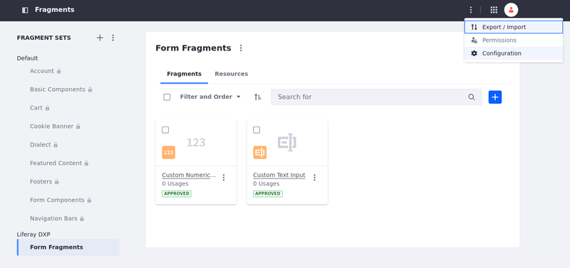
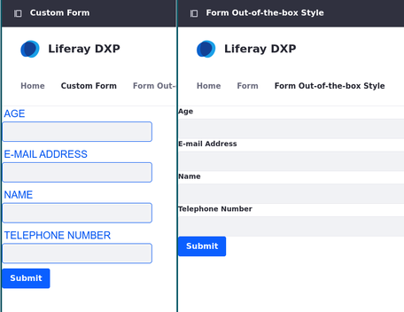

---
taxonomy-category-names:
- Sites
- Fragments
- Liferay Self-Hosted
- Liferay PaaS
- Liferay SaaS
uuid: 6d5cef22-172b-49bf-ae3d-cf89bb6f908b
---

# Personalizing Custom Forms Using Form Fragments

Form fragments auto-generate forms based on custom objects. If Liferay's out-of-the-box form fragments don't satisfy your use case, you can create custom form fragments and alter the style of your forms by [mapping your custom form fragment to a field type](#map-custom-form-fragments-to-form-fields).

The custom form fragments use HTML, CSS, and JavaScript code to create an element with customized style and functionality. This way, you can customize your forms using an existing design system and/or components library. See [Creating Form Fragments](../../../developer-guide/developing-page-fragments/creating-form-fragments.md) for more information.

!!! important
    Form fragments can only be used with custom objects. Liferay hides the Form Components fragment set until you have at least one published object. Once published, users with access to the object can view and use the Form Components fragments. See [Creating Objects](../../../../liferay-development/objects/creating-and-managing-objects/creating-objects.md) for more information.

## Map Custom Form Fragments to Form Fields

To alter the default style and functionality of a form field, you can map a [custom form fragment](../../../developer-guide/developing-page-fragments/creating-form-fragments.md) to a field type:

1. Open the *Site Menu* () and click *Design* &rarr; *Fragments*.

1. In the Fragments application, click *Options* () in the applications bar &rarr; *Configuration*.

   

1. Select the *Form Fragment* (in the right column) to be applied to the Field Type (in the left column).

   

1. Choose the fragment set under your site's tab. Fragments with a compatible type of field appear.

1. Select the custom form fragment you want to apply.

   

You can check if the custom fragment is applied to the field type by adding a form to a content or template page. See [Using Fragments to Build Forms](../../../../liferay-development/objects/using-fragments-to-build-forms.md) to learn more about building forms using fragments.

Once you've applied the custom form fragment to the field type, the new style (on the left) is applied to the field type instead of the out-of-the-box style (on the right).

## Related Topics

- [Configuring Fragments](./configuring-fragments.md)
- [Creating Form Fragments](../../../developer-guide/developing-page-fragments/creating-form-fragments.md)
- [Developing Page Fragments](../../../developer-guide/developing-page-fragments.md)
- [Form Components](./default-fragments-reference.md#form-components)
- [Form Fragment Options](./configuring-fragments/general-settings-reference.md#form-fragment-options)
- [Using Fragments to Build Forms](../../../../liferay-development/objects/using-fragments-to-build-forms.md)

