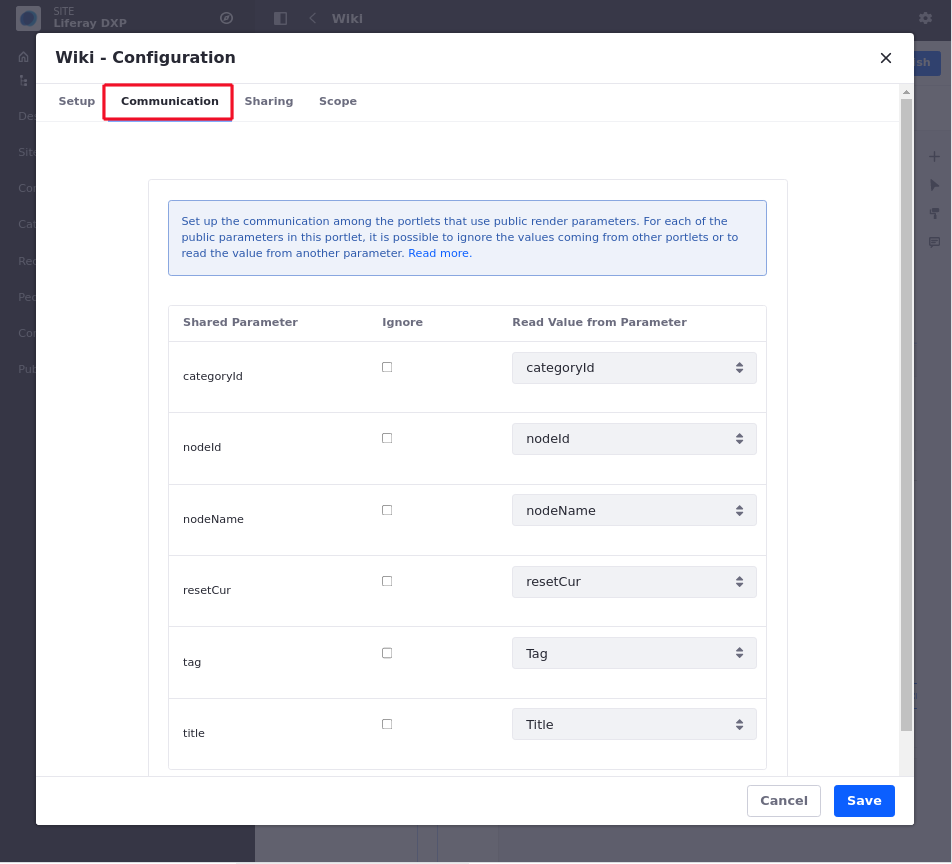

# Communication Between Widgets

Portlet widgets can communicate with each other using public render parameters and events. Some Liferay portlets provide a configuration UI to help you get the most out of this communication mechanism:

1. Click *Options* () &rarr; *Configuration* &rarr; *Communication* tab.



The screenshot above shows the Wiki, which has six public render parameters: `categoryId`, `nodeId`, `nodeName`, `resetCur`, `tag`, and `title`. For each of these parameters, you can configure the portlet to ignore the values coming from other portlets or read the value from another parameter.

```{important}
If your widget isn't a portlet, this feature isn't available.
```

You might wish to ignore certain parameter values from other portlets. For example, a common use case for the Wiki application pairs it with the Tag Filter widget so that when a user clicks a tag in Tag Filter, the Wiki shows a list of pages with that tag. But if you want the Wiki to show the front page always regardless of tag navigation done through other portlets, you can ignore parameter values coming from other widgets.

Reading the value of a parameter from another portlet is an advanced but powerful option that allows portlets to communicate with each other even if their developers didn't intend them to. For example, imagine that the Wiki publishes information about certain countries, and another portlet shows country names for administrative reasons. If the second portlet has a *country* public render parameter, the Wiki can show the information from the country selected in the administration portlet by setting the value of the Wiki portlet's title parameter from the country parameter value of the administration portlet. Cool, isn't it?

## Additional Information

- [Sharing Applications With Other Sites](./sharing-widgets-with-other-sites.md)
